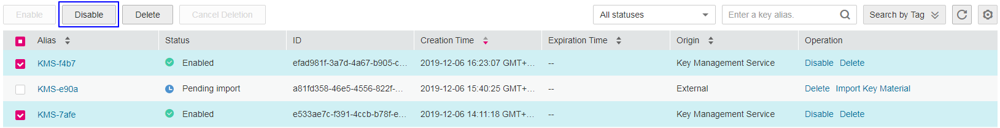

# Disabling One or Multiple CMKs

## Scenario

This section describes how to use the management console to disable one or multiple CMKs, thereby protecting data in urgent cases.

After being disabled, a CMK cannot be used to encrypt or decrypt any data. Before using a disabled CMK to encrypt or decrypt data, you must enable it by following instructions in  [Enabling One or Multiple CMKs](enabling-one-or-multiple-cmks.md).

> **NOTE:**   
>Default Master Keys created by KMS cannot be disabled.  

## Prerequisites

-   You have obtained an account and its password for logging in to the management console.
-   The CMK you want to disable is in  **Enabled**  status.

## Procedure

-   Disabling one CMK

1.  Log in to the management console.
2.  Click    in the upper left corner of the management console and select a region or project.
3.  Choose  **Security**  \>  **Key Management Service**. The  **Key Management Service**  page is displayed.
4.  In the row containing the desired CMK, click  **Disable**.

    **Figure  1**  Disabling one CMK  
    

5.  In the dialog box that is displayed, click  **Yes**  to disable the CMK.

-   Disabling multiple CMKs

1.  Log in to the management console.
2.  Click    in the upper left corner of the management console and select a region or project.
3.  Choose  **Security**  \>  **Key Management Service**. The  **Key Management Service**  page is displayed.
4.  In the list of CMKs, select the desired CMKs and click  **Disable**.

    **Figure  2**  Disabling multiple CMKs  
    

5.  In the dialog box that is displayed, click  **Yes**  to disable the CMKs.

