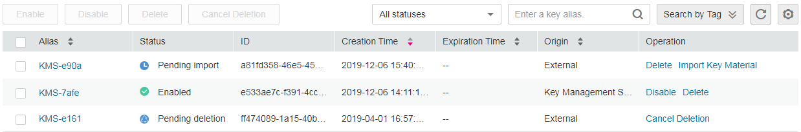

# Querying a CMK

## Scenario

This section describes how to use the management console to view the information about a CMK, such as its alias, status, ID, and creation time. The status of a CMK can be  **Enabled**,  **Disabled**,  **Pending deletion**, or  **Pending import**.

## Prerequisites

You have obtained an account and its password for logging in to the management console.

## Procedure

1.  Log in to the management console.
2.  Click    in the upper left corner of the management console and select a region or project.
3.  Choose  **Security**  \>  **Key Management Service**. The  **Key Management Service**  page is displayed.
4.  In the CMK list you can view details about the CMKs, as shown in  [Figure 1](#fig4265586161137).

    **Figure  1**  CMK list  
    

    > **NOTE:**   
    >-   Select the CMK status from the drop-down list of  **All statuses**. Then the CMK list displays only the CMKs in the corresponding state.  
    >-   Enter the alias of a CMK in the search box on top of the CMK list. Click    or press Enter to search for the specified CMK.  
    >-   You can click  **Search Tag**  to search for the CMK that meets the search criteria.  
    >-   You can click    at the upper right corner on top of the CMK list to show or hide columns of the CMK list.  

    [Table 1](#table15653286125723)  describes the parameters of a CMK list.

    **Table  1**  CMK list parameters

    
    <table><thead align="left"><tr id="row16764658153819"><th class="cellrowborder" valign="top" width="24.25%" id="mcps1.2.3.1.1">
<strong>Parameter</strong>

    </th>
    <th class="cellrowborder" valign="top" width="75.75%" id="mcps1.2.3.1.2">
<strong id="b842352706112113">Description</strong>

    </th>
    </tr>
    </thead>
    <tbody><tr id="row1764115873811"><td class="cellrowborder" valign="top" width="24.25%" headers="mcps1.2.3.1.1 ">
Alias

    </td>
    <td class="cellrowborder" valign="top" width="75.75%" headers="mcps1.2.3.1.2 ">
Alias of a CMK

    </td>
    </tr>
    <tr id="row87642058133813"><td class="cellrowborder" valign="top" width="24.25%" headers="mcps1.2.3.1.1 ">
Status

    </td>
    <td class="cellrowborder" valign="top" width="75.75%" headers="mcps1.2.3.1.2 ">
Status of a CMK, which can be one of the following:

    <ul id="ul19764125893812"><li><strong id="b842352706171111">Enabled</strong>
The CMK is enabled.

    </li><li><strong id="b842352706174855">Disabled</strong>
The CMK is disabled.

    </li><li><strong id="b842352706114222">Pending deletion</strong>
The CMK is scheduled for deletion.

    </li><li><strong id="b842352706114648">Pending import</strong>
If your CMK does not have the key material, its status is <strong id="b842352706114727">Pending import</strong>.

    </li></ul>
    </td>
    </tr>
    <tr id="row1576425817386"><td class="cellrowborder" valign="top" width="24.25%" headers="mcps1.2.3.1.1 ">
ID

    </td>
    <td class="cellrowborder" valign="top" width="75.75%" headers="mcps1.2.3.1.2 ">
Random ID of a CMK generated during the CMK creation

    </td>
    </tr>
    <tr id="row14764125813817"><td class="cellrowborder" valign="top" width="24.25%" headers="mcps1.2.3.1.1 ">
Creation Time

    </td>
    <td class="cellrowborder" valign="top" width="75.75%" headers="mcps1.2.3.1.2 ">
Creation time of the CMK

    </td>
    </tr>
    <tr id="row12764145843815"><td class="cellrowborder" valign="top" width="24.25%" headers="mcps1.2.3.1.1 ">
Expiration Time

    </td>
    <td class="cellrowborder" valign="top" width="75.75%" headers="mcps1.2.3.1.2 ">
Expiration time of the key material. When the material expires, the CMK becomes an empty CMK.

    </td>
    </tr>
    <tr id="row1276445816383"><td class="cellrowborder" valign="top" width="24.25%" headers="mcps1.2.3.1.1 ">
Origin

    </td>
    <td class="cellrowborder" valign="top" width="75.75%" headers="mcps1.2.3.1.2 ">
Source of key material, which can be one of the following:

    <ul id="ul1476475818381"><li><strong id="b842352706115215">External</strong>
You import the key material for the CMK.

    </li><li>Key Management Service
The CMK uses KMS-generated material.

    </li></ul>
    </td>
    </tr>
    </tbody>
    </table>

5.  You can click the alias of a CMK to view its details, as shown in  [Figure 2](#fig14725810113147).

    **Figure  2**  Viewing CMK details  
    

