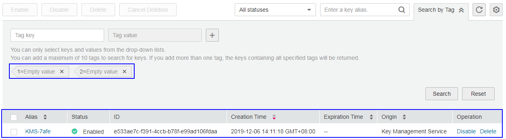

# Searching for Tags

## Scenario

This section describes how to search for tags through KMS. You can search for tags of all CMKs that meet the search criteria in the current project.

## Prerequisites

-   You have obtained an account and its password for logging in to the management console.
-   Tags have been added.

## Procedure

1.  Log in to the management console.
2.  Click    in the upper left corner of the management console and select a region or project.
3.  Choose  **Security**  \>  **Key Management Service**. The  **Key Management Service**  page is displayed.
4.  Click  **Search by Tag**  to show the search box, as shown in  [Figure 1](#fig12211629175812).

    **Figure  1**  Searching for tags  
    

5.  In the search box, enter the tag key and tag value.
6.  Click    to add the input to the search criteria, and click  **Search**. The list displays the CMKs that meet the search criteria, as shown in  [Figure 2](#fig10181104794619).

    **Figure  2**  Search results  
    

    > **NOTE:**   
    >-   Multiple tags can be added at one search. A maximum of 10 tags can be added for one search. If multiple tags are searched for at one time, only CMKs meet the combined search criteria will be displayed in the search result.  
    >-   If you want to delete an added tag from the search criteria, click    next to the tag.  
    >-   You can click  **Reset**  to reset the search criteria.  

