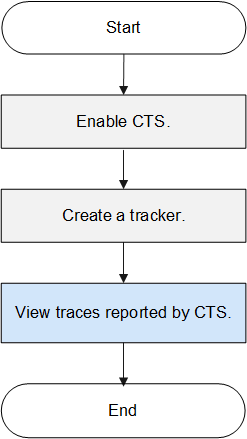
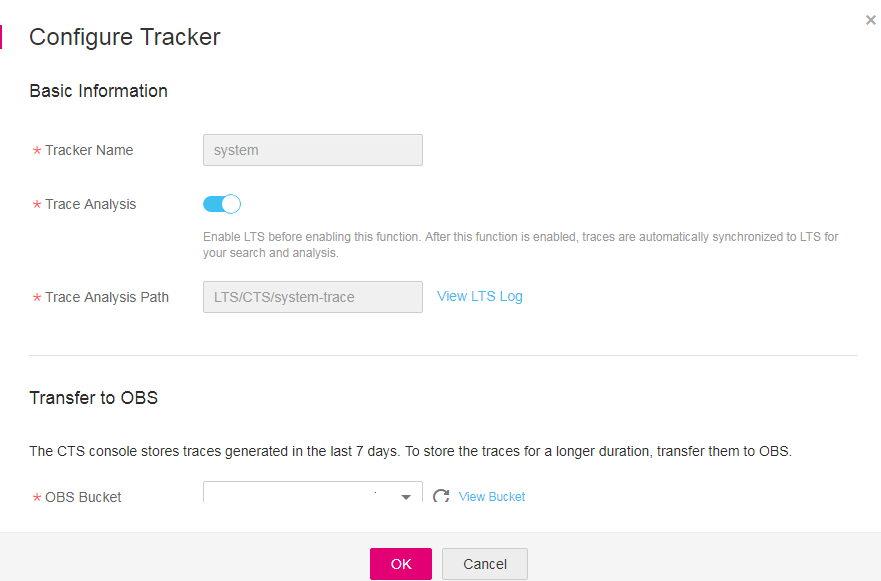
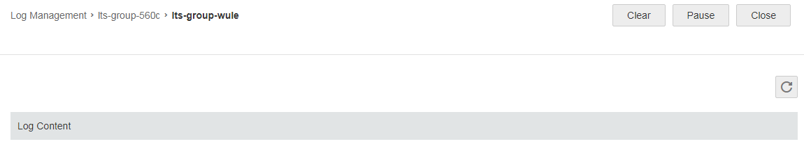

# Configuring CTS to Upload Traces to LTS

## Scenarios

This section describes how to enable the trace analysis function on the Cloud Trace Service \(CTS\) console to report traces to Log Tank Service \(LTS\) so that you can query the traces on the LTS console.

## Operation process

**Figure  1**  Flowchart  

Operations in  [Figure 1](#fig1610211279519)  are performed on different consoles:

1.  CTS console: Enabling CTS and creating and configuring a tracker

1.  LTS console: Viewing traces reported by CTS

## Enabling CTS

You can perform the following operations to enable CTS and create a tracker.

1.  Log in to the management console.
2.  In the upper left corner of the management console, select the target region and project.
3.  Click  **Service List**  and choose  **Management & Deployment**  \>  **Cloud Trace Service**.
4.  In the navigation pane on the left, choose  **Tracker**.
5.  On the  **Tracker**  page, click  **Enable CTS**.
6.  On the displayed page, set  [OBS Bucket](creating-a-log-transfer-task.md).

    **Figure  2**  Enabling CTS  
    

7.  Click  **OK**.

    After you enable CTS, tracker  **system**  is automatically created. All recorded traces are associated with the tracker.

    Currently, only one tracker can be created for each account.

## Configuring the Tracker

You can perform the following operations to enable the trace analysis function, thus reporting CTS traces to LTS.

1.  On the  **Tracker**  page, click  **Configure**  in the  **Operation**  column.

    The  **Configure Tracker**  page is displayed.

2.  On the displayed page, enable  **Trace Analysis**.

    **Figure  3**  Configuring a tracker  
    

    > **NOTE:**   
    >During CTS trace reporting, the system automatically creates a log group and a log topic on the LTS console.  

3.  Click  **OK**.

## Viewing Logs in Real Time

You can perform the following operations to view logs reported by CTS:

1.  Click  **Service List**  and choose  **Management & Deployment**  \>  **Log Tank Service**.
2.  In the log group list, click the name of the target log group.
3.  In the log topic list, locate the target log topic and click  **View**  in the  **Operation**  column.

    **Figure  4**  Viewing logs in real time  
    

    Logs are reported to LTS every 10 minutes. In the log display area, you may wait for at most 10 minutes to view the logs.

    In addition, you can customize log display by clicking  **Clear**,  **Pause**, or  **Close**  in the upper right corner.

    **Figure  5**  Log display area  
    

    -   **Clear**: clears all logs that are displayed in the log display area.
    -   **Pause**: pauses the real-time log display so that you can view details of the displayed logs.

        After you click  **Pause**, the button changes to  **Continue**. You can click  **Continue**  to resume the log display.

    -   **Close**: closes the real-time log view page. You are redirected to the  **Log Topic List **page.

