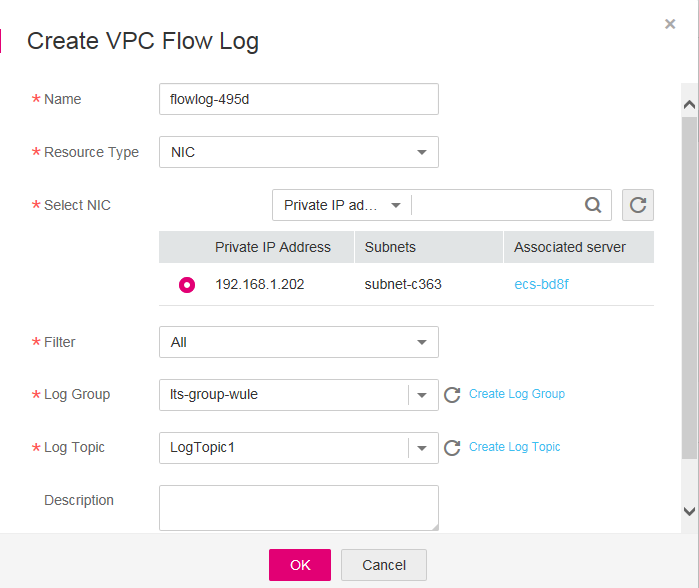
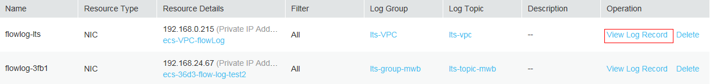

# Configuring the VPC Flow Log Function<a name="lts_01_0009"></a>

## Scenarios<a name="section12968185213249"></a>

A Virtual Private Cloud \(VPC\) flow log captures information about the traffic going to and from your VPC. You can use flow logs to monitor network traffic, analyze network attacks, and determine whether security groups and firewall rules need to be modified.

To obtain traffic details of VPC Network Interface Cards \(NICs\), you can enable Log Tank Service \(LTS\) and view logs about the NICs on the LTS console.

This section describes how to create a VPC flow log to report logs to LTS.

## Constraints<a name="section58159301573"></a>

-   A VPC is available.
-   Currently, only C3, CC3, and P2 ECSs are supported.

## Operation Process<a name="section950534918297"></a>

**Figure  1**  Flowchart<a name="fig14917812017"></a>  


Operations in  [Figure 1](#fig14917812017)  are performed on different consoles:

-   LTS console: Creating a log group and creating a log topic.
-   VPC console: Creating a VPC flow log and viewing the flow log.

## Creating a Log Group<a name="section176098385295"></a>

1.  Log in to the management console.
2.  In the upper left corner of the management console, select the target region and project.
3.  Click  **Service List**  and choose  **Management & Deployment**  \>  **Log Tank Service**.

    **Figure  2**  Log management<a name="fig3974114194720"></a>  
    

4.  On the  **Log Management**  page, click  **Create Log Group**.

    **Figure  3**  Creating a log group<a name="fig17334722174915"></a>  
    

5.  On the displayed page, enter a log group name.

    **Table  1**  Parameter description

    <a name="tc4e92c47af3a47f7b69cba1439248224"></a>
    <table><thead align="left"><tr id="r15344338a4e74dd0a45b85428a12cc7f"><th class="cellrowborder" valign="top" width="17.1%" id="mcps1.2.4.1.1"><p id="aa487841208374399aaedd5154775c1d5"><a name="aa487841208374399aaedd5154775c1d5"></a><a name="aa487841208374399aaedd5154775c1d5"></a><strong id="b84235270610452"><a name="b84235270610452"></a><a name="b84235270610452"></a>Parameter</strong></p>
    </th>
    <th class="cellrowborder" valign="top" width="63.160000000000004%" id="mcps1.2.4.1.2"><p id="ae52d0994d40646cb8c8c30ac095434cb"><a name="ae52d0994d40646cb8c8c30ac095434cb"></a><a name="ae52d0994d40646cb8c8c30ac095434cb"></a><strong id="b84235270681846"><a name="b84235270681846"></a><a name="b84235270681846"></a>Description</strong></p>
    </th>
    <th class="cellrowborder" valign="top" width="19.74%" id="mcps1.2.4.1.3"><p id="a23cef20415544798acbf584dc1412a69"><a name="a23cef20415544798acbf584dc1412a69"></a><a name="a23cef20415544798acbf584dc1412a69"></a><strong id="b623545212478"><a name="b623545212478"></a><a name="b623545212478"></a>Example Value</strong></p>
    </th>
    </tr>
    </thead>
    <tbody><tr id="rfb6e3052f90244c88657c4634d4e6c3a"><td class="cellrowborder" valign="top" width="17.1%" headers="mcps1.2.4.1.1 "><p id="aad79aafef1044ab5ac14f95a1608a13f"><a name="aad79aafef1044ab5ac14f95a1608a13f"></a><a name="aad79aafef1044ab5ac14f95a1608a13f"></a>Log Group Name</p>
    </td>
    <td class="cellrowborder" valign="top" width="63.160000000000004%" headers="mcps1.2.4.1.2 "><p id="a85abdc81ab8744b69765ad68746d242f"><a name="a85abdc81ab8744b69765ad68746d242f"></a><a name="a85abdc81ab8744b69765ad68746d242f"></a>Specifies the log group name which must be globally unique. The configuration rules are as follows:</p>
    <a name="u171738f158ec47de86f1dcc16cd98255"></a><a name="u171738f158ec47de86f1dcc16cd98255"></a><ul id="u171738f158ec47de86f1dcc16cd98255"><li>Must be a string of 1 to 64 characters.</li><li>Only allows uppercase and lowercase letters, digits, underscores (_), hyphens (-), and periods (.). The name cannot start or end with a period.</li></ul>
    </td>
    <td class="cellrowborder" valign="top" width="19.74%" headers="mcps1.2.4.1.3 "><p id="p7805113317136"><a name="p7805113317136"></a><a name="p7805113317136"></a>lts-group-wule</p>
    </td>
    </tr>
    <tr id="r729e5c09ff0c4d41a7881000dcc22c36"><td class="cellrowborder" valign="top" width="17.1%" headers="mcps1.2.4.1.1 "><p id="a4803a0ee93784f33838604c63f348fbf"><a name="a4803a0ee93784f33838604c63f348fbf"></a><a name="a4803a0ee93784f33838604c63f348fbf"></a>Log Retention Duration</p>
    </td>
    <td class="cellrowborder" valign="top" width="63.160000000000004%" headers="mcps1.2.4.1.2 "><p id="a5ff74668638040b4bfb8f6d997ca719a"><a name="a5ff74668638040b4bfb8f6d997ca719a"></a><a name="a5ff74668638040b4bfb8f6d997ca719a"></a>Specifies the time period, in the unit of days, of storing logs in the LTS database. The default retention period for logs is seven days. Any logs stored longer than the retention period will be deleted.</p>
    </td>
    <td class="cellrowborder" valign="top" width="19.74%" headers="mcps1.2.4.1.3 "><p id="a57255dddf6444d1c88d9c7757726711b"><a name="a57255dddf6444d1c88d9c7757726711b"></a><a name="a57255dddf6444d1c88d9c7757726711b"></a>7</p>
    </td>
    </tr>
    </tbody>
    </table>

6.  Click  **OK**.

## Creating a Log Topic<a name="section1261914912293"></a>

To create a log topic in the log group, perform the following operations:

1.  Log in to the management console.
2.  In the upper left corner of the management console, select the target region and project.
3.  Click  **Service List**  and choose  **Management & Deployment**  \>  **Log Tank Service**.

1.  In the log group list, click the name of the target log group.

    **Figure  4**  Log topic list<a name="fig9481122918517"></a>  
    

2.  On the displayed page, click  **Create Log Topic**.

    **Figure  5**  Creating a log topic<a name="fig148168102112"></a>  
    

3.  On the displayed page, enter a name.

    **Table  2**  Parameter description

    <a name="tec8380f8cf2f409595baef93c3cea7d2"></a>
    <table><thead align="left"><tr id="r066e26ab18654808b1c93257dfc8b47f"><th class="cellrowborder" valign="top" width="18.951895189518954%" id="mcps1.2.4.1.1"><p id="ad7e5abb209404db5b547f03ef29eda85"><a name="ad7e5abb209404db5b547f03ef29eda85"></a><a name="ad7e5abb209404db5b547f03ef29eda85"></a><strong id="b171790588528"><a name="b171790588528"></a><a name="b171790588528"></a>Parameter</strong></p>
    </th>
    <th class="cellrowborder" valign="top" width="62.59625962596259%" id="mcps1.2.4.1.2"><p id="a0a3d258072084d5797f89fa4f30bf65f"><a name="a0a3d258072084d5797f89fa4f30bf65f"></a><a name="a0a3d258072084d5797f89fa4f30bf65f"></a><strong id="b687916335"><a name="b687916335"></a><a name="b687916335"></a>Description</strong></p>
    </th>
    <th class="cellrowborder" valign="top" width="18.45184518451845%" id="mcps1.2.4.1.3"><p id="p513310529412"><a name="p513310529412"></a><a name="p513310529412"></a><strong id="b10579120105311"><a name="b10579120105311"></a><a name="b10579120105311"></a>Example Value</strong></p>
    </th>
    </tr>
    </thead>
    <tbody><tr id="rdd3f317244eb472ab6080aa57e924d84"><td class="cellrowborder" valign="top" width="18.951895189518954%" headers="mcps1.2.4.1.1 "><p id="ae51963c4b0a44e6b95c48775a2ec9a93"><a name="ae51963c4b0a44e6b95c48775a2ec9a93"></a><a name="ae51963c4b0a44e6b95c48775a2ec9a93"></a>Log Topic Name</p>
    </td>
    <td class="cellrowborder" valign="top" width="62.59625962596259%" headers="mcps1.2.4.1.2 "><p id="ae7552ec5f29b4af9b0ceb23ca7befc5a"><a name="ae7552ec5f29b4af9b0ceb23ca7befc5a"></a><a name="ae7552ec5f29b4af9b0ceb23ca7befc5a"></a>Specifies the log topic name. The name must be unique in a log group. The configuration rules are as follows:</p>
    <a name="ul16409171764511"></a><a name="ul16409171764511"></a><ul id="ul16409171764511"><li>Must be a string of 1 to 64 characters.</li><li>Only allows uppercase and lowercase letters, digits, underscores (_), hyphens (-), and periods (.). The name cannot start or end with a period.</li></ul>
    </td>
    <td class="cellrowborder" valign="top" width="18.45184518451845%" headers="mcps1.2.4.1.3 "><p id="p34907356539"><a name="p34907356539"></a><a name="p34907356539"></a>LogTopic1</p>
    </td>
    </tr>
    </tbody>
    </table>

4.  Click  **OK**.

## Creating a VPC Flow Log<a name="section1996205712919"></a>

1.  Log in to the management console.
2.  In the upper left corner of the management console, select the target region and project.
3.  Choose  **Service List**  \>  **Network**  \>  **Virtual Private Cloud**.
4.  In the navigation pane on the left, choose  **VPC Flow Logs**.
5.  In the upper right corner, click  **Create VPC Flow Log**. On the displayed page, configure parameters as prompted.

    **Figure  6**  Creating a VPC flow log<a name="fd4dc29a8a453411186a545afff99a78c"></a>  
    

    **Table  3**  Parameter description

    <a name="t277be2f7c3314fcaa69382ba736045e9"></a>
    <table><thead align="left"><tr id="r4fa59ee1a83043e69134ea32e51ad933"><th class="cellrowborder" valign="top" width="19.24%" id="mcps1.2.4.1.1"><p id="en-us_topic_0151016581_p234731711214"><a name="en-us_topic_0151016581_p234731711214"></a><a name="en-us_topic_0151016581_p234731711214"></a><strong id="b51784514412"><a name="b51784514412"></a><a name="b51784514412"></a>Parameter</strong></p>
    </th>
    <th class="cellrowborder" valign="top" width="55.7%" id="mcps1.2.4.1.2"><p id="en-us_topic_0151016581_p934711715210"><a name="en-us_topic_0151016581_p934711715210"></a><a name="en-us_topic_0151016581_p934711715210"></a><strong id="b1845148132"><a name="b1845148132"></a><a name="b1845148132"></a>Description</strong></p>
    </th>
    <th class="cellrowborder" valign="top" width="25.06%" id="mcps1.2.4.1.3"><p id="en-us_topic_0151016581_p23473171214"><a name="en-us_topic_0151016581_p23473171214"></a><a name="en-us_topic_0151016581_p23473171214"></a><strong id="b181703114516"><a name="b181703114516"></a><a name="b181703114516"></a>Example Value</strong></p>
    </th>
    </tr>
    </thead>
    <tbody><tr id="rc038158b404a48cfa49167824e36fb03"><td class="cellrowborder" valign="top" width="19.24%" headers="mcps1.2.4.1.1 "><p id="en-us_topic_0151016581_p63477171520"><a name="en-us_topic_0151016581_p63477171520"></a><a name="en-us_topic_0151016581_p63477171520"></a>Name</p>
    </td>
    <td class="cellrowborder" valign="top" width="55.7%" headers="mcps1.2.4.1.2 "><p id="en-us_topic_0151016581_p0347817222"><a name="en-us_topic_0151016581_p0347817222"></a><a name="en-us_topic_0151016581_p0347817222"></a>Specifies the VPC flow log name.</p>
    <p id="a4facfed772d545c68774c7de5c15c34b"><a name="a4facfed772d545c68774c7de5c15c34b"></a><a name="a4facfed772d545c68774c7de5c15c34b"></a>The VPC flow log name can contain a maximum of 64 characters, which may consist of letters, digits, underscores (_), hyphens (-), and periods (.). The name cannot contain spaces.</p>
    </td>
    <td class="cellrowborder" valign="top" width="25.06%" headers="mcps1.2.4.1.3 "><p id="adc2198e9534b4f009631eb2d5f519b76"><a name="adc2198e9534b4f009631eb2d5f519b76"></a><a name="adc2198e9534b4f009631eb2d5f519b76"></a>flowlog-495d</p>
    </td>
    </tr>
    <tr id="rb87d56b8e3ce464588a4c05d6b5f34da"><td class="cellrowborder" valign="top" width="19.24%" headers="mcps1.2.4.1.1 "><p id="a8dc76867ffaf44f9aac8b3999dc11e77"><a name="a8dc76867ffaf44f9aac8b3999dc11e77"></a><a name="a8dc76867ffaf44f9aac8b3999dc11e77"></a>Resource Type</p>
    </td>
    <td class="cellrowborder" valign="top" width="55.7%" headers="mcps1.2.4.1.2 "><p id="en-us_topic_0151016581_p834721711219"><a name="en-us_topic_0151016581_p834721711219"></a><a name="en-us_topic_0151016581_p834721711219"></a>Specifies the type of resources whose traffic is to be logged. Currently, <strong id="b12174172815610"><a name="b12174172815610"></a><a name="b12174172815610"></a>Resource Type</strong> can only be <strong id="b917418284611"><a name="b917418284611"></a><a name="b917418284611"></a>NIC</strong>.</p>
    </td>
    <td class="cellrowborder" valign="top" width="25.06%" headers="mcps1.2.4.1.3 "><p id="en-us_topic_0151016581_p6347317525"><a name="en-us_topic_0151016581_p6347317525"></a><a name="en-us_topic_0151016581_p6347317525"></a>NIC</p>
    </td>
    </tr>
    <tr id="r679721f6a29c462888e85d65ee2f6d55"><td class="cellrowborder" valign="top" width="19.24%" headers="mcps1.2.4.1.1 "><p id="en-us_topic_0151016581_p53471517126"><a name="en-us_topic_0151016581_p53471517126"></a><a name="en-us_topic_0151016581_p53471517126"></a>Select NIC</p>
    </td>
    <td class="cellrowborder" valign="top" width="55.7%" headers="mcps1.2.4.1.2 "><p id="en-us_topic_0151016581_p143471917921"><a name="en-us_topic_0151016581_p143471917921"></a><a name="en-us_topic_0151016581_p143471917921"></a>Specifies the specific NIC whose traffic is to be logged. You can select only one NIC.</p>
    </td>
    <td class="cellrowborder" valign="top" width="25.06%" headers="mcps1.2.4.1.3 "><p id="en-us_topic_0151016581_p4347517128"><a name="en-us_topic_0151016581_p4347517128"></a><a name="en-us_topic_0151016581_p4347517128"></a>-</p>
    </td>
    </tr>
    <tr id="r62e2ec6856084095a56090f5a950ef77"><td class="cellrowborder" valign="top" width="19.24%" headers="mcps1.2.4.1.1 "><p id="en-us_topic_0151016581_p934719178215"><a name="en-us_topic_0151016581_p934719178215"></a><a name="en-us_topic_0151016581_p934719178215"></a>Filter</p>
    </td>
    <td class="cellrowborder" valign="top" width="55.7%" headers="mcps1.2.4.1.2 "><a name="ua24af925f4d944f7a170bb763a3a38db"></a><a name="ua24af925f4d944f7a170bb763a3a38db"></a><ul id="ua24af925f4d944f7a170bb763a3a38db"><li><strong id="b128416441167"><a name="b128416441167"></a><a name="b128416441167"></a>All</strong>: specifies that both accepted and rejected traffic of the specified resource will be logged.</li><li><strong id="b1649865115611"><a name="b1649865115611"></a><a name="b1649865115611"></a>Accepted traffic</strong>: specifies that only accepted traffic of the specified resource will be logged. Accepted traffic refers to the traffic permitted by the security group or firewall.</li><li><strong id="b7251359663"><a name="b7251359663"></a><a name="b7251359663"></a>Rejected traffic</strong>: specifies that only rejected traffic of the specified resource will be logged. Rejected traffic refers to the traffic not permitted by the firewall.</li></ul>
    </td>
    <td class="cellrowborder" valign="top" width="25.06%" headers="mcps1.2.4.1.3 "><p id="en-us_topic_0151016581_p93471617626"><a name="en-us_topic_0151016581_p93471617626"></a><a name="en-us_topic_0151016581_p93471617626"></a>All</p>
    </td>
    </tr>
    <tr id="re99805ed289a4bb0a94ea17338ffd194"><td class="cellrowborder" valign="top" width="19.24%" headers="mcps1.2.4.1.1 "><p id="en-us_topic_0151016581_p734771710219"><a name="en-us_topic_0151016581_p734771710219"></a><a name="en-us_topic_0151016581_p734771710219"></a>Log Group</p>
    </td>
    <td class="cellrowborder" valign="top" width="55.7%" headers="mcps1.2.4.1.2 "><p id="ac784e22085df4fa7882e987444c5e7e2"><a name="ac784e22085df4fa7882e987444c5e7e2"></a><a name="ac784e22085df4fa7882e987444c5e7e2"></a>Specifies the log group created in LTS.</p>
    </td>
    <td class="cellrowborder" valign="top" width="25.06%" headers="mcps1.2.4.1.3 "><p id="p1647111591615"><a name="p1647111591615"></a><a name="p1647111591615"></a>lts-group-wule</p>
    </td>
    </tr>
    <tr id="rfc8c9980096f44c282de4bd992709f80"><td class="cellrowborder" valign="top" width="19.24%" headers="mcps1.2.4.1.1 "><p id="en-us_topic_0151016581_p133476171224"><a name="en-us_topic_0151016581_p133476171224"></a><a name="en-us_topic_0151016581_p133476171224"></a>Log Topic</p>
    </td>
    <td class="cellrowborder" valign="top" width="55.7%" headers="mcps1.2.4.1.2 "><p id="a1c3e78fe4fae4e03a99af38b22428c5c"><a name="a1c3e78fe4fae4e03a99af38b22428c5c"></a><a name="a1c3e78fe4fae4e03a99af38b22428c5c"></a>Specifies the log topic created in LTS.</p>
    </td>
    <td class="cellrowborder" valign="top" width="25.06%" headers="mcps1.2.4.1.3 "><p id="p42009151827"><a name="p42009151827"></a><a name="p42009151827"></a>LogTopic1</p>
    </td>
    </tr>
    <tr id="re2418e49e6024e54931b5953460643a8"><td class="cellrowborder" valign="top" width="19.24%" headers="mcps1.2.4.1.1 "><p id="en-us_topic_0151016581_p113471171229"><a name="en-us_topic_0151016581_p113471171229"></a><a name="en-us_topic_0151016581_p113471171229"></a>Description</p>
    </td>
    <td class="cellrowborder" valign="top" width="55.7%" headers="mcps1.2.4.1.2 "><p id="en-us_topic_0151016581_p43473171124"><a name="en-us_topic_0151016581_p43473171124"></a><a name="en-us_topic_0151016581_p43473171124"></a>Provides supplementary information about the VPC flow log. This parameter is optional.</p>
    <p id="ad1b06fc6396947c0b65e77f4b6ce328b"><a name="ad1b06fc6396947c0b65e77f4b6ce328b"></a><a name="ad1b06fc6396947c0b65e77f4b6ce328b"></a>The VPC flow log description can contain a maximum of 255 characters and cannot contain angle brackets (&lt; or &gt;).</p>
    </td>
    <td class="cellrowborder" valign="top" width="25.06%" headers="mcps1.2.4.1.3 "><p id="a125d440a1c974d63a9840877402e5335"><a name="a125d440a1c974d63a9840877402e5335"></a><a name="a125d440a1c974d63a9840877402e5335"></a>-</p>
    </td>
    </tr>
    </tbody>
    </table>

6.  Click  **OK**.

## Viewing a VPC Flow Log<a name="section541514571089"></a>

The capture window is approximately 10 minutes, which indicates that a flow log record will be generated every 10 minutes. After creating a VPC flow log, you need to wait about 10 minutes before you can view the flow log record.

1.  Log in to the management console.
2.  In the upper left corner of the management console, select the target region and project.
3.  Choose  **Service List**  \>  **Network**  \>  **Virtual Private Cloud**.
4.  In the navigation pane on the left, choose  **VPC Flow Logs**.
5.  Locate the target VPC flow log and click  **View Log Record**  in the  **Operation**  column to view information about the flow log record in LTS.

    **Figure  7**  Viewing a log record<a name="f304ba9ddd96b41eeb27374ae1f9218e2"></a>  
    

    **Figure  8**  Viewing details of a log record<a name="en-us_topic_0151016582_fig8284117387"></a>  
    

    The flow log record is in the following format:

    ```
    <version> <project-id> <interface-id> <srcaddr> <dstaddr> <srcport> <dstport> <protocol> <packets> <bytes> <start> <end> <action> <log-status>
    ```

    Example 1: The following is an example of a flow log record in which traffic was allowed during the capture window:

    ```
    1 5f67944957444bd6bb4fe3b367de8f3d 1d515d18-1b36-47dc-a983-bd6512aed4bd 192.168.0.154 192.168.3.25 38929 53 17 1 96 1548752136 1548752736 ACCEPT OK
    ```

    Value  **1**  indicates the VPC flow log version. Traffic with a size of 96 bytes to NIC  **1d515d18-1b36-47dc-a983-bd6512aed4bd**  during the past 10 minutes \(from 16:55:36 to 17:05:36 on January 29, 2019\) was allowed. A data packet was transmitted over the UDP protocol from source IP address  **192.168.0.154**  and port  **38929**  to destination IP address  **192.168.3.25**  and port  **53**.

    Example 2: The following is an example of a flow log record in which no data was recorded during the capture window:

    ```
    1 5f67944957444bd6bb4fe3b367de8f3d 1d515d18-1b36-47dc-a983-bd6512aed4bd - - - - - - - 1431280876 1431280934 - NODATA
    ```

    Example 3: The following is an example of a flow log record in which records were skipped during the capture window:

    ```
    1 5f67944957444bd6bb4fe3b367de8f3d 1d515d18-1b36-47dc-a983-bd6512aed4bd - - - - - - - 1431280876 1431280934 - SKIPDATA
    ```

    [Table 4](#t9a4cf19ba62a45f0ac75fd5bebea45c6)  describes the fields of a flow log record.

    **Table  4**  Log field description

    <a name="t9a4cf19ba62a45f0ac75fd5bebea45c6"></a>
    <table><thead align="left"><tr id="rca25436b6bb64063b9538532b1c03c93"><th class="cellrowborder" valign="top" width="21.25%" id="mcps1.2.4.1.1"><p id="a8756e87ec1ca4eb7bf5be8f9daee7808"><a name="a8756e87ec1ca4eb7bf5be8f9daee7808"></a><a name="a8756e87ec1ca4eb7bf5be8f9daee7808"></a><strong id="a2244c7525f7d4d30bc37329f1933142a"><a name="a2244c7525f7d4d30bc37329f1933142a"></a><a name="a2244c7525f7d4d30bc37329f1933142a"></a>Field</strong></p>
    </th>
    <th class="cellrowborder" valign="top" width="38.29%" id="mcps1.2.4.1.2"><p id="en-us_topic_0151016582_p313821712314"><a name="en-us_topic_0151016582_p313821712314"></a><a name="en-us_topic_0151016582_p313821712314"></a><strong id="ae46015ca168c44979b03044524d8103b"><a name="ae46015ca168c44979b03044524d8103b"></a><a name="ae46015ca168c44979b03044524d8103b"></a>Description</strong></p>
    </th>
    <th class="cellrowborder" valign="top" width="40.46%" id="mcps1.2.4.1.3"><p id="a22031de109c54a48bd9192713c3afef2"><a name="a22031de109c54a48bd9192713c3afef2"></a><a name="a22031de109c54a48bd9192713c3afef2"></a><strong id="a7bb3f24a6cef4870ac30b4a5ecf9c88a"><a name="a7bb3f24a6cef4870ac30b4a5ecf9c88a"></a><a name="a7bb3f24a6cef4870ac30b4a5ecf9c88a"></a>Example Value</strong></p>
    </th>
    </tr>
    </thead>
    <tbody><tr id="r794596d5afc84eb7a8ee73e457d201e2"><td class="cellrowborder" valign="top" width="21.25%" headers="mcps1.2.4.1.1 "><p id="abdbf3c19b63d480696c7e8a7f177f716"><a name="abdbf3c19b63d480696c7e8a7f177f716"></a><a name="abdbf3c19b63d480696c7e8a7f177f716"></a>version</p>
    </td>
    <td class="cellrowborder" valign="top" width="38.29%" headers="mcps1.2.4.1.2 "><p id="aff53492928e24de286a38de942fe3f98"><a name="aff53492928e24de286a38de942fe3f98"></a><a name="aff53492928e24de286a38de942fe3f98"></a>Specifies the VPC flow log version.</p>
    </td>
    <td class="cellrowborder" valign="top" width="40.46%" headers="mcps1.2.4.1.3 "><p id="en-us_topic_0151016582_p181383178234"><a name="en-us_topic_0151016582_p181383178234"></a><a name="en-us_topic_0151016582_p181383178234"></a>1</p>
    </td>
    </tr>
    <tr id="r7a9069ccc7f54199b34129318f8a4c55"><td class="cellrowborder" valign="top" width="21.25%" headers="mcps1.2.4.1.1 "><p id="en-us_topic_0151016582_p813814175238"><a name="en-us_topic_0151016582_p813814175238"></a><a name="en-us_topic_0151016582_p813814175238"></a>project-id</p>
    </td>
    <td class="cellrowborder" valign="top" width="38.29%" headers="mcps1.2.4.1.2 "><p id="aeb3030d885f04f23969fa386bcd3c9f7"><a name="aeb3030d885f04f23969fa386bcd3c9f7"></a><a name="aeb3030d885f04f23969fa386bcd3c9f7"></a>Specifies the project ID.</p>
    </td>
    <td class="cellrowborder" valign="top" width="40.46%" headers="mcps1.2.4.1.3 "><p id="en-us_topic_0151016582_p41383177232"><a name="en-us_topic_0151016582_p41383177232"></a><a name="en-us_topic_0151016582_p41383177232"></a>5f67944957444bd6bb4fe3b367de8f3d</p>
    </td>
    </tr>
    <tr id="rd2de18afa22a4308870e986456f2af9d"><td class="cellrowborder" valign="top" width="21.25%" headers="mcps1.2.4.1.1 "><p id="a8429c2f1531540658c2b5c43cf328073"><a name="a8429c2f1531540658c2b5c43cf328073"></a><a name="a8429c2f1531540658c2b5c43cf328073"></a>interface-id</p>
    </td>
    <td class="cellrowborder" valign="top" width="38.29%" headers="mcps1.2.4.1.2 "><p id="a91d6c6acb77c47c5b4c2f20b2b69e78f"><a name="a91d6c6acb77c47c5b4c2f20b2b69e78f"></a><a name="a91d6c6acb77c47c5b4c2f20b2b69e78f"></a>Specifies the ID of the NIC for which the traffic is recorded.</p>
    </td>
    <td class="cellrowborder" valign="top" width="40.46%" headers="mcps1.2.4.1.3 "><p id="a74ce1d9f237f487d97d6f4cbc42c6169"><a name="a74ce1d9f237f487d97d6f4cbc42c6169"></a><a name="a74ce1d9f237f487d97d6f4cbc42c6169"></a>1d515d18-1b36-47dc-a983-bd6512aed4bd</p>
    </td>
    </tr>
    <tr id="r189e40e298474370a175cf617c7281d2"><td class="cellrowborder" valign="top" width="21.25%" headers="mcps1.2.4.1.1 "><p id="en-us_topic_0151016582_p313851792312"><a name="en-us_topic_0151016582_p313851792312"></a><a name="en-us_topic_0151016582_p313851792312"></a>srcaddr</p>
    </td>
    <td class="cellrowborder" valign="top" width="38.29%" headers="mcps1.2.4.1.2 "><p id="a3eaf3fa625a34a00b8c7f24f28017e56"><a name="a3eaf3fa625a34a00b8c7f24f28017e56"></a><a name="a3eaf3fa625a34a00b8c7f24f28017e56"></a>Specifies the source IP address.</p>
    </td>
    <td class="cellrowborder" valign="top" width="40.46%" headers="mcps1.2.4.1.3 "><p id="en-us_topic_0151016582_p913821715234"><a name="en-us_topic_0151016582_p913821715234"></a><a name="en-us_topic_0151016582_p913821715234"></a>x.x.x.x</p>
    </td>
    </tr>
    <tr id="rfd2764d8108041f591cebe81d9216a7c"><td class="cellrowborder" valign="top" width="21.25%" headers="mcps1.2.4.1.1 "><p id="a402d95ca35384fa08317225a50eef868"><a name="a402d95ca35384fa08317225a50eef868"></a><a name="a402d95ca35384fa08317225a50eef868"></a>dstaddr</p>
    </td>
    <td class="cellrowborder" valign="top" width="38.29%" headers="mcps1.2.4.1.2 "><p id="af915b908f7314fb4982fefb95824c9d1"><a name="af915b908f7314fb4982fefb95824c9d1"></a><a name="af915b908f7314fb4982fefb95824c9d1"></a>Specifies the destination IP address.</p>
    </td>
    <td class="cellrowborder" valign="top" width="40.46%" headers="mcps1.2.4.1.3 "><p id="a6f750aafd89d48cf929c08cd3c3446b1"><a name="a6f750aafd89d48cf929c08cd3c3446b1"></a><a name="a6f750aafd89d48cf929c08cd3c3446b1"></a>x.x.x.x</p>
    </td>
    </tr>
    <tr id="r67e56d44c8fa4a718e2e96a249552213"><td class="cellrowborder" valign="top" width="21.25%" headers="mcps1.2.4.1.1 "><p id="a2956be981ffb4c3a9723c1411b8fb355"><a name="a2956be981ffb4c3a9723c1411b8fb355"></a><a name="a2956be981ffb4c3a9723c1411b8fb355"></a>srcport</p>
    </td>
    <td class="cellrowborder" valign="top" width="38.29%" headers="mcps1.2.4.1.2 "><p id="acd131b82f2a9494eb1c48444bdbd567a"><a name="acd131b82f2a9494eb1c48444bdbd567a"></a><a name="acd131b82f2a9494eb1c48444bdbd567a"></a>Specifies the source port of the traffic.</p>
    </td>
    <td class="cellrowborder" valign="top" width="40.46%" headers="mcps1.2.4.1.3 "><p id="a5100e4370e1e42eaaf391aa55b8c08e2"><a name="a5100e4370e1e42eaaf391aa55b8c08e2"></a><a name="a5100e4370e1e42eaaf391aa55b8c08e2"></a>38929</p>
    </td>
    </tr>
    <tr id="r11f9eaf44c234b4896a1ee6a38114e9f"><td class="cellrowborder" valign="top" width="21.25%" headers="mcps1.2.4.1.1 "><p id="ac305980ce560482cbc579c8b1ce02098"><a name="ac305980ce560482cbc579c8b1ce02098"></a><a name="ac305980ce560482cbc579c8b1ce02098"></a>dstport</p>
    </td>
    <td class="cellrowborder" valign="top" width="38.29%" headers="mcps1.2.4.1.2 "><p id="a1390d5d3f2f54a81b9664a71f1c63b07"><a name="a1390d5d3f2f54a81b9664a71f1c63b07"></a><a name="a1390d5d3f2f54a81b9664a71f1c63b07"></a>Specifies the destination port of the traffic.</p>
    </td>
    <td class="cellrowborder" valign="top" width="40.46%" headers="mcps1.2.4.1.3 "><p id="ae2c326ad214c45bdbfa8715a00ffdb37"><a name="ae2c326ad214c45bdbfa8715a00ffdb37"></a><a name="ae2c326ad214c45bdbfa8715a00ffdb37"></a>53</p>
    </td>
    </tr>
    <tr id="r2e5f7cfaefe148f2a8004e6db517b78c"><td class="cellrowborder" valign="top" width="21.25%" headers="mcps1.2.4.1.1 "><p id="ab8ff93088c3c4e22bbdf6bf52ad6a1df"><a name="ab8ff93088c3c4e22bbdf6bf52ad6a1df"></a><a name="ab8ff93088c3c4e22bbdf6bf52ad6a1df"></a>protocol</p>
    </td>
    <td class="cellrowborder" valign="top" width="38.29%" headers="mcps1.2.4.1.2 "><p id="a3272f91cb5ec43adb64b71737152c861"><a name="a3272f91cb5ec43adb64b71737152c861"></a><a name="a3272f91cb5ec43adb64b71737152c861"></a>Specifies the Internet Assigned Numbers Authority (IANA) protocol number of the traffic. For details, see <span id="text4399555495847"><a name="text4399555495847"></a><a name="text4399555495847"></a>Assigned Internet Protocol Numbers</span>.</p>
    </td>
    <td class="cellrowborder" valign="top" width="40.46%" headers="mcps1.2.4.1.3 "><p id="a1821d9f1481748be8931bd13516ffbf3"><a name="a1821d9f1481748be8931bd13516ffbf3"></a><a name="a1821d9f1481748be8931bd13516ffbf3"></a>17</p>
    </td>
    </tr>
    <tr id="reca0cd03f3e64149abae416511d584fa"><td class="cellrowborder" valign="top" width="21.25%" headers="mcps1.2.4.1.1 "><p id="en-us_topic_0151016582_p113801772317"><a name="en-us_topic_0151016582_p113801772317"></a><a name="en-us_topic_0151016582_p113801772317"></a>packets</p>
    </td>
    <td class="cellrowborder" valign="top" width="38.29%" headers="mcps1.2.4.1.2 "><p id="a2b3828a537a04687b433e365cfd6bf1d"><a name="a2b3828a537a04687b433e365cfd6bf1d"></a><a name="a2b3828a537a04687b433e365cfd6bf1d"></a>Specifies the number of packets transferred during the capture window.</p>
    </td>
    <td class="cellrowborder" valign="top" width="40.46%" headers="mcps1.2.4.1.3 "><p id="a616c99b702654c2ab32541a0f724105a"><a name="a616c99b702654c2ab32541a0f724105a"></a><a name="a616c99b702654c2ab32541a0f724105a"></a>1</p>
    </td>
    </tr>
    <tr id="rd76fb4e45eda4e9185e2d7e6bcfc74d3"><td class="cellrowborder" valign="top" width="21.25%" headers="mcps1.2.4.1.1 "><p id="ad2128ae23a8749b69f02d44e7b17a8b9"><a name="ad2128ae23a8749b69f02d44e7b17a8b9"></a><a name="ad2128ae23a8749b69f02d44e7b17a8b9"></a>bytes</p>
    </td>
    <td class="cellrowborder" valign="top" width="38.29%" headers="mcps1.2.4.1.2 "><p id="en-us_topic_0151016582_p813861716230"><a name="en-us_topic_0151016582_p813861716230"></a><a name="en-us_topic_0151016582_p813861716230"></a>Specifies the number of bytes transferred during the capture window.</p>
    </td>
    <td class="cellrowborder" valign="top" width="40.46%" headers="mcps1.2.4.1.3 "><p id="a31355850b08444b5a75af9aa5c142c29"><a name="a31355850b08444b5a75af9aa5c142c29"></a><a name="a31355850b08444b5a75af9aa5c142c29"></a>96</p>
    </td>
    </tr>
    <tr id="rd7c820059b57414bbfad93e9d792b3aa"><td class="cellrowborder" valign="top" width="21.25%" headers="mcps1.2.4.1.1 "><p id="en-us_topic_0151016582_p71380173233"><a name="en-us_topic_0151016582_p71380173233"></a><a name="en-us_topic_0151016582_p71380173233"></a>start</p>
    </td>
    <td class="cellrowborder" valign="top" width="38.29%" headers="mcps1.2.4.1.2 "><p id="en-us_topic_0151016582_p513841762316"><a name="en-us_topic_0151016582_p513841762316"></a><a name="en-us_topic_0151016582_p513841762316"></a>Specifies the time, in Unix seconds, of the start of the capture window.</p>
    </td>
    <td class="cellrowborder" valign="top" width="40.46%" headers="mcps1.2.4.1.3 "><p id="en-us_topic_0151016582_p61381178236"><a name="en-us_topic_0151016582_p61381178236"></a><a name="en-us_topic_0151016582_p61381178236"></a>1548752136</p>
    </td>
    </tr>
    <tr id="r99979e79d45c464d80d0dc80ebc48649"><td class="cellrowborder" valign="top" width="21.25%" headers="mcps1.2.4.1.1 "><p id="aa5720e7b482342ceaa06ac5b1ae11eef"><a name="aa5720e7b482342ceaa06ac5b1ae11eef"></a><a name="aa5720e7b482342ceaa06ac5b1ae11eef"></a>end</p>
    </td>
    <td class="cellrowborder" valign="top" width="38.29%" headers="mcps1.2.4.1.2 "><p id="a5ff60b64a150447f8e7e40e9d9b15caf"><a name="a5ff60b64a150447f8e7e40e9d9b15caf"></a><a name="a5ff60b64a150447f8e7e40e9d9b15caf"></a>Specifies the time, in Unix seconds, of the end of the capture window.</p>
    </td>
    <td class="cellrowborder" valign="top" width="40.46%" headers="mcps1.2.4.1.3 "><p id="ab9f9c77886824a63ab7d9edf4d2771a2"><a name="ab9f9c77886824a63ab7d9edf4d2771a2"></a><a name="ab9f9c77886824a63ab7d9edf4d2771a2"></a>1548752736</p>
    </td>
    </tr>
    <tr id="r9997fe595b66424e863e919d3244e7fb"><td class="cellrowborder" valign="top" width="21.25%" headers="mcps1.2.4.1.1 "><p id="ab02e3f85b46d4166b8cabbf5f313f541"><a name="ab02e3f85b46d4166b8cabbf5f313f541"></a><a name="ab02e3f85b46d4166b8cabbf5f313f541"></a>action</p>
    </td>
    <td class="cellrowborder" valign="top" width="38.29%" headers="mcps1.2.4.1.2 "><p id="a5afba28a841948b99ea13e3c200595dd"><a name="a5afba28a841948b99ea13e3c200595dd"></a><a name="a5afba28a841948b99ea13e3c200595dd"></a>Specifies the action associated with the traffic:</p>
    <a name="u602e13e35f344346ad17ae14f0d1b3f2"></a><a name="u602e13e35f344346ad17ae14f0d1b3f2"></a><ul id="u602e13e35f344346ad17ae14f0d1b3f2"><li><strong id="en-us_topic_0151016582_b460717481811"><a name="en-us_topic_0151016582_b460717481811"></a><a name="en-us_topic_0151016582_b460717481811"></a>ACCEPT</strong>: The recorded traffic was permitted by the security group or firewall.</li><li><strong id="abaf44706308f41f5be087879ea8d9f53"><a name="abaf44706308f41f5be087879ea8d9f53"></a><a name="abaf44706308f41f5be087879ea8d9f53"></a>REJECT</strong>: The recorded traffic was not permitted by the firewall.</li></ul>
    </td>
    <td class="cellrowborder" valign="top" width="40.46%" headers="mcps1.2.4.1.3 "><p id="a5fd9d5fa16f34e59afe086917cd5d2c5"><a name="a5fd9d5fa16f34e59afe086917cd5d2c5"></a><a name="a5fd9d5fa16f34e59afe086917cd5d2c5"></a>ACCEPT</p>
    </td>
    </tr>
    <tr id="r2b8fccb1e6d84b30bb195f0766753886"><td class="cellrowborder" valign="top" width="21.25%" headers="mcps1.2.4.1.1 "><p id="en-us_topic_0151016582_p91383171236"><a name="en-us_topic_0151016582_p91383171236"></a><a name="en-us_topic_0151016582_p91383171236"></a>log-status</p>
    </td>
    <td class="cellrowborder" valign="top" width="38.29%" headers="mcps1.2.4.1.2 "><p id="a5144a05a44974d0bb7ab0064941e6ac1"><a name="a5144a05a44974d0bb7ab0064941e6ac1"></a><a name="a5144a05a44974d0bb7ab0064941e6ac1"></a>Specifies the logging status of the VPC flow log:</p>
    <a name="u4a25ef326df04914835f6cdc5841e806"></a><a name="u4a25ef326df04914835f6cdc5841e806"></a><ul id="u4a25ef326df04914835f6cdc5841e806"><li><strong id="en-us_topic_0151016582_b54661210129"><a name="en-us_topic_0151016582_b54661210129"></a><a name="en-us_topic_0151016582_b54661210129"></a>OK</strong>: Data is logging normally to the chosen destinations.</li><li><strong id="a6f641cfc0fe84ec1bf52581e6233c517"><a name="a6f641cfc0fe84ec1bf52581e6233c517"></a><a name="a6f641cfc0fe84ec1bf52581e6233c517"></a>NODATA</strong>: There was no network traffic to or from the NIC during the capture window.</li><li><strong id="en-us_topic_0151016582_b44741312212"><a name="en-us_topic_0151016582_b44741312212"></a><a name="en-us_topic_0151016582_b44741312212"></a>SKIPDATA</strong>: Some flow log records were skipped during the capture window. This may be caused by an internal capacity constraint or an internal error.</li></ul>
    </td>
    <td class="cellrowborder" valign="top" width="40.46%" headers="mcps1.2.4.1.3 "><p id="a389c228847fd44518104da7ea72cf984"><a name="a389c228847fd44518104da7ea72cf984"></a><a name="a389c228847fd44518104da7ea72cf984"></a>OK</p>
    </td>
    </tr>
    </tbody>
    </table>

    You can enter a keyword on the log topic details page on the LTS console to search for flow log records.


