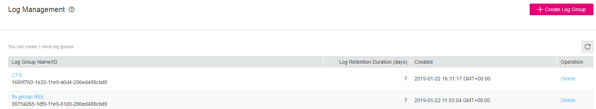

# Creating a Log Group

## Scenarios

This section describes how to create a log group. You can create a maximum of 100 log groups in a region.

## Prerequisites

You have obtained a username and password for logging in to the management console.

## Procedure

1.  Log in to the management console.
2.  In the upper left corner of the management console, select the target region and project.
3.  Click  **Service List**  and choose  **Management & Deployment**  \>  **Log Tank Service**.

    **Figure  1**  Log management  
    

4.  Click  **Create Log Group**.

    **Figure  2**  Creating a log group  
    

5.  On the displayed page, enter a log group name.
6.  Click  **OK**.

