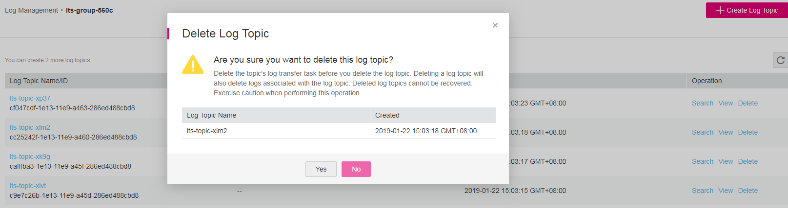

# Deleting a Log Topic

## Scenarios

This section describes how to delete a log topic that will no longer be used.

> **NOTE:**   
>Ensure that the target log topic has no log transfer task. Deleted log topics cannot be recovered. Therefore, exercise caution when performing this deletion operation.  

## Prerequisites

-   You have obtained a username and password for logging in to the management console.
-   You have deleted the log transfer task associated with the target log topic.

## Procedure

1.  Log in to the management console.
2.  In the upper left corner of the management console, select the target region and project.
3.  Click  **Service List**  and choose  **Management & Deployment**  \>  **Log Tank Service**.

1.  In the log group list, click the name of the target log group.
2.  In the log topic list, locate the target log topic and click  **Delete**  in the  **Operation**  column.
3.  Click  **Yes**.

    **Figure  1**  Deleting a log topic  
    

