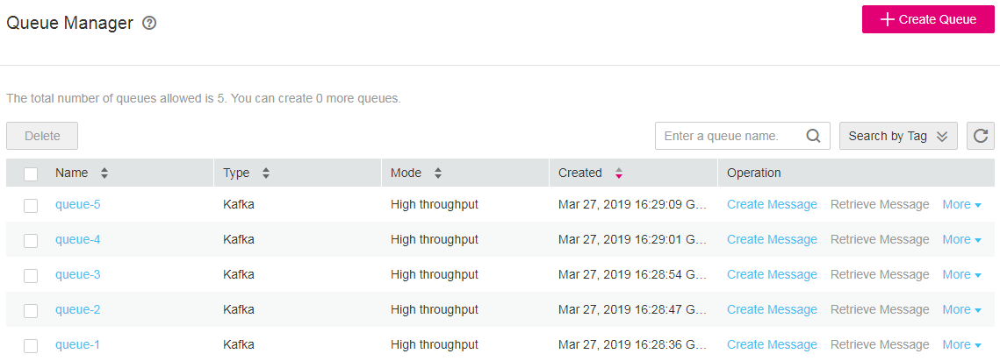
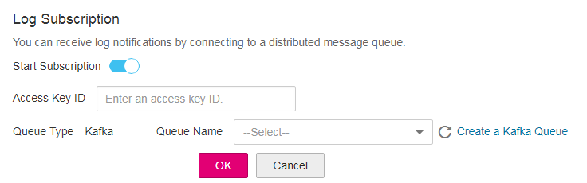

# Log Subscription

To interconnect Log Tank Service \(LTS\) logs with your O&M platform in real time, you can enable the log subscription function. After the function is enabled, LTS calls the transmission API of  [Distributed Message Service \(DMS\)](https://docs.otc.t-systems.com/en-us/dms/index.html)  to send logs to a specified Kafka queue. Then you can consume logs in this Kafka queue. The log subscription function is disabled by default. You need to manually enable it. Then you can modify the settings. If you do not need to use the log subscription function, you can disable it.

## Enabling Log Subscription

1.  Log in to the management console.
2.  In the upper left corner of the management console, select the target region and project.
3.  Click  **Service List**  and choose  **Management & Deployment**  \>  **Log Tank Service**. The  **Log Subscription**  page is displayed.
4.  Subscribe to logs. 
    1.  Click the button next to  **Start Subscription**  to start log subscription.
    2.  Enter an access key ID.

        > **NOTE:**   
        >An access key ID is needed to send logs to a specified Kafka queue through the API provided by DMS.  

    3.  Create a Kafka queue on the DMS page. If you have created a Kafka queue, skip this step.

        LTS currently supports only Kafka queues. Click  **Create Queue**  to go to the DMS page to start queue creation. To learn how to create a Kafka queue, see  [Creating a Queue](https://docs.otc.t-systems.com/en-us/usermanual/dms/dms-ug-0312102.html).

        **Figure  1**  Creating a Kafka queue  
        

    4.  Select a created Kafka queue from the  **Queue Name**  drop-down list, and click  **OK**.

        **Figure  2**  Log subscription  
        

1.  Consume logs.

    > **NOTE:**   
    >After the log subscription function is enabled, if you delete the entered access key, the log subscription function will be affected. Therefore, you are advised not to delete the access key.  

## Modifying Log Subscription

Click  **Edit**  next to the  **Queue Name**  to modify the Kafka queue and send logs to the modified Kafka queue.

> **NOTE:**   
>The access key ID cannot be changed. If you have deleted the access key ID or need to change the access key ID, you can disable the log subscription function and enable it again. Then enter a new access key ID.  

## Disabling Log Subscription

Click the button next to  **Start Subscription**  to disable the log subscription function. The following figure shows that the log subscription function is disabled.

> **NOTE:**   
>If you enable the log subscription function again after disabling it, you need to enter an access key ID and select a Kafka queue again. The access key ID and Kafka queue can be the ones before or after the function is disabled.  

