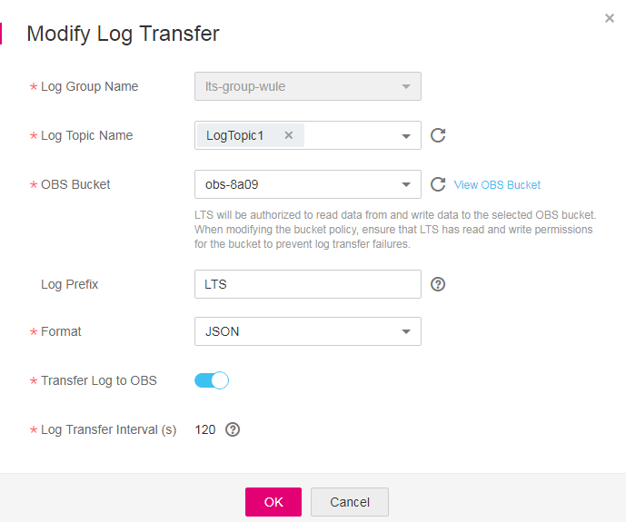

# Modifying a Log Transfer Task

## Scenarios

This section describes how to modify a log transfer task. You can modify the log topic, Object Storage Service \(OBS\) bucket, log prefix, and status of the transfer task.

## Prerequisites

-   You have created a log group.
-   You have created a log topic.
-   You have configured a log transfer task.

## Procedure

1.  Log in to the management console.
2.  In the upper left corner of the management console, select the target region and project.
3.  Click  **Service List**  and choose  **Management & Deployment**  \>  **Log Tank Service**.
4.  In the navigation pane on the left, choose  **Log Transfer**.

    **Figure  1**  Log transfer page  
    

5.  In the log transfer task list, locate the target transfer task and click  **Modify**  in the  **Operation**  column.

    The  **Modify Log Transfer**  page is displayed.

    **Figure  2**  Modifying parameters for a log transfer task  
    

6.  Modify the transfer task by following the instructions in  [Table 1](#table23279244163823).

    **Table  1**  Modification description

    
    <table><thead align="left"><tr id="r9b320f28ba1e4d1881bb20480d66c1ea"><th class="cellrowborder" valign="top" width="21.25%" id="mcps1.2.4.1.1">
<strong id="b84235270610452">Parameter</strong>

    </th>
    <th class="cellrowborder" valign="top" width="65.14%" id="mcps1.2.4.1.2">
<strong id="b84235270681846">Description</strong>

    </th>
    <th class="cellrowborder" valign="top" width="13.61%" id="mcps1.2.4.1.3">
<strong id="b1330392512497">Example Value</strong>

    </th>
    </tr>
    </thead>
    <tbody><tr id="r77bd0944864c4dad9cee530dd8208dc3"><td class="cellrowborder" valign="top" width="21.25%" headers="mcps1.2.4.1.1 ">
Log Topic Name

    </td>
    <td class="cellrowborder" valign="top" width="65.14%" headers="mcps1.2.4.1.2 ">
Select the log topic that you have created.

    </td>
    <td class="cellrowborder" valign="top" width="13.61%" headers="mcps1.2.4.1.3 ">
LogTopic1

    </td>
    </tr>
    <tr id="rd56087b2bbd142788d2dbb5eb3df3d93"><td class="cellrowborder" valign="top" width="21.25%" headers="mcps1.2.4.1.1 ">
OBS Bucket

    </td>
    <td class="cellrowborder" valign="top" width="65.14%" headers="mcps1.2.4.1.2 ">
Select the desired OBS bucket.

    </td>
    <td class="cellrowborder" valign="top" width="13.61%" headers="mcps1.2.4.1.3 ">
obs-8a09

    </td>
    </tr>
    <tr id="ra149c1a748234fbf87a1106cfafd1938"><td class="cellrowborder" valign="top" width="21.25%" headers="mcps1.2.4.1.1 ">
Log Prefix

    </td>
    <td class="cellrowborder" valign="top" width="65.14%" headers="mcps1.2.4.1.2 ">
Enter a prefix as required.

    </td>
    <td class="cellrowborder" valign="top" width="13.61%" headers="mcps1.2.4.1.3 ">
LTS

    </td>
    </tr>
    <tr id="row744818185414"><td class="cellrowborder" valign="top" width="21.25%" headers="mcps1.2.4.1.1 ">
Format

    </td>
    <td class="cellrowborder" valign="top" width="65.14%" headers="mcps1.2.4.1.2 ">
Select <strong id="b0367258103919">Raw Log Format</strong> or <strong id="b203686585399">JSON</strong>.

    </td>
    <td class="cellrowborder" valign="top" width="13.61%" headers="mcps1.2.4.1.3 ">
JSON

    </td>
    </tr>
    <tr id="r74f80a2ec0794d0cbec96aa11f8600ca"><td class="cellrowborder" valign="top" width="21.25%" headers="mcps1.2.4.1.1 ">
Transfer Log to OBS

    </td>
    <td class="cellrowborder" valign="top" width="65.14%" headers="mcps1.2.4.1.2 ">
Enable or disable log transfer.

    </td>
    <td class="cellrowborder" valign="top" width="13.61%" headers="mcps1.2.4.1.3 ">
Enable

    </td>
    </tr>
    <tr id="row14902102212341"><td class="cellrowborder" valign="top" width="21.25%" headers="mcps1.2.4.1.1 ">
Log Transfer Interval

    </td>
    <td class="cellrowborder" valign="top" width="65.14%" headers="mcps1.2.4.1.2 ">
Specifies the interval, in the unit of seconds, at which logs are automatically transferred to the OBS bucket. The default value is 120.

    </td>
    <td class="cellrowborder" valign="top" width="13.61%" headers="mcps1.2.4.1.3 ">
120

    </td>
    </tr>
    </tbody>
    </table>

7.  Click  **OK**.

