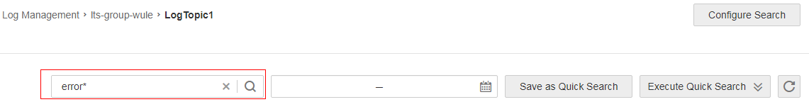
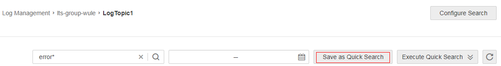
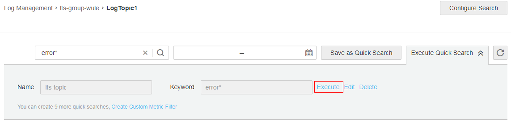

# Searching for Logs by Keyword

## Search Syntax and Examples

[Table 1](#table973553521214)  describes the search syntax.

**Table  1**  Search syntax

<table><thead align="left"><tr id="row18734103511120"><th class="cellrowborder" valign="top" width="16.34%" id="mcps1.2.3.1.1">
<strong id="b19481175861714">Filter</strong>

</th>
<th class="cellrowborder" valign="top" width="83.66%" id="mcps1.2.3.1.2">
<strong id="b18263185941713">Description</strong>

</th>
</tr>
</thead>
<tbody><tr id="row573483518122"><td class="cellrowborder" valign="top" width="16.34%" headers="mcps1.2.3.1.1 ">
AND

</td>
<td class="cellrowborder" valign="top" width="83.66%" headers="mcps1.2.3.1.2 ">
Intersection of search results

</td>
</tr>
<tr id="row1973463501211"><td class="cellrowborder" valign="top" width="16.34%" headers="mcps1.2.3.1.1 ">
OR

</td>
<td class="cellrowborder" valign="top" width="83.66%" headers="mcps1.2.3.1.2 ">
Union of search results

</td>
</tr>
<tr id="row117341135101217"><td class="cellrowborder" valign="top" width="16.34%" headers="mcps1.2.3.1.1 ">
NOT

</td>
<td class="cellrowborder" valign="top" width="83.66%" headers="mcps1.2.3.1.2 ">
Results that satisfy <strong id="b84234391271">query1</strong> but not <strong id="b962944411719">query2</strong>

</td>
</tr>
<tr id="row966034111313"><td class="cellrowborder" valign="top" width="16.34%" headers="mcps1.2.3.1.1 ">
*

</td>
<td class="cellrowborder" valign="top" width="83.66%" headers="mcps1.2.3.1.2 ">
Fuzzy search. The wildcard (*) can only be after a keyword to replace an unspecified number of characters.

</td>
</tr>
<tr id="row562615442135"><td class="cellrowborder" valign="top" width="16.34%" headers="mcps1.2.3.1.1 ">
?

</td>
<td class="cellrowborder" valign="top" width="83.66%" headers="mcps1.2.3.1.2 ">
Fuzzy search. The question mark (?) is in the middle or at the end of a keyword to replace a character.

</td>
</tr>
</tbody>
</table>

The rules for searching for logs by keyword are as follows:

-   Fuzzy search is supported.

    For example, if you enter  **error\***, all logs that contain  **error**  will be displayed and especially those start with  **error**  will be highlighted.

-   Search based on combined conditions \(including  **host\_name:**,  **ip:**,  **path:**, and  **time:**\) is supported. The format is  **key1:value1** _\[__condition__\] _**key2:value2**, for example,  **host\_name:ecs-rxm NOT ip:192.168.1.205 AND path:/home/home.log**.

The following are examples:

-   **query1 AND query2**: logs that contain  **query1**  and  **query2**
-   **query1 OR query2**: logs that contain  **query1**  or  **query2**
-   **query1 NOT query2**: logs that contain  **query1**  but not  **query2**
-   **error\***: logs that contain  **error**
-   **er?or**: logs that start with  **er**, is followed by any single character, and end with  **or**
-   **query1 AND query2 NOT query3**: logs that contain  **query1**  and  **query2**  but not  **query3**

    > **NOTE:**   
    >-   Characters connected with an underscore \(\_\) will be deemed as a word and cannot be split during log search.  
    >-   When you enter a keyword to query logs, the keyword is case-insensitive. Log contents you queried are case-insensitive but the highlighted log contents are case-sensitive.  
    >-   Fuzzy search. The wildcard \(\*\) and question mark \(?\) cannot be replaced with some special characters such as hyphens \(-\) and spaces.  

## Searching for Logs

To set search filters and a time range, perform the following operations:

1.  Log in to the management console.
2.  In the upper left corner of the management console, select the target region and project.
3.  Click  **Service List**  and choose  **Management & Deployment**  \>  **Log Tank Service**.
4.  In the log group list, click the name of the target log group.
5.  In the log topic list, click the name of the target log topic.

    You can also locate the target log topic and click  **Search**  in the  **Operation**  column to go to the log topic details page.

6.  On the displayed page, enter your keyword in the search box by following the instructions in  [Search Syntax and Examples](#section118029111411).

    **Figure  1**  Search box  
    

7.  Click the search icon to start the search.

    Logs containing the keyword are displayed.

8.  Click the calendar icon to set a time range of logs.

    Only the latest 100,000 logs reported within the specified time range are displayed.

## Configuring Quick Search

To search for logs using a keyword repeatedly, perform the following operations to configure a quick search:

1.  Log in to the management console.
2.  In the upper left corner of the management console, select the target region and project.
3.  Click  **Service List**  and choose  **Management & Deployment**  \>  **Log Tank Service**.
4.  In the log group list, click the name of the target log group.
5.  In the log topic list, click the name of the target log topic.

    You can also locate the target log topic and click  **Search**  in the  **Operation**  column to go to the log topic details page.

6.  Set search filters by following the instructions in  [Search Syntax and Examples](#section118029111411).

    For example, you can enter  **error\***.

7.  Click  **Save as Quick Search**.

    **Figure  2**  Saving as quick search  
    

8.  Enter a quick search name.

    The quick search name must meet the following requirements:

    -   Must be a string of 1 to 64 characters.
    -   Only allows uppercase and lowercase letters, digits, underscores \(\_\), hyphens \(-\), and periods \(.\). The name cannot start or end with a period.
    -   Must be unique within a log topic.

9.  Click  **OK**.
10. Click  **Execute Quick Search**.

    **Figure  3**  Executing a quick search  
    

11. Click  **Execute**  next to the quick search keyword.

    The search result is displayed.

    **Figure  4**  Executing a quick search  
    

    > **NOTE:**   
    >On the  **Execute Quick Search**  page, you can edit or delete a created quick search.  

## Viewing Context of a Log

To facilitate fault location during O&M, perform the following operations to query logs generated within the time range before and after the time when a log is generated:

1.  Log in to the management console.
2.  In the upper left corner of the management console, select the target region and project.
3.  Click  **Service List**  and choose  **Management & Deployment**  \>  **Log Tank Service**.

1.  In the log group list, click the name of the target log group.
2.  In the log topic list, click the name of the target log topic.

    You can also locate the target log topic and click  **Search**  in the  **Operation**  column to go to the log topic details page.

3.  Set search filters by following the instructions in  [Search Syntax and Examples](#section118029111411).
4.  In the search result, click  **View Context**  on the right of the log to be viewed.

    Details of several logs generated before and after the log are displayed.

    **Figure  5**  Viewing context  
    

