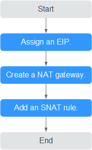

# **Overview**

If your servers \(ECSs, BMSs, and desktops\) without EIPs assigned need to access the Internet, the servers can share one or more EIPs to access the Internet through a NAT gateway without exposing their IP addresses.  [Figure 1](#fig3421331131416)  shows how to enable ECSs without EIPs assigned to access the Internet.

**Figure  1**  Flowchart  

