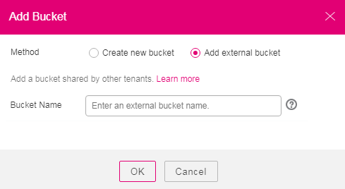

# Adding External Buckets

OBS Browser supports the external bucket adding function.

## Prerequisites

You have obtained the permissions to read and write the external bucket that you want to add.

For example: Account  **A**  wants to add bucket  **testbucket**  of account  **B**. Account  **B**  must authorize account  **A**  the permission to read bucket  **testbucket**. If account  **A**  needs to upload object to bucket  **testbucket**, account  **B**  needs to authorize account  **A**  the permission to write the bucket. Account  **A**  is the owner of the uploaded objects, and needs to authorize account  **B**  the permission to read and write the objects.

> **NOTE:**   
>An external bucket \(version 3.0 or later\) can be added only when its standard bucket policy is set to  **Public Read and Write**.  
>If the standard bucket policy of an external bucket is set to  **Public Read and Write**  upon its creation, you need to manually change the standard bucket policy to  **Private**  and then change it back to  **Public Read and Write**  again, so that it can be added.  

## Procedure

1.  Log in to OBS Browser.
2.  Click  **Add Bucket**  on the upper left corner of the page. The  **Add Bucket**  dialog box is displayed.
3.  Select  **Add external bucket**  and enter the bucket name.

    **Figure  1**  Adding an external bucket  
    

    After successfully adding an external bucket, you can see the external bucket in the bucket list and have the ACL access permissions for the bucket.

4.  Click  **OK**.
5.  In the displayed dialog box, click  **Close**  to close the dialog box.

