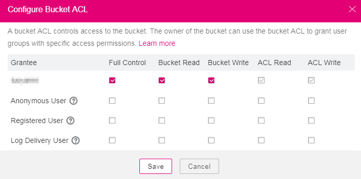

# Configuring a Bucket ACL

By configuring ACL, you can authorize bucket and ACL permissions to the  **Owner**,  **Anonymous User**,  **Registered User**, or  **Log Delivery User**  groups.

## Procedure

1.  Log in to OBS Browser.
2.  Click the blank area in the row of the bucket for which you want to set ACL permissions and click  **Configure Bucket ACL**.
3.  Configure the ACL of the bucket and click  **Save**. For details, see  [Figure 1](#ff824ee795c054719ae026365b7671c8f).

    **Figure  1**  Configuring a bucket ACL  
    

4.  In the displayed dialog box, click  **Close**  to close the dialog box.

