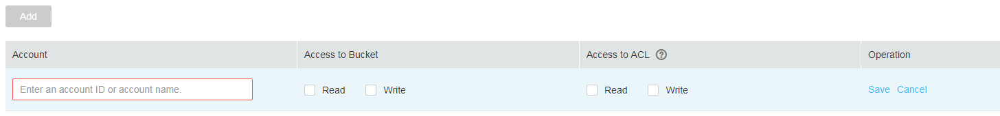

# Configuring a Bucket ACL

## Procedure

1.  In the bucket list, click the bucket to be operated. The  **Overview**  page of the bucket is displayed.
2.  In the navigation pane on the left, click  **Permissions**  to go to the permission management page.
3.  In  **Bucket ACL**, click  **Edit**  to set ACL permissions of the  **Owner**,  **Registered User**,  **Anonymous User**, and  **Log Delivery User**  for the target bucket.
4.  **Optional**: Click  **Add**  to set the ACL permissions of a specific user. For details, see  [Figure 1](#fig28074666202331).

    Enter an account ID or account name and set ACL permissions for the account. You can obtain the account ID or account name on the  **My Credentials**  page. The account ID and account name correspond to the  **Domain ID**  and  **Domain Name**  respectively on the  **My Credentials**  page.

    **Figure  1**  Adding permissions  
    

5.  Click  **Save**.

