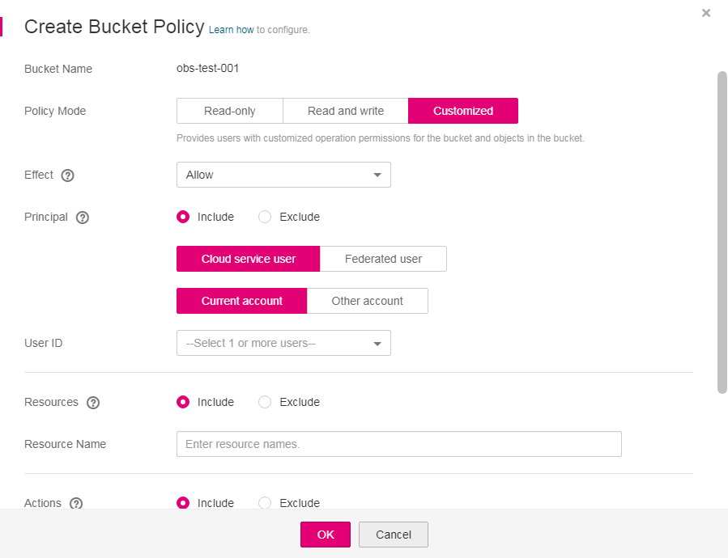

# Configuring a Custom Bucket Policy \(Common Mode\)

If you want to grant special permissions to specific users, you can configure custom bucket policies. If a standard bucket policy conflicts with a custom bucket policy, the authorization priority is given to the custom bucket policy and then the standard bucket policy.

This topic describes how to configure a custom bucket policy in common mode \(GUI\).

## Procedure

1.  In the bucket list, click the bucket to be operated. The  **Overview**  page of the bucket is displayed.
2.  In the navigation pane on the left, click  **Permissions**  to go to the permission management page.
3.  On the  **Bucket Policies**  tab page, configure a custom bucket policy according to your needs.

    On the right of  **Custom Bucket Policies**, select  **Common mode**  to configure the policy in the GUI mode.

4.  Click  **Create Bucket Policy**. Select a proper policy mode as required. Valid values are as follows:

    -   **Read-only**: The authorized user will be granted with the read permission on the bucket and objects. For subsequent operations, see  [5](#li3552175452220).
    -   **Read and write**: The authorized user will be granted with read and write permissions on the bucket and objects. For subsequent operations, see  [5](#li3552175452220).
    -   **Customized**: The authorized user will be granted with customized permissions on the bucket and objects. For detailed configuration, see  [6](#li588503161565).

    > **NOTE:** 
    >Only one bucket policy mode can be configured at a time.

5.  For the read-only and read and write modes, enter information about the authorized user in the following format and click  **OK**.

    **Figure  1**  Parameter settings of a custom bucket policy in the read-only or read and write mode  
    

    **Table  1**  Parameters in bucket policies

    
    <table><thead align="left"><tr id="row27504174239"><th class="cellrowborder" valign="top" width="15.151515151515152%" id="mcps1.2.4.1.1">
Parameter

    </th>
    <th class="cellrowborder" valign="top" width="37.37373737373738%" id="mcps1.2.4.1.2">
Value

    </th>
    <th class="cellrowborder" valign="top" width="47.474747474747474%" id="mcps1.2.4.1.3">
Description

    </th>
    </tr>
    </thead>
    <tbody><tr id="row8783617122317"><td class="cellrowborder" valign="top" width="15.151515151515152%" headers="mcps1.2.4.1.1 ">
Principal

    </td>
    <td class="cellrowborder" valign="top" width="37.37373737373738%" headers="mcps1.2.4.1.2 "><ul id="ul278810179232"><li><strong id="b8700129123916">Include</strong> or <strong id="b13701149143915">Exclude</strong></li><li><strong id="b20217128143219">Cloud service user</strong>, <strong id="b3946133123218">Federated user</strong><ul id="ul15575185754819"><li>If you select <strong id="b1719003851715">Cloud service user</strong>, you can specify the user to be the <strong id="b13691182461815">Current account</strong> or <strong id="b811012284185">Other account</strong>.
If you select <strong id="b19285104818530">Other account</strong>, enter the account ID, which is the <strong id="b1854913415546">Domain ID</strong> on the <strong id="b314165115542">My Credential</strong> page.

    </li><li>If you select <strong id="b10799136191814">Federated user</strong>, you can specify the user to be an <strong id="b14629912194">Identity provider</strong> or a <strong id="b1312311791912">User group</strong>.</li></ul>
    </li></ul>
    </td>
    <td class="cellrowborder" valign="top" width="47.474747474747474%" headers="mcps1.2.4.1.3 ">
Specifies users on whom this bucket policy takes effect, including cloud service users and federated users. A cloud service user is the one who accesses the cloud services through registration with the cloud services. A federated user is the one who accesses the cloud services through federated identity authentication.

    <ul id="ul20673512167"><li><strong id="b1104616143714">Include</strong>: Specifies the user on whom the bucket policy statement takes effect.</li><li><strong id="b970317196371">Exclude</strong>: Specifies that on all users except the specified user the bucket policy statement takes effect.</li></ul>
    </td>
    </tr>
    <tr id="row081741752319"><td class="cellrowborder" valign="top" width="15.151515151515152%" headers="mcps1.2.4.1.1 ">
Resources

    </td>
    <td class="cellrowborder" valign="top" width="37.37373737373738%" headers="mcps1.2.4.1.2 "><ul id="ul2824151742319"><li><strong id="b41985308397">Include</strong> or <strong id="b111991430193912">Exclude</strong></li><li>Input format: 
Object: <em id="i1428683216397">object name</em>

    
Object set: <em id="i847916338396">object name prefix*</em>, <em id="i1848013313917">*object name suffix</em>, or *

    </li></ul>
    </td>
    <td class="cellrowborder" valign="top" width="47.474747474747474%" headers="mcps1.2.4.1.3 ">
Indicates the resource that a bucket policy applies to. With the read-only mode and read and write mode, the policy can only apply to objects.

    <ul id="ul7274173411710"><li><strong id="b24951819019">Include</strong>: Specifies the OBS resources on which the bucket policy statement takes effect.</li><li><strong id="b172155361308">Exclude</strong>: Specifies that on all OBS resources except the specified ones the bucket policy statement takes effect.</li></ul>
    </td>
    </tr>
    </tbody>
    </table>

6.  For the customized mode, set parameters based on the site requirements and click  **OK**.

    **Figure  2**  Parameter settings of a custom bucket policy in the customized mode  
    

    [Table 2](#table25824246144542)  lists the meaning of each parameter.

    **Table  2**  Parameters in bucket policies

    
    <table><thead align="left"><tr id="row20874365144542"><th class="cellrowborder" valign="top" width="20.202020202020204%" id="mcps1.2.4.1.1">
Parameter

    </th>
    <th class="cellrowborder" valign="top" width="34.343434343434346%" id="mcps1.2.4.1.2">
Value

    </th>
    <th class="cellrowborder" valign="top" width="45.45454545454546%" id="mcps1.2.4.1.3">
Description

    </th>
    </tr>
    </thead>
    <tbody><tr id="row10774617144542"><td class="cellrowborder" valign="top" width="20.202020202020204%" headers="mcps1.2.4.1.1 ">
Effect

    </td>
    <td class="cellrowborder" valign="top" width="34.343434343434346%" headers="mcps1.2.4.1.2 ">
<strong id="b97561137113311">Allow</strong> or <strong id="b135788406338">Deny</strong>

    </td>
    <td class="cellrowborder" valign="top" width="45.45454545454546%" headers="mcps1.2.4.1.3 ">
Effect of a bucket policy.

    <ul id="ul1835191314190"><li><strong id="b1391852611270">Allow</strong>: Indicates access requests are allowed, if they match the configurations of this bucket policy.</li><li><strong id="b1037794816276">Deny</strong>: Indicates access requests are denied, if they match the configurations of this bucket policy.</li></ul>
    </td>
    </tr>
    <tr id="row46881427144542"><td class="cellrowborder" valign="top" width="20.202020202020204%" headers="mcps1.2.4.1.1 ">
Principal

    </td>
    <td class="cellrowborder" valign="top" width="34.343434343434346%" headers="mcps1.2.4.1.2 "><ul id="ul19561211185417"><li><strong id="b830025419431">Include</strong> or <strong id="b030075414316">Exclude</strong></li><li><strong id="b19619115514331">Cloud service user</strong>, <strong id="b1769811573338">Federated user</strong><ul id="ul3534111145812"><li>If you select <strong id="b12105540112018">Cloud service user</strong>, you can specify the user to be the <strong id="b15106124020204">Current account</strong> or <strong id="b19107540182019">Other account</strong>.
If you select <strong id="b22846587544">Other account</strong>, enter the account ID, which is the <strong id="b429005865414">Domain ID</strong> on the <strong id="b1529085812541">My Credential</strong> page.

    </li><li>If you select <strong id="b11332843172011">Federated user</strong>, you can specify the user to be an <strong id="b18332134322012">Identity provider</strong> or a <strong id="b1133313438201">User group</strong>.</li></ul>
    </li></ul>
    </td>
    <td class="cellrowborder" valign="top" width="45.45454545454546%" headers="mcps1.2.4.1.3 ">
Specifies users on whom this bucket policy takes effect, including cloud service users and federated users. A cloud service user is the one who accesses the cloud services through registration with the cloud services. A federated user is the one who accesses the cloud services through federated identity authentication.

    <ul id="ul101874512014"><li><strong id="b5139722814">Include</strong>: Specifies the user on whom the bucket policy statement takes effect.</li><li><strong id="b1873720225119">Exclude</strong>: Specifies that on all users except the specified user the bucket policy statement takes effect.</li></ul>
    </td>
    </tr>
    <tr id="row26311294144542"><td class="cellrowborder" valign="top" width="20.202020202020204%" headers="mcps1.2.4.1.1 ">
Resources

    </td>
    <td class="cellrowborder" valign="top" width="34.343434343434346%" headers="mcps1.2.4.1.2 "><ul id="ul151711055754"><li><strong id="b260811154416">Include</strong> or <strong id="b1661019115446">Exclude</strong></li><li>Resource input format:
Object: <em id="i135851314448">object name</em>

    
Object set: <em id="i193453404413">object name prefix*</em>, <em id="i93461441445">*object name suffix</em>, or *

    
Blank: Indicates that the resource is the entire bucket.

    </li></ul>
    </td>
    <td class="cellrowborder" valign="top" width="45.45454545454546%" headers="mcps1.2.4.1.3 ">
Indicates the resource that a bucket policy applies to.

    <ul id="ul1243923162015"><li><strong id="b865918341216">Include</strong>: Specifies the OBS resources on which the bucket policy statement takes effect.</li><li><strong id="b944620361117">Exclude</strong>: Specifies that on all OBS resources except the specified ones the bucket policy statement takes effect.</li></ul>
    
Relationship between resource types and actions:

    <ul id="ul1943618171341"><li>When a resource is an object or an object set, only the actions related to the object can be configured.</li><li>When the resource is a bucket, only the actions related to the bucket can be configured.</li></ul>
    </td>
    </tr>
    <tr id="row461371117754"><td class="cellrowborder" valign="top" width="20.202020202020204%" headers="mcps1.2.4.1.1 ">
Actions

    </td>
    <td class="cellrowborder" valign="top" width="34.343434343434346%" headers="mcps1.2.4.1.2 "><ul id="ul732518295298"><li><strong id="b2283202443">Include</strong> or <strong id="b1929620114413">Exclude</strong></li><li>For details, see <a href="actions.md">Actions</a>.</li></ul>
    </td>
    <td class="cellrowborder" valign="top" width="45.45454545454546%" headers="mcps1.2.4.1.3 ">
Operations stated in the bucket policy.

    <ul id="ul172495822013"><li><strong id="b6426853183718">Include</strong>: Specifies the actions on which the bucket policy takes effect.</li><li><strong id="b10431155616372">Exclude</strong>: Specifies that on all actions except the specified ones the bucket policy takes effect.</li></ul>
    </td>
    </tr>
    <tr id="row8998688144542"><td class="cellrowborder" valign="top" width="20.202020202020204%" headers="mcps1.2.4.1.1 ">
Conditions

    </td>
    <td class="cellrowborder" valign="top" width="34.343434343434346%" headers="mcps1.2.4.1.2 "><ul id="ul63480483323"><li>Conditional Operator: see <a href="conditions.md#table16670126115713">Table 1</a>.</li><li>Key: For details, see <a href="conditions.md#table6707152645718">Table 2</a>, <a href="conditions.md#table1972610267573">Table 3</a>, and <a href="conditions.md#table14742526145718">Table 4</a>.</li><li><strong id="b142352724416">Value</strong>: The entered value is associated with the key.</li></ul>
    </td>
    <td class="cellrowborder" valign="top" width="45.45454545454546%" headers="mcps1.2.4.1.3 ">
Conditions for the policy statement to take effect.

    </td>
    </tr>
    </tbody>
    </table>

