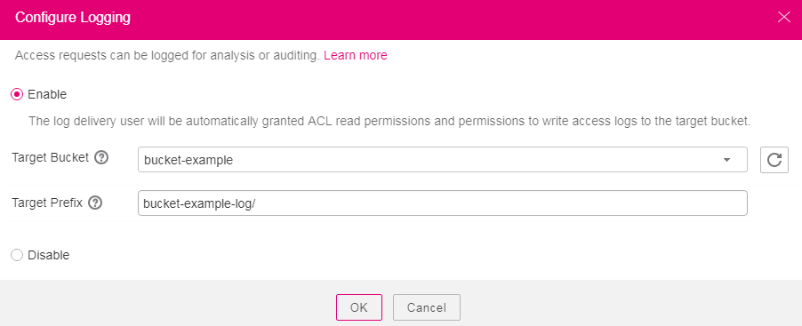

# Configuring Logging

After logging is enabled for a bucket, OBS automatically converts bucket logs into objects following the naming rules and writes the objects into a target bucket.

## Prerequisites

The log delivery user group has been assigned the  **Write**  and  **ACL View**  permissions for the target bucket. For details, see  [Configuring a Bucket ACL](configuring-a-bucket-acl-(browser).md).

## Procedure

1.  Log in to OBS Browser.
2.  Click the blank area in the row of the bucket for which you want to configure logging and choose  **More**  \>  **Configure Logging**.
3.  Select  **Enable**. See  [Figure 1](#fig5791779717938).

    **Figure  1**  Logging  
    

4.  Select a bucket from existing buckets to save log files. Log delivery users of the selected bucket will be automatically assigned with the permission to read the bucket ACL and write logs to the bucket.
5.  Enter a prefix for the  **Log File Name Prefix**.

    After logging is enabled, generated logs are named in the following format:

    _<Log File Name Prefix\>_YYYY-mm-DD-HH-MM-SS-_<UniqueString\>_

    -   _<Log File Name Prefix\>_  is the shared prefix of log file names.
    -   **YYYY-mm-DD-HH-MM-SS**  indicates the date and time when the log is generated.
    -   _<UniqueString\>_  indicates a character string generated by OBS.

    On OBS Console, if configured <TargetPrefix\> ends with a slash \(/\), logs generated in the bucket are stored on OBS Console; if configured  _<Log File Name Prefix\>_  ends with a slash \(/\), logs generated in the bucket are stored in the  _<Log File Name Prefix\>_  folder in the bucket, facilitating the management of log files.

    Example:

    -   If the bucket named  **bucket**  is selected to save log files, and the log file name prefix is set to  **bucket-log/**, all log files delivered to the bucket are saved in the  **bucket-log**  folder. A log file is named as follows:  **2015-06-29-12-22-07-N7MXLAF1BDG7MPDV**.
    -   If the bucket named  **bucket**  is selected to save log files, and the log file name prefix is set to  **bucket-log**, then no folder is created for log files delivered to the bucket. A log file is named as follows:  **bucket-log2015-06-29-12-22-07-N7MXLAF1BDG7MPDV**.

    After logging is configured, you can view operation logs in the bucket that stores the logs in approximately fifteen minutes.

6.  Click  **OK**.
7.  In the displayed dialog box, click  **Close**  to close the dialog box.

