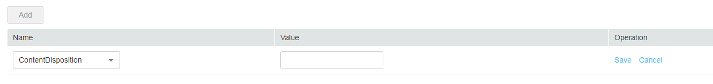

# Configuring Object Metadata

## **Procedure**

1.  In the bucket list, click the bucket to be operated. The  **Overview**  page of the bucket is displayed.
2.  In the navigation pane on the left, click  **Objects**.
3.  Click the object to be operated, and then click the  **Metadata**  tab.
4.  Click  **Add**  and enter the metadata information based on your needs. For details, see  [Figure 1](#fig23497413194123).

    **Figure  1**  Adding metadata  
    

5.  Click  **Save**.

