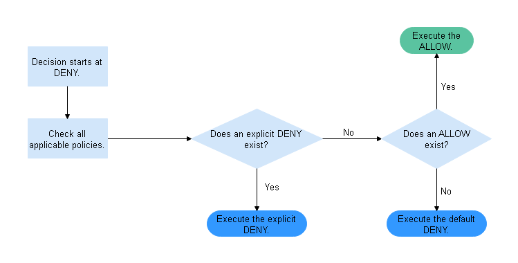

# How Does Authorization Work When Multiple Access Control Mechanisms Co-Exist?

Based on the least-privilege principle, decisions default to deny, and an explicit deny statement always takes precedence over an allow statement. For example,  IAM policies  grant a user the access to an object, a bucket policy denies the user's access to that object, and there is no ACL. Then access will be denied.

If no method specifies an allow statement, then the request will be denied by default. Only if no method specifies a deny statement and one or more methods specify an allow statement, will the request be allowed. For example, if a bucket has multiple bucket policies with allow statements, the adding of a new bucket policy with an allow statement will simply add the allowed permissions to the bucket, but the adding of a new bucket policy with a deny statement will result in a re-arrangement of the permissions. The deny statement will take precedence over allowed statements, even the denied permissions are allowed in other bucket policies.

**Figure  1**  Authorization process  

[Figure 2](#fig1251114133010)  is a matrix of the  IAM policies, bucket policies, and ACLs \(allow and deny effects\).

**Figure  2**  Matrix of the  IAM policies, bucket policies, and ACLs \(allow and deny effects\)  
.png "matrix-of-the-iam-policies-bucket-policies-and-acls-(allow-and-deny-effects)")

