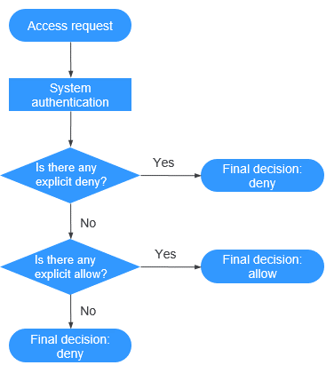

# IAM Policies<a name="obs_03_0110"></a>

You can create IAM users under a registered cloud service account, and then use IAM policies to control users' access permissions to cloud resources.

IAM policies  define the actions that can be performed on your cloud resources. In other words,  IAM policies  specify what actions are allowed or denied.

IAM policies  with OBS permissions take effect on all OBS buckets and objects. To grant an IAM user the permission to operate OBS resources, you need to assign one or more OBS permission sets to the user group to which the user belongs.

For details about OBS permissions controlled by IAM policies, see  [Permissions Management](permissions-management.md).

## IAM Policies Application Scenarios<a name="section01904185241"></a>

IAM policies  are used to authorize IAM users under an account.

-   Controlling permissions to cloud resources as a whole under an account
-   Controlling permissions to all OBS buckets and objects under an account

## Policy Structure and Syntax<a name="section9268135516548"></a>

A policy consists of a Version and a Statement. Each policy can have multiple statements.

**Figure  1**  Policy structure<a name="fig378124416551"></a>  


Policy syntax example:

```
{
        "Version": "1.0",
        "Statement": [
                {
                        "Effect": "Allow",
                        "Action": [
                                "s3:ListAllMyBuckets",
                                "s3:HeadBucket",
                                "s3:GetBucketLocation",
                                "s3:ListBucket"
                        ]
                }
        ]
}
```

**Table  1**  Policy syntax parameters

<a name="table987212714414"></a>
<table><thead align="left"><tr id="row19873102713411"><th class="cellrowborder" valign="top" width="50%" id="mcps1.2.3.1.1"><p id="p178737272043"><a name="p178737272043"></a><a name="p178737272043"></a>Parameter</p>
</th>
<th class="cellrowborder" valign="top" width="50%" id="mcps1.2.3.1.2"><p id="p1887302718414"><a name="p1887302718414"></a><a name="p1887302718414"></a>Description</p>
</th>
</tr>
</thead>
<tbody><tr id="row17873027842"><td class="cellrowborder" valign="top" width="50%" headers="mcps1.2.3.1.1 "><p id="p48732027743"><a name="p48732027743"></a><a name="p48732027743"></a>Version</p>
</td>
<td class="cellrowborder" valign="top" width="50%" headers="mcps1.2.3.1.2 "><div class="p" id="p829912213615"><a name="p829912213615"></a><a name="p829912213615"></a>The version number of a policy.<a name="ul1484412128619"></a><a name="ul1484412128619"></a><ul id="ul1484412128619"><li><strong id="b11365145614458"><a name="b11365145614458"></a><a name="b11365145614458"></a>1.0</strong>: RBAC policies. An RBAC policy consists of permissions for an entire service. Users in a group with such a policy assigned are granted all of the permissions required for that service.</li></ul>
</div>
</td>
</tr>
<tr id="row187317273414"><td class="cellrowborder" valign="top" width="50%" headers="mcps1.2.3.1.1 "><p id="p108731927249"><a name="p108731927249"></a><a name="p108731927249"></a>Statement</p>
</td>
<td class="cellrowborder" valign="top" width="50%" headers="mcps1.2.3.1.2 "><p id="p10869111617713"><a name="p10869111617713"></a><a name="p10869111617713"></a>Permissions defined by a policy, including <strong id="b1953163904712"><a name="b1953163904712"></a><a name="b1953163904712"></a>Effect</strong> and <strong id="b15171134334712"><a name="b15171134334712"></a><a name="b15171134334712"></a>Action</strong>.</p>
<div class="p" id="p151471577233"><a name="p151471577233"></a><a name="p151471577233"></a><a name="ul1802181615716"></a><a name="ul1802181615716"></a><ul id="ul1802181615716"><li><strong id="b8423527069271"><a name="b8423527069271"></a><a name="b8423527069271"></a>Effect</strong><p id="p1880291618711"><a name="p1880291618711"></a><a name="p1880291618711"></a>The valid values for <strong id="b453725310478"><a name="b453725310478"></a><a name="b453725310478"></a>Effect</strong> are <strong id="b1496385664715"><a name="b1496385664715"></a><a name="b1496385664715"></a>Allow</strong> and <strong id="b172848592477"><a name="b172848592477"></a><a name="b172848592477"></a>Deny</strong>. System policies contain only <strong id="b132351212154812"><a name="b132351212154812"></a><a name="b132351212154812"></a>Allow</strong> statements.</p>
</li><li><strong id="b53451317470"><a name="b53451317470"></a><a name="b53451317470"></a>Action</strong><p id="p14803201610710"><a name="p14803201610710"></a><a name="p14803201610710"></a>Permissions of specific operations on resources . A policy can contain one or more permissions. The wildcard (*) is allowed to indicate all of the services, resource types, or operations depending on its location in the action. </p>
</li></ul>
</div>
</td>
</tr>
</tbody>
</table>

## Authentication of IAM Policies<a name="section477513429495"></a>

The authentication of  IAM policies  starts from the Deny statements. The following figure shows the authentication logic for resource access.

**Figure  2**  Authentication logic<a name="fig1757455075016"></a>  


> **NOTE:**   
>The actions in each policy bear the OR relationship.  

1.  A user accesses the system and makes an operation request.
2.  The system evaluates all the permission policies assigned to the user.
3.  In these policies, the system looks for explicit deny permissions. If the system finds an explicit deny that applies, it returns a decision of Deny, and the authentication ends.
4.  If no explicit deny is found, the system looks for allow permissions that would apply to the request. If the system finds an explicit allow permission that applies, it returns a decision of Allow, and the authentication ends.
5.  If no explicit allow permission is found, IAM returns a decision of Deny, and the authentication ends.

