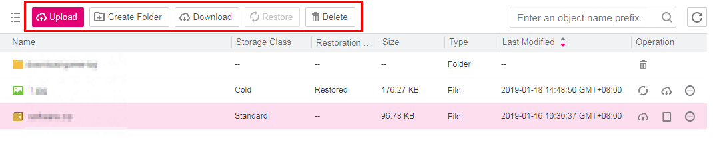
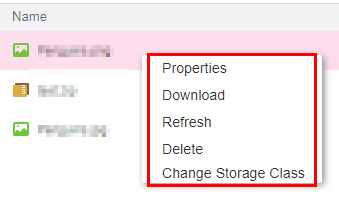

# Object Management Methods

OBS Browser supports three methods of object management.

1.  You can use the operation buttons above the object list to manage objects.

    Click the blank area in the row where the object to be managed resides. You can manage the object using the buttons displayed in the upper part. For details, see  [Figure 1](#fig4140529718916).

    **Figure  1**  First method of managing objects  
    

2.  Use the operation button on the right of the row where the object is located to manage the object.

    Click the operation buttons in the row of the object to be managed. For details, see  [Figure 2](#fig24767716181032).

    **Figure  2**  Second method of managing objects  
    

3.  Use the shortcut menu to manage objects.

    Right-click the blank area in the row where the object to be managed resides. A shortcut menu is displayed for managing the object. For details, see  [Figure 3](#fig56131650141216).

    **Figure  3**  Third method of managing objects  
    

