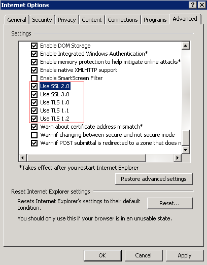

# OBS Console Cannot Be Opened in Internet Explorer 9

## Question

Why OBS Console cannot be opened in Internet Explorer 9, even if the address of OBS Console can be pinged?

## Answer

Confirm whether  **Use SSL**  and  **Use TLS**  are selected in  **Internet Options**. If not, perform the following procedure and try again:

1.  Open Internet Explorer 9.
2.  Click  **Tools**  in the upper right corner and choose  **Internet Options**  \>  **Advanced**. Then select  **Use SSL 2.0**,  **Use SSL 3.0**,  **Use TLS 1.0**,  **Use TLS 1.1**, and  **Use TLS 1.2**, as shown in  [Figure 1](#fig3632690019428).

    **Figure  1**  Internet Options  
    

3.  Click  **OK**.

