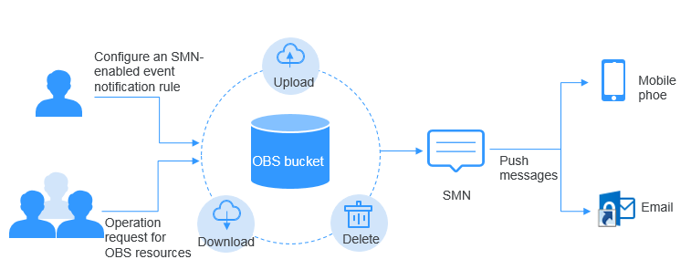

# SMN-Enabled Event Notification

Simple Message Notification \(SMN\) is a reliable and extensible message notification service that can handle massive amounts of messages. SMN significantly simplifies system coupling. It can automatically push messages to subscribers through emails and text messages.

OBS leverages SMN to provide the event notification function. In OBS, you can use SMN to send event notifications to specified subscribers, so that you will be informed of any critical operations \(such as upload and deletion\) occurred on specified buckets in real time. For example, you can configure an event notification rule to send messages through SMN to the specified email address whenever an upload operation occurs on the specified bucket.

You can configure the event notification rule to filter objects by the object name prefix or suffix. For example, you can add an event notification rule to send notifications whenever an object with the  **.jpg**  suffix is uploaded to the specified bucket. You can also add an event notification rule to send notifications whenever an object with the  **images/**  prefix is uploaded to the specified bucket.

For details about events supported by SMN and how to configure an SMN-enabled event notification rule, see  [Configuring SMN-Enabled Event Notification](configuring-smn-enabled-event-notification.md).

**Figure  1**  SMN-enabled event notification  

