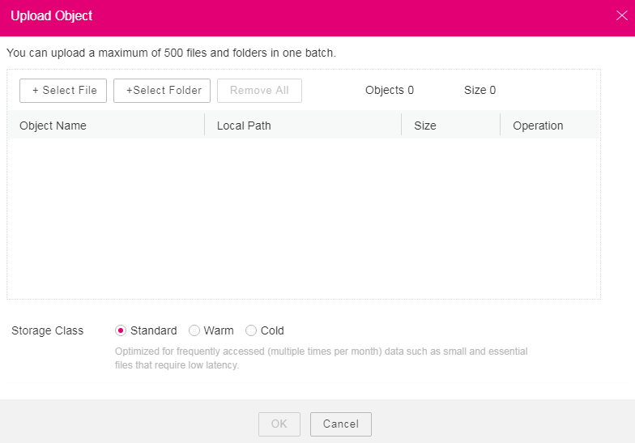

# Uploading a File or Folder

## Background Information

Files are uploaded in multiparts on OBS Browser. OBS Browser supports the upload of a single file with the maximum size of 48.8 TB.

OBS Browser supports resumable transfer. If the upload task is suspended or fails, restart the task. According to the part information recorded in the task, the successfully uploaded parts will not be uploaded again, and other parts will be requested for uploading.

## Procedure

1.  Log in to OBS Browser.
2.  Click the bucket to which the file or folder will be uploaded.
3.  Click  **Upload**. The  **Upload Object**  dialog box is displayed. For details, see  [Figure 1](#obs_03_0024_fig1511502439).

    You can select either files or folders to upload. For details, see  [4](#obs_03_0024_li1356818523426)  and  [5](#obs_03_0024_li018223074620).

    **Figure  1**  Uploading objects  
    

4.  Click  **Select File**. The local file browser dialog box is displayed. Select the file that you want to upload and click  **Open**.

    You can upload a maximum of 500 files or folders at a time.

    > **NOTE:** 
    >If the files that you want to upload to OBS are stored in Microsoft OneDrive, it is recommended that the names of these files contain a maximum of 32 characters.

5.  Click  **Select Folder**, select a folder, and click  **OK**.
6.  Select a storage class. If no storage class is selected, the object inherits the bucket storage class by default.
7.  Click  **OK**  to upload the file or folder.

## Related Operations

You can modify the storage class of the object after uploading the file or folder.

1.  Log in to OBS Browser.
2.  In the bucket list, click the bucket name.
3.  Select the target object and choose  **More**  \>  **Change Storage Class**  on the right.
4.  Select the desired storage class and click  **OK**.
5.  In the displayed dialog box, click  **Close**  to close the dialog box.

> **NOTE:** 
>-   Objects can be changed from  **Standard**  to  **Warm**  or  **Cold**  storage class, or from  **Warm**  to  **Standard**  or  **Cold**  storage class, but objects in  **Cold**  storage class must be restored before being changed to  **Standard**  or  **Warm**  storage class. Changing from  **Warm**  or  **Cold**  to other storage classes incurs restoration fees. Select an appropriate change option based on your actual needs.
>-   When the storage class is changed to  **Cold**, the object restoration status changes to  **Unrestored**.
>-   You can also configure a lifecycle rule to change the storage class of an object. For details, see  [Lifecycle Management Overview](lifecycle-management-overview-(browser).md).

