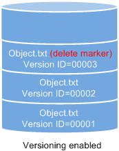
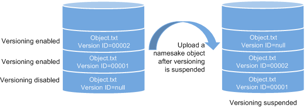

# Versioning Overview

OBS can store multiple versions of an object. You can quickly search for and restore different versions or restore data in the event of accidental deletions or application faults.

By default, the versioning function is disabled for new buckets on OBS. Therefore, if you upload an object to a bucket where an object with the same name exists, the new object will overwrite the existing one.

## Enabling Versioning

-   Enabling versioning does not change the versions and contents of existing objects in the bucket. The version ID of an object is  **null**  before versioning is enabled. If a namesake object is uploaded after versioning is enabled, a version ID will be assigned to the object. For details, see  [Figure 1](#fig2477115284615).

    **Figure  1**  Versioning \(with existing objects\)  
    .png "versioning-(with-existing-objects)")

-   OBS automatically allocates a unique version ID to a newly uploaded object. Objects with the same name are stored in OBS with different version IDs.

    **Figure  2**  Versioning \(for new objects\)  
    .png "versioning-(for-new-objects)")

    **Table  1**  Version description

    
    <table><thead align="left"><tr id="row154903306372"><th class="cellrowborder" valign="top" width="21%" id="mcps1.2.3.1.1">
Version

    </th>
    <th class="cellrowborder" valign="top" width="79%" id="mcps1.2.3.1.2">
Description

    </th>
    </tr>
    </thead>
    <tbody><tr id="row184901130183714"><td class="cellrowborder" valign="top" width="21%" headers="mcps1.2.3.1.1 ">
Latest version

    </td>
    <td class="cellrowborder" valign="top" width="79%" headers="mcps1.2.3.1.2 ">
After versioning is enabled, each operation on an object will result in saving of the object with a new version ID. The version ID generated upon the latest operation is called the latest version.

    </td>
    </tr>
    <tr id="row16490143043711"><td class="cellrowborder" valign="top" width="21%" headers="mcps1.2.3.1.1 ">
Historical version

    </td>
    <td class="cellrowborder" valign="top" width="79%" headers="mcps1.2.3.1.2 ">
After versioning is enabled, each operation on an object will result in saving of the object with a new version ID. Version IDs generated upon operations other than the latest operation are called historical versions.

    </td>
    </tr>
    </tbody>
    </table>

-   The latest objects in a bucket are returned by default after a GET Object request.
-   Objects can be downloaded by version IDs. By default, the latest object is downloaded if the version ID is not specified. For details, see  [Follow-up Procedure](configuring-versioning.md#section29772226)  in  [Configuring Versioning](configuring-versioning.md).
-   You can select an object and click  **Delete**  on the right to delete the object. After the object is deleted, OBS generates a  **Delete Marker**  with a unique version ID for the deleted object, and the deleted object is displayed in the  **Deleted Objects**  list. For details, see  [Deleting a File or Folder](deleting-a-file-(console).md). The 404 error will be returned if attempts are made to access this deleted object.

    **Figure  3**  Object with a delete marker  
    

-   You can recover a deleted object by deleting the object version that has the  **Delete Marker**. For details, see  [Follow-up Procedure](undeleting-a-file.md#section27691114163422)  in  [Undeleting a File](undeleting-a-file.md).
-   After an object is deleted, you can specify the version number in  **Deleted Objects**  to permanently delete the object of the specified version. For details, see  [Follow-up Procedure](deleting-a-file-(console).md#section089519314196)  in  [Deleting a File or Folder](deleting-a-file-(console).md).
-   An object is displayed either in the object list or the list of deleted objects. It will never be displayed in both the lists at the same time.

    For example, after object  **A**  is uploaded and deleted, it will be displayed in the  **Deleted Objects**  list. If you upload an object named  **A**  again, the object  **A**  will be displayed in the  **Objects**  list, and the previously deleted object  **A**  will no longer be displayed in the  **Deleted Objects**  list. For details, see  [Figure 4](#fig1469714544377).

    **Figure  4**  Uploading a namesake object after the original one is deleted  
    

## Suspending Versioning

Once the versioning function is enabled, it can be suspended but cannot be disabled. Once versioning is suspended, version IDs will no longer be allocated to newly uploaded objects. If an object with the same name already exists and does not have a version ID, the object will be overwritten.

**Figure  5**  Object versions in the scenario when versioning is suspended  

If versions of objects in a bucket do not need to be controlled, you can suspend the versioning function.

-   Historical versions will be retained in OBS. If you do not need these historical versions, manually delete them.
-   Objects can be downloaded by version IDs. By default, the latest object is downloaded if the version ID is not specified.

## Differences Between Scenarios When Versioning Is Suspended and Disabled

If you delete an object when versioning is suspended, a  **null**  version with the  **Delete Marker**  is generated regardless of whether the object has historical versions. But, if versioning is disabled, the same operation will not generate a version with the  **Delete Marker**.

