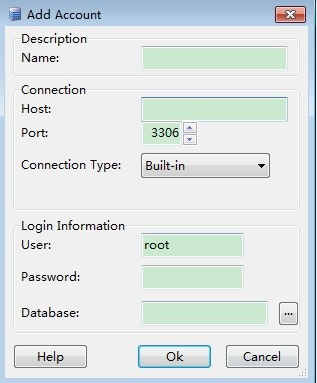

# Step 3: Connect to a DB Instance Through a Private Network<a name="rds_02_0047"></a>

You can connect to a DB instance through a common connection or an SSL connection. The  SSL connection encrypts data  and is more secure.

## Prerequisites<a name="section549821216525"></a>

1.  Log in to the ECS.
    -       -   To connect to a DB instance through an ECS, you must ensure that:
        -   The ECS and DB instance must be in the same VPC and subnet.
        -   The ECS must be allowed by the security group to access RDS DB instances.
            -   If the security group to which the target DB instance belongs is the default security group, you do not need to configure security group rules.
            -   If the security group to which the target DB instance belongs is not the default security group, check whether the security group rules allow the ECS to connect to the DB instance. For details, see section  [Step 2: Configure Security Group Rules](step-2-configure-security-group-rules.md).

                If the security group rules allow the access from the ECS, the ECS can connect to the DB instance.

                If the security group rules do not allow the access from the ECS, you need to add a security group rule. The ECS must be allowed by the security group to access RDS DB instances.


2.  Use a database client to connect to the target DB instance.

    You can use a database client to connect to the target DB instance in the Linux or Windows OS.

    -   In the Linux OS, install the MySQL client on the device that can access RDS. It is recommended that you download a MySQL client running a version later than that of the DB instance.

        For details about how to obtain and install the MySQL client, see section  [How Can I Install the MySQL Client?](how-can-i-install-the-mysql-client.md)

    -   In the Windows OS, you can use any common database client to connect to the target DB instance in a similar way.

        The database client MySQL-Front is used as an example in  [Using MySQL-Front to Connect to a DB Instance](#section103301531245).


## Using MySQL-Front to Connect to a DB Instance<a name="section103301531245"></a>

1.  Start MySQL-Front.
2.  In the displayed dialog box, click  **New**.

    **Figure  1**  Connection management<a name="fig221381114711"></a>  
    

3.  <a name="li194201396457"></a>Enter the information of the target DB instance to be connected and click  **Ok**, as shown in  [Figure 2](#fig4664143131112).

    **Figure  2**  Adding an account<a name="fig4664143131112"></a>  
    

    **Table  1**  Parameter description

    <a name="table19344113119498"></a>
    <table><thead align="left"><tr id="row93441531194919"><th class="cellrowborder" valign="top" width="18%" id="mcps1.2.3.1.1"><p id="p77919310509"><a name="p77919310509"></a><a name="p77919310509"></a><strong id="b52527469138"><a name="b52527469138"></a><a name="b52527469138"></a>Parameter</strong></p>
    </th>
    <th class="cellrowborder" valign="top" width="82%" id="mcps1.2.3.1.2"><p id="p1779116320501"><a name="p1779116320501"></a><a name="p1779116320501"></a><strong id="b941624851318"><a name="b941624851318"></a><a name="b941624851318"></a>Description</strong></p>
    </th>
    </tr>
    </thead>
    <tbody><tr id="row193441314499"><td class="cellrowborder" valign="top" width="18%" headers="mcps1.2.3.1.1 "><p id="p534403184920"><a name="p534403184920"></a><a name="p534403184920"></a>Name</p>
    </td>
    <td class="cellrowborder" valign="top" width="82%" headers="mcps1.2.3.1.2 "><p id="p1534413154913"><a name="p1534413154913"></a><a name="p1534413154913"></a>Indicates the name of the database connection task. If you do not set this parameter, it will be the same as <strong id="b415155314130"><a name="b415155314130"></a><a name="b415155314130"></a>Host</strong> by default.</p>
    </td>
    </tr>
    <tr id="row13345133120497"><td class="cellrowborder" valign="top" width="18%" headers="mcps1.2.3.1.1 "><p id="p18345123120494"><a name="p18345123120494"></a><a name="p18345123120494"></a>Host</p>
    </td>
    <td class="cellrowborder" valign="top" width="82%" headers="mcps1.2.3.1.2 "><div class="p" id="p076620352501"><a name="p076620352501"></a><a name="p076620352501"></a>Indicates the floating IP address of the DB instance to be connected. To view the floating IP address and port of the DB instance, perform the following steps:<a name="ol2197921185015"></a><a name="ol2197921185015"></a><ol id="ol2197921185015"><li>Log in to the RDS console.</li><li>Select the region in which the DB instance is located.</li><li>Click the target DB instance to enter the <strong id="b84235270620346"><a name="b84235270620346"></a><a name="b84235270620346"></a>Basic Information</strong> page.</li><li>In the <span class="uicontrol" id="uicontrol115643191513227"><a name="uicontrol115643191513227"></a><a name="uicontrol115643191513227"></a><b>Connection Information</b></span> area, view the floating IP address.</li></ol>
    </div>
    </td>
    </tr>
    <tr id="row234513154910"><td class="cellrowborder" valign="top" width="18%" headers="mcps1.2.3.1.1 "><p id="p73451831134915"><a name="p73451831134915"></a><a name="p73451831134915"></a>Port</p>
    </td>
    <td class="cellrowborder" valign="top" width="82%" headers="mcps1.2.3.1.2 "><p id="p162470367519"><a name="p162470367519"></a><a name="p162470367519"></a>Indicates the private network port of the DB instance.</p>
    </td>
    </tr>
    <tr id="row17345103164918"><td class="cellrowborder" valign="top" width="18%" headers="mcps1.2.3.1.1 "><p id="p9345193114915"><a name="p9345193114915"></a><a name="p9345193114915"></a>User</p>
    </td>
    <td class="cellrowborder" valign="top" width="82%" headers="mcps1.2.3.1.2 "><p id="p1634511315492"><a name="p1634511315492"></a><a name="p1634511315492"></a>Indicates the name of the user who will access the DB instance. The default user is <strong id="b1477714116226"><a name="b1477714116226"></a><a name="b1477714116226"></a>root</strong>.</p>
    </td>
    </tr>
    <tr id="row165789172519"><td class="cellrowborder" valign="top" width="18%" headers="mcps1.2.3.1.1 "><p id="p957918174514"><a name="p957918174514"></a><a name="p957918174514"></a>Password</p>
    </td>
    <td class="cellrowborder" valign="top" width="82%" headers="mcps1.2.3.1.2 "><p id="p18579717195113"><a name="p18579717195113"></a><a name="p18579717195113"></a>Indicates the password of the RDS database account.</p>
    </td>
    </tr>
    </tbody>
    </table>

4.  In the displayed window, select the connection that you have created in  [3](#li194201396457)  and click  **Open**. If the connection information is correct, the DB instance is successfully connected.

    **Figure  3**  Opening a session<a name="fig4589305124"></a>  
    

    > **NOTE:**   
    >If the connection fails, see  [What Should I Do If an ECS Cannot Connect to an RDS DB Instance?](what-should-i-do-if-an-ecs-cannot-connect-to-an-rds-db-instance.md)  


## SSL Connection<a name="section09675811156"></a>

1.  Log in to the management console.
2.  Click    in the upper left corner and select a region and a project.
3.  Click  **Service List**. Under  **Database**, click  **Relational Database Service**  to go to the RDS console. The RDS console is displayed.
4.  In the  **DB Information**  area on the  **Basic Information**  page, click    in the  **SSL**  field to download the root certificate or certificate bundle.
5.  Import the root certificate to the Linux OS on the ECS. For details, see  [How Can I Import the Root Certificate to the Windows or Linux OS?](how-can-i-import-the-root-certificate-to-the-windows-or-linux-os.md)

    > **NOTE:**   
    >-   Since April 2017, RDS has offered a new root certificate that has a 20-year validation period. The new certificate takes effect after DB instances are rebooted. Replace the old certificate before it expires to improve system security.  
    >    For details, see section  [How Can I Identify the Validity Period of the SSL Root Certificate?](how-can-i-identify-the-validity-period-of-the-ssl-root-certificate.md)  
    >-   You can also download the certificate bundle, which contains both the new certificate provided since April 2017 and the old certificate.  

6.  Run the following command to connect to an RDS DB instance. The Linux OS is used as an example.

    **mysql -h**  <_hostName_\>  **-P**_ <port\>_ **-u**  <_userName_\>  **-p** **--ssl-ca=**<_caName_\>

    **Table  2**  Parameter description

    <a name="table385819434338"></a>
    <table><thead align="left"><tr id="row1285974314331"><th class="cellrowborder" valign="top" width="21.2%" id="mcps1.2.3.1.1"><p id="p13859124323319"><a name="p13859124323319"></a><a name="p13859124323319"></a><strong id="b963063452415"><a name="b963063452415"></a><a name="b963063452415"></a>Parameter</strong></p>
    </th>
    <th class="cellrowborder" valign="top" width="78.8%" id="mcps1.2.3.1.2"><p id="p88598436331"><a name="p88598436331"></a><a name="p88598436331"></a><strong id="b850683532415"><a name="b850683532415"></a><a name="b850683532415"></a>Description</strong></p>
    </th>
    </tr>
    </thead>
    <tbody><tr id="row128591243133311"><td class="cellrowborder" valign="top" width="21.2%" headers="mcps1.2.3.1.1 "><p id="p128591843133314"><a name="p128591843133314"></a><a name="p128591843133314"></a>&lt;<em id="i11472201511342"><a name="i11472201511342"></a><a name="i11472201511342"></a>hostName</em>&gt;</p>
    </td>
    <td class="cellrowborder" valign="top" width="78.8%" headers="mcps1.2.3.1.2 "><p id="p78592436337"><a name="p78592436337"></a><a name="p78592436337"></a>Indicates the floating IP address. To obtain this parameter, go to the <strong id="b168353617303"><a name="b168353617303"></a><a name="b168353617303"></a>Basic Information</strong> page of the DB instance and view the floating IP address in the <strong id="b986163614307"><a name="b986163614307"></a><a name="b986163614307"></a>Connection Information</strong> area.</p>
    </td>
    </tr>
    <tr id="row885918436335"><td class="cellrowborder" valign="top" width="21.2%" headers="mcps1.2.3.1.1 "><p id="p1985934313335"><a name="p1985934313335"></a><a name="p1985934313335"></a><em id="i148916198347"><a name="i148916198347"></a><a name="i148916198347"></a>&lt;port&gt;</em></p>
    </td>
    <td class="cellrowborder" valign="top" width="78.8%" headers="mcps1.2.3.1.2 "><p id="p6859104373314"><a name="p6859104373314"></a><a name="p6859104373314"></a>Indicates the database port. By default, the value is <strong id="b372029376135817"><a name="b372029376135817"></a><a name="b372029376135817"></a>3306</strong>. To obtain this parameter, go to the <strong id="b1587817373"><a name="b1587817373"></a><a name="b1587817373"></a>Basic Information</strong> page of the DB instance and view the database port in the <strong id="b629707034"><a name="b629707034"></a><a name="b629707034"></a>Connection Information</strong> area.</p>
    </td>
    </tr>
    <tr id="row14859174318331"><td class="cellrowborder" valign="top" width="21.2%" headers="mcps1.2.3.1.1 "><p id="p20859184323316"><a name="p20859184323316"></a><a name="p20859184323316"></a>&lt;<em id="i1310372463412"><a name="i1310372463412"></a><a name="i1310372463412"></a>userName</em>&gt;</p>
    </td>
    <td class="cellrowborder" valign="top" width="78.8%" headers="mcps1.2.3.1.2 "><p id="p4859143123318"><a name="p4859143123318"></a><a name="p4859143123318"></a>Indicates the username of the RDS database account. The default administrator is <strong id="b94357222817"><a name="b94357222817"></a><a name="b94357222817"></a>root</strong>.</p>
    </td>
    </tr>
    <tr id="row63981620153510"><td class="cellrowborder" valign="top" width="21.2%" headers="mcps1.2.3.1.1 "><p id="p7399182018357"><a name="p7399182018357"></a><a name="p7399182018357"></a>&lt;<em id="i9263152720352"><a name="i9263152720352"></a><a name="i9263152720352"></a>caName</em>&gt;</p>
    </td>
    <td class="cellrowborder" valign="top" width="78.8%" headers="mcps1.2.3.1.2 "><p id="p16399920103511"><a name="p16399920103511"></a><a name="p16399920103511"></a>Indicates the name of the SSL certificate file, which should be stored in the same directory where the command is executed.</p>
    </td>
    </tr>
    </tbody>
    </table>

    For example, to connect to a DB instance through an SSL connection as user  **root**, run the following command:

    **mysql -h 172.16.0.31 -P 3306 -u root -p --ssl-ca=ca.pem**

    Enter the password of the database account if the following information is displayed:

    ```
    Enter password:
    ```

    > **NOTE:**   
    >If the connection fails, see  [What Should I Do If an ECS Cannot Connect to an RDS DB Instance?](what-should-i-do-if-an-ecs-cannot-connect-to-an-rds-db-instance.md)  


