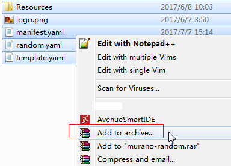

# Template File Packaging

After you have prepared all template files and completed the required configuration, you can use compression software to package them into .zip files. The following is an example of using WinRAR to package a template package.

1.  Select all files, right-click, and choose  **Add to archive**.

    **Figure  1**  Packaging template files  
    

2.  Select the .zip format.

    **Figure  2**  Package type  
    

3.  Produce a package.

    **Figure  3**  Compression format  
    

A template package is prepared. The size of a .zip template package cannot exceed 80 KB. A template package can contain one or more template files.

