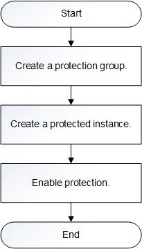

# Configuration Process

SDRS uses storage-layer synchronization and replication to provide cross-AZ DR to ensure data crash consistency and server-level protection with zero RPO. If a source AZ encounters a disaster \(such as a fire or an earthquake\) or a device fault \(such as a software or hardware damage\), replications running in the source AZ can quickly restore in the target AZ.

[Figure 1](#fig19593154813218)  shows the cross-AZ DR configuration process.

> **NOTE:**   
>When you create a protected instance, the system creates a replication pair for the disks of the servers at the production and DR site by default.   

**Figure  1**  Cross-AZ DR configuration process  

