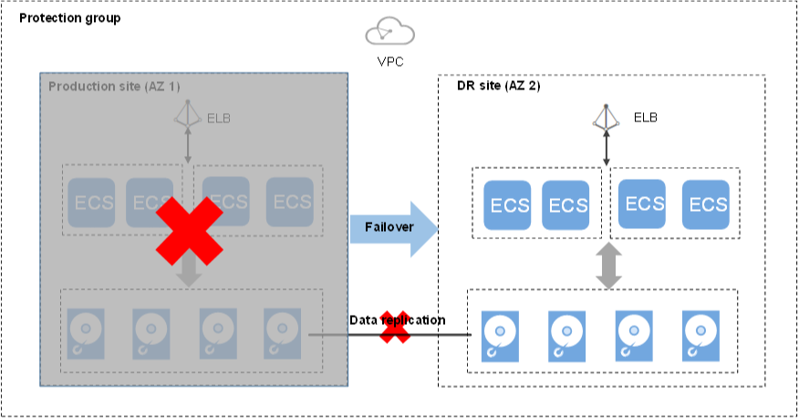

# Performing a Failover

## Scenarios

When the servers and disks at the production site become faulty due to force majeure, you can perform a failover for them and enable the servers and disks at the DR site to ensure the service continuity.

Once you perform a failover, the DR site servers and disks become available immediately. You can power on the servers, or use Cloud Server Backup Service \(CSBS\) or Volume Backup Service \(VBS\) to restore the data to a specified data recovery point.

SDRS will migrate NICs on the server during the failover. After the failover, the IP, EIP, and MAC addresses of the production site server will be migrated to the DR site server, so that the IP, EIP, and MAC addresses remain the same .

> **NOTE:**   
>-   Once the failover is started, data synchronization stops.  
>-   After the failover is complete, the status of the protection group changes to  **Failover complete**. Then, you need to switch to the protected instance details page and start the DR site server.  

**Figure  1**  Performing a failover  

## Notes

For Linux servers with Cloud-Init installed, if you have changed  **hostname**  of the production site server before you perform a failover for the first time, this modification will not synchronize to the DR site server.

To resolve this problem, see  [What Can I Do If hostname of the Production Site Server and DR Site Server Are Different After a Planned Failover or Failover?](what-can-i-do-if-hostname-of-the-production-site-server-and-dr-site-server-are-different-after-a-pla.md).

## **Prerequisites**

-   You have confirmed with the customer service that the servers and disks at the production site are faulty, and the deployed services are unavailable.
-   The protection group has replication pairs.
-   Protection is enabled for the protection group, and the protection group is in the  **Protecting**,  **Planned failover failed**, or  **Failover failed**  state.

## Procedure

1.  Log in to the management console. 
2.  Click  **Service List**  and choose  **Storage**  \>  **Storage Disaster Recovery Service**.

    The  **Storage Disaster Recovery Service**  page is displayed.

3.  In the pane of the desired protection group, click  **Protected Instances**. 

    The operation page for the protection group is displayed.

4.  In the upper right corner of the page, click  **More**  and choose  **Fail Over**  from the drop-down list. 

    The  **Fail Over**  dialog box is displayed.

5.  Click  **Fail Over**.

    During the failover, do not start or stop the servers in the protection group. Otherwise, the failover may fail.

    > **NOTE:**   
    >After you confirm the failover, production site servers will encounter blue screen of death \(BSOD\) or be forcibly stopped, and will not be able to start any more.  

## Related Operations

-   After the failover is complete, the status of the protection group changes to  **Failover complete**. Then, you need to switch to the protected instance details page and start the DR site server.
-   After the failover is complete, the protection group is in the  **Protection disabled**  state. You need to enable protection again to start data synchronization. For details, see  [Performing Reprotection](performing-reprotection.md).
-   After the failover is complete, the NIC and IP address information of the servers at the DR site \(original production site\) will not be displayed. For details, see  [Why NICs of DR Site Servers Are Not Displayed After I Perform a Failover?](why-nics-of-dr-site-servers-are-not-displayed-after-i-perform-a-failover.md).

