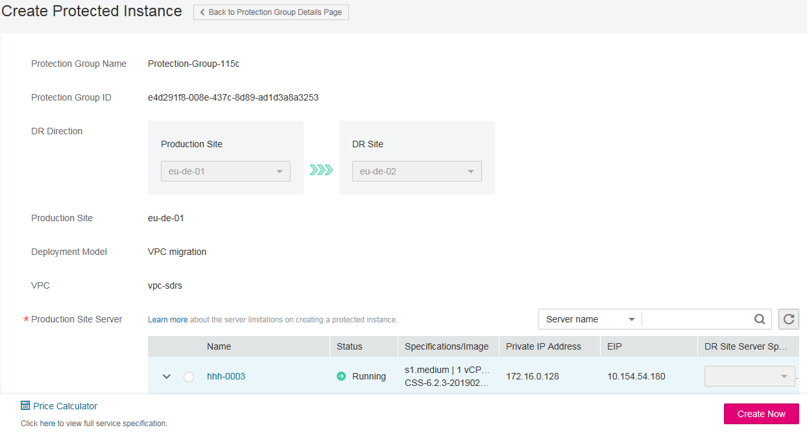

# Step 2: Create a Protected Instance

## Scenarios

You can create protected instances using the servers that you want to perform DR protection. If the current production site encounters an unexpected large-scale server failure, you can call the related protection group API to perform a failover, ensuring that services running on protected instances are not affected.

Select a protection group for each server to be replicated and create a protected instance using the server. When you create a protected instance, the server and disk will be created at the DR site for the production site server and disk. The server specifications can be configured as required. Specifically, the specifications of the DR site server can be different from those of the production site server. The disks of the production site and DR site are of the same specifications and can automatically form a replication pair.

The server at the DR site is in the Stopped state after the protected instance created. These automatically created resources, including the DR site servers and disks, cannot be used before a planned failover or failover.

**Figure  1**  Creating a protected instance  

## Notes

-   If a production site server has been added to an ECS group, you are not allowed to specify a DeH to create the DR site server for the production site server.
-   When a protected instance is created, the default name of the server at the DR site is the same as that of the server at the production site, but their IDs are different.
-   To modify a server name, switch to the protected instance details page and click the server name to switch to the server details page.
-   After you create a protected instance and enable protection for the protection group, modifications to the  **Hostname**,  **Name**,  **Agency**,  **ECS Group**,  **Security Group**,  **Tags**, and  **Auto Recovery**  configurations of the production site server will not synchronize to the DR site server. You can log in to the management console and manually add the configuration items to the servers at the DR site.
-   If protection is enabled for servers created during capacity expansion of an Auto Scaling \(AS\) group, these servers cannot be deleted when the capacity of the AS group is reduced.
-   If the server at the production site runs Windows and you choose the key login mode, ensure that the key pair of the server exists when you create a protected instance. Otherwise, the server at the DR site may fail to create, causing the protected instance creation failure.

    > **NOTE:**   
    >If the key pair of the server at the production site has been deleted, create a key pair with the same name.  

-   When you create a protected instance, if the production site server runs Linux and uses the key login mode, the key pair information will not be displayed on the details page of the DR site server after the DR site server is created. You can use the key pair of the production site server to log in to the DR site server.
-   If the production site server is added to Enterprise Project, the created DR site server will not be automatically added to Enterprise Project. You need to manually add it to Enterprise Project if needed.

## **Prerequisites**

-   The protection group is in the  **Available**  or  **Protecting**  state.
-   No shared disk is attached to the production site server.

    If some services need to use shared disks, perform steps in  [Creating a Replication Pair](creating-a-replication-pair.md)  to create a replication pair for the shared disks. Then, perform steps in  [Attaching a Replication Pair](attaching-a-replication-pair.md)  to attach the replication pair to the protected instance.

-   No protected instances have been created for the production site server.
-   Resources of the target specifications for the server to be protected are not sold out at the DR site.
-   The server that you use to create a protected instance and the protection group are in the same VPC.

## Procedure

1.  Log in to the management console.
2.  Click  **Service List**  and choose  **Storage**  \>  **Storage Disaster Recovery Service**.

    The  **Storage Disaster Recovery Service**  page is displayed.

3.  In the pane of the protection group for which protected instances are to be added, click  **Protected Instances**.

    The operation page for the protection group is displayed.

4.  On the  **Protected Instances**  tab, click  **Create Protected Instance**.

    The  **Create Protected Instance**  page is displayed.

    **Figure  2**  Creating a protected instance  
    

5.  Configure the basic information about the protected instance, as described in  [Table 1](#table14113172215131).

    **Table  1**  Parameter description

    
    <table><thead align="left"><tr id="row711682216134"><th class="cellrowborder" valign="top" width="33.33333333333333%" id="mcps1.2.4.1.1">
<strong id="b842352706211121">Parameter</strong>

    </th>
    <th class="cellrowborder" valign="top" width="36.36363636363636%" id="mcps1.2.4.1.2">
<strong id="b84235270695711">Description</strong>

    </th>
    <th class="cellrowborder" valign="top" width="30.303030303030305%" id="mcps1.2.4.1.3">
<strong>Example Value</strong>

    </th>
    </tr>
    </thead>
    <tbody><tr id="row16116152218134"><td class="cellrowborder" valign="top" width="33.33333333333333%" headers="mcps1.2.4.1.1 ">
Protection Group Name

    </td>
    <td class="cellrowborder" valign="top" width="36.36363636363636%" headers="mcps1.2.4.1.2 ">
Indicates the name of the protection group to which the protected instance to be created belongs. You do not need to configure it.

    </td>
    <td class="cellrowborder" valign="top" width="30.303030303030305%" headers="mcps1.2.4.1.3 ">
protection_group_001

    </td>
    </tr>
    <tr id="row132183175150"><td class="cellrowborder" valign="top" width="33.33333333333333%" headers="mcps1.2.4.1.1 ">
Protection Group ID

    </td>
    <td class="cellrowborder" valign="top" width="36.36363636363636%" headers="mcps1.2.4.1.2 ">
Indicates the ID of the protection group to which the protected instance to be created belongs.

    </td>
    <td class="cellrowborder" valign="top" width="30.303030303030305%" headers="mcps1.2.4.1.3 ">
2a663c5c-4774-4775-a321-562a1ea163e3

    </td>
    </tr>
    <tr id="row2116722191312"><td class="cellrowborder" valign="top" width="33.33333333333333%" headers="mcps1.2.4.1.1 ">
DR Direction

    </td>
    <td class="cellrowborder" valign="top" width="36.36363636363636%" headers="mcps1.2.4.1.2 ">
Indicates the replication direction of the protection group to which the protected instance to be created belongs. You do not need to configure it.

    </td>
    <td class="cellrowborder" valign="top" width="30.303030303030305%" headers="mcps1.2.4.1.3 ">
eu-de-01 -&gt; eu-de-02

    </td>
    </tr>
    <tr id="row446619382712"><td class="cellrowborder" valign="top" width="33.33333333333333%" headers="mcps1.2.4.1.1 ">
Production Site

    </td>
    <td class="cellrowborder" valign="top" width="36.36363636363636%" headers="mcps1.2.4.1.2 ">
Indicates the AZ of the production site server. You do not need to configure it.

    </td>
    <td class="cellrowborder" valign="top" width="30.303030303030305%" headers="mcps1.2.4.1.3 ">
az-01

    </td>
    </tr>
    <tr id="row33787144198"><td class="cellrowborder" valign="top" width="33.33333333333333%" headers="mcps1.2.4.1.1 ">
Deployment Model

    </td>
    <td class="cellrowborder" valign="top" width="36.36363636363636%" headers="mcps1.2.4.1.2 ">
Indicates the deployment model of the protection group to which the protected instance to be created belongs. You do not need to configure it.

    </td>
    <td class="cellrowborder" valign="top" width="30.303030303030305%" headers="mcps1.2.4.1.3 ">
VPC migration

    </td>
    </tr>
    <tr id="row1620211262191"><td class="cellrowborder" valign="top" width="33.33333333333333%" headers="mcps1.2.4.1.1 ">
VPC

    </td>
    <td class="cellrowborder" valign="top" width="36.36363636363636%" headers="mcps1.2.4.1.2 ">
Indicates the VPC of the protection group to which the protected instance to be created belongs. You do not need to configure it.

    </td>
    <td class="cellrowborder" valign="top" width="30.303030303030305%" headers="mcps1.2.4.1.3 ">
vpc1

    </td>
    </tr>
    <tr id="row1811682219137"><td class="cellrowborder" valign="top" width="33.33333333333333%" headers="mcps1.2.4.1.1 ">
Production Site Server

    </td>
    <td class="cellrowborder" valign="top" width="36.36363636363636%" headers="mcps1.2.4.1.2 ">
This parameter is mandatory.

    
In the server list, select the server and specifications to be used to create the protected instance. 

    
 NOTE: 
<ul id="ul8355134911610"><li>If <strong id="b39451965615">Server Type</strong> of the protection group is <strong id="b4785151220565">ECS</strong>, select the DR site server specifications. The specifications of the production site server and DR site server can be different. Select the specifications from the <strong id="b376725914336">DR Site Server Specifications</strong> drop-down list.</li></ul>
    

    </td>
    <td class="cellrowborder" valign="top" width="30.303030303030305%" headers="mcps1.2.4.1.3 ">
ecs-test &gt; s3.small.1

    </td>
    </tr>
    <tr id="row6491123874013"><td class="cellrowborder" valign="top" width="33.33333333333333%" headers="mcps1.2.4.1.1 ">
DR Site VPC

    </td>
    <td class="cellrowborder" valign="top" width="36.36363636363636%" headers="mcps1.2.4.1.2 ">
Indicates the VPC of the DR site server.

    
Its value is the same as the <strong id="b842352706164937">VPC</strong> value and do not need to be configured.

    </td>
    <td class="cellrowborder" valign="top" width="30.303030303030305%" headers="mcps1.2.4.1.3 ">
vpc1

    </td>
    </tr>
    <tr id="row1498954271619"><td class="cellrowborder" valign="top" width="33.33333333333333%" headers="mcps1.2.4.1.1 ">
Protected Instance Name

    </td>
    <td class="cellrowborder" valign="top" width="36.36363636363636%" headers="mcps1.2.4.1.2 ">
This parameter is mandatory.

    
Enter the protected instance name. It is used for protected instance classification and search.

    </td>
    <td class="cellrowborder" valign="top" width="30.303030303030305%" headers="mcps1.2.4.1.3 ">
Protected-Instance-test

    </td>
    </tr>
    <tr id="row567517599146"><td class="cellrowborder" valign="top" width="33.33333333333333%" headers="mcps1.2.4.1.1 ">
Tag

    </td>
    <td class="cellrowborder" valign="top" width="36.36363636363636%" headers="mcps1.2.4.1.2 ">
This parameter is optional.

    
Tags are identifiers of protected instances. You can add tags for protected instances, and classify and search the protected instances based on these tags. You can add up to 10 tags for each server.

    
For details, see <a href="managing-protected-instance-tags.md">Managing Protected Instance Tags</a>.

    </td>
    <td class="cellrowborder" valign="top" width="30.303030303030305%" headers="mcps1.2.4.1.3 ">
Organization/Marketing

    </td>
    </tr>
    </tbody>
    </table>

6.  Click  **Create Now**.
7.  On the  **Confirm**  page, you can confirm the protected instance information.
    -   If you do not need to modify the information, click  **Submit**.
    -   If you need to modify the information, click  **Previous**.

8.  Click  **Back to Protection Group Details Page**  and view the protected instances of the protection group.

    If the protected instance status changes to  **Available**  or  **Protecting**, the protected instance has been created successfully.

    > **NOTE:**   
    >After a protected instance is created, the system automatically creates replication pairs for the disks of the protected instance and backs up all the disks.  
    >Query the replication pairs.  
    >1.  Switch to the operation page for the protection group.  
    >2.  Click the  **Replication Pairs**  tab.  
    >    On this tab, you can query the statuses of the replication pairs, target protected instance, and production site disk.  

