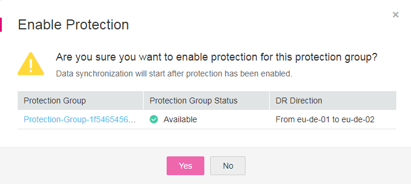

# Step 3: Enable Protection

## Scenarios

If you want to enable protection for all resources in a specified protection group, you can perform steps provided in this section.

When data is written to the disks of the production site server, SDRS synchronizes the data to the disks of the DR site server in real time. Both the production site and DR site can use Cloud Server Backup Service \(CSBS\) and Volume Backup Service \(VBS\) to back up the servers and disks.

**Figure  1**  Enabling protection  

## **Prerequisites**

-   The protection group has replication pairs.
-   The protection group is in the  **Available**  or  **Enabling protection failed**  state.
-   After you create a protected instance and enable protection on servers at the production site, modifications to the  **Hostname**,  **Name**,  **Security Group**,  **Agency**,  **ECS Group**,  **Tags**, and  **Auto Recovery**  configurations of servers on the production site will not synchronize to the servers at the DR site. You can manually add the configuration items to the servers at the DR site on the management console.

## Procedure

1.  Log in to the management console.
2.  Click  **Service List**  and choose  **Storage**  \>  **Storage Disaster Recovery Service**.

    The  **Storage Disaster Recovery Service**  page is displayed.

3.  In the pane of the desired protection group, click  **Enable Protection**.

    **Figure  2**  Enabling protection  
    

4.  In the displayed dialog box, click  **Yes**.

    Once protection is enabled, data synchronization starts.

    > **NOTE:**   
    >The synchronization time is in direct proportion to the disk capacity. Larger disk capacity requires longer synchronization time.  

