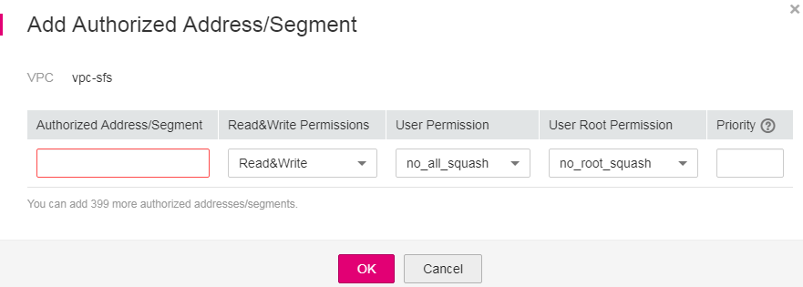

# Configuring VPCs

VPC provisions an isolated virtual network environment defined and managed by yourself, improving the security of cloud resources and simplifying network deployment. When using SFS, a file system and the associated ECSs need to belong to a same VPC for file sharing.

In addition, VPC can use network access control list \(ACL\) to implement access control. A network ACL is an access control policy system for one or more subnets. Based on inbound and outbound rules, it determines whether data packets are allowed in or out of any associated subnet. In the VPC list of a file system, each time an authorization address is added and the corresponding permissions are set, a network ACL is created.

Multiple VPCs can be configured for an SFS file system so that ECSs belonging to different VPCs can share the same file system, as long as the VPCs that the ECSs belong to are added to the VPC list of the file system or the ECSs are added to the authorized addresses of the VPCs.

For more information about VPC, see the  _Virtual Private Cloud User Guide_.

## Restrictions

-   You can add a maximum of 20 VPCs for each file system. A maximum of 400 ACL rules for added VPCs can be created. When adding a VPC, the default IP address 0.0.0.0/0 is automatically added.
-   If a VPC bound to the file system has been deleted from the VPC console, the IP address/address segment of this VPC in the VPC list of the file system can still be seen as activated. However, this VPC cannot be used any longer and you are advised to delete the VPC from the list.

## Procedure

1.  Log in to SFS Console.
2.  In the file system list, click the name of the target file system to go to the VPC authorization page.
3.  If no VPCs are available, apply for one. You can add multiple VPCs for a file system. Click  **Add Authorized VPC**  and the  **Add Authorized VPC**  dialog box is displayed. See  [Figure 1](#fig8892193084618).

    You can select multiple VPCs from the drop-down list.

    **Figure  1**  Adding authorized VPCs  
    

4.  Click  **OK**. A successfully added VPC is displayed in the list. When adding a VPC, the default IP address  **0.0.0.0/0**  is automatically added. The default read/write permission is  **read/write**, the default user permission is  **no\_all\_squash**, and the default root permission is  **no\_root\_squash**.
5.  View the VPC information in the VPC list. For details about the parameters, see  [Table 1](#table99851739124510).

    **Table  1**  Parameter description

    
    <table><thead align="left"><tr id="row18986439164514"><th class="cellrowborder" valign="top" width="50%" id="mcps1.2.3.1.1">
Parameter

    </th>
    <th class="cellrowborder" valign="top" width="50%" id="mcps1.2.3.1.2">
Description

    </th>
    </tr>
    </thead>
    <tbody><tr id="row159865391455"><td class="cellrowborder" valign="top" width="50%" headers="mcps1.2.3.1.1 ">
Name

    </td>
    <td class="cellrowborder" valign="top" width="50%" headers="mcps1.2.3.1.2 ">
Name of the added VPC, for example, <strong id="b842352706102553">vpc-4040</strong>

    </td>
    </tr>
    <tr id="row1398615399451"><td class="cellrowborder" valign="top" width="50%" headers="mcps1.2.3.1.1 ">
Authorized Addresses/Segments

    </td>
    <td class="cellrowborder" valign="top" width="50%" headers="mcps1.2.3.1.2 ">
Number of added IP addresses or IP address segments.

    </td>
    </tr>
    <tr id="row498693904514"><td class="cellrowborder" valign="top" width="50%" headers="mcps1.2.3.1.1 ">
Operation

    </td>
    <td class="cellrowborder" valign="top" width="50%" headers="mcps1.2.3.1.2 ">
The value can be <strong id="b842352706164653">Add</strong> or <strong id="b842352706164656">Delete</strong>. <strong id="b842352706164735">Add</strong>: Adds an authorized VPC. This operation configures the IP address, read/write permission, user permission, user root permission, and priority. For details, see <a href="#table1242824684814">Table 2</a>. <strong id="b842352706165531">Delete</strong>: Deletes this VPC.

    </td>
    </tr>
    </tbody>
    </table>

6.  Click    on the left of the VPC name to view details about the IP addresses/segments added to this VPC. You can  **Add**,  **Edit**, and  **Delete**  IP addresses/segments. In the  **Operation**  column of the target VPC, click  **Add**. The  **Add Authorized Address/Segment**  dialog box is displayed. See  [Figure 2](#fig3912714184914).  [Table 2](#table1242824684814)  describes the parameters to be added.

    **Figure  2**  Adding an authorized address or segment  
    

    **Table  2**  Parameter description

    
    <table><thead align="left"><tr id="row18428154644810"><th class="cellrowborder" valign="top" width="25%" id="mcps1.2.3.1.1">
Parameter

    </th>
    <th class="cellrowborder" valign="top" width="75%" id="mcps1.2.3.1.2">
Description

    </th>
    </tr>
    </thead>
    <tbody><tr id="row242814617489"><td class="cellrowborder" valign="top" width="25%" headers="mcps1.2.3.1.1 ">
Authorized Address/Segment

    </td>
    <td class="cellrowborder" valign="top" width="75%" headers="mcps1.2.3.1.2 "><ul id="ul13324116192216"><li>Only one IPv4 address or address segment can be entered.</li><li>The entered IPv4 address or address segment must be valid and cannot be an IP address or address segment starting with 0 except 0.0.0.0/0. The value <strong id="b796618473454">0.0.0.0/0</strong> indicates any IP address in the VPC. In addition, the IP address or address segment cannot start with 127 or any number from 224 to 255, such as 127.0.0.1, 224.0.0.1, or 255.255.255.255. This is because IP addresses or address segments starting with any number from 224 to 239 are class D addresses and they are reserved for multicast. IP addresses or address segments starting with any number from 240 to 255 are class E addresses and they are reserved for research purposes. If an invalid IP address or address segment is used, the access rule may fail to be added or the added access rule cannot take effect.</li><li>Multiple addresses separated by commas (,), such as <strong id="b182010254501">10.0.1.32,10.5.5.10</strong> are not allowed.</li><li>An address segment, for example, 192.168.1.0 to 192.168.1.255, needs to be in the mask format like 192.168.1.0/24. Other formats such as 192.168.1.0-255 are not allowed. The number of bits in a subnet mask must be an integer ranging from 0 to 31. The number of bits <strong id="b1225625833512">0</strong> is valid only in 0.0.0.0/0.</li></ul>
    </td>
    </tr>
    <tr id="row144285465480"><td class="cellrowborder" valign="top" width="25%" headers="mcps1.2.3.1.1 ">
Read&amp;Write Permissions

    </td>
    <td class="cellrowborder" valign="top" width="75%" headers="mcps1.2.3.1.2 ">
The value can be <strong id="b1993124163617">Read&amp;Write</strong> or <strong id="b65273913364">Read-only</strong>. The default value is <strong id="b6645857123512">Read&amp;Write</strong>.

    </td>
    </tr>
    <tr id="row4428104634818"><td class="cellrowborder" valign="top" width="25%" headers="mcps1.2.3.1.1 ">
User Permission

    </td>
    <td class="cellrowborder" valign="top" width="75%" headers="mcps1.2.3.1.2 ">
Specifies whether to retain the user identifier (UID) and group identifier (GID) of the shared directory. The default value is <strong id="b35617280106">no_all_squash</strong>.

    <ul id="ul1829105884712"><li><strong id="b2918132125215">all_squash</strong>: The UID and GID of a shared file are mapped to user <strong id="b558762611616">nobody</strong>, which is applicable to public directories.</li><li><strong id="b45475389525">no_all_squash</strong>: The UID and GID of a shared directory are retained.</li></ul>
    </td>
    </tr>
    <tr id="row1942884614813"><td class="cellrowborder" valign="top" width="25%" headers="mcps1.2.3.1.1 ">
User Root Permission

    </td>
    <td class="cellrowborder" valign="top" width="75%" headers="mcps1.2.3.1.2 ">
Specifies whether to allow the root permission of the client. The default value is <strong id="b139817316101">no_root_squash</strong>.

    <ul id="ul202950116498"><li><strong id="b19579155013523">root_squash</strong>: Clients cannot access as the <strong id="b8737141111813">root</strong> user. When a client accesses as the <strong id="b83701013121810">root</strong> user, the user is mapped to the <strong id="b964011173181">nobody</strong> user.</li><li><strong id="b74998567522">no_root_squash</strong>: Clients are allowed to access as the <strong id="b18458191611912">root</strong> user who has full control and access permissions of the root directories.</li></ul>
    </td>
    </tr>
    <tr id="row144282465483"><td class="cellrowborder" valign="top" width="25%" headers="mcps1.2.3.1.1 ">
Priority

    </td>
    <td class="cellrowborder" valign="top" width="75%" headers="mcps1.2.3.1.2 ">
The value must be an integer ranging from <strong id="b1926211414217">0</strong> to <strong id="b763510644213">100</strong>. <strong id="b1765312117429">0</strong> indicates the highest priority, and <strong id="b6839113184216">100</strong> indicates the lowest priority. In the same VPC, the permission of the IP address or address segment with the highest priority is preferentially used. If some IP addresses or address segments are of the same priority, the permission of the most recently added or modified one prevails. For example, if the IP address for mounting is 10.1.1.32 and both 10.1.1.32 (read/write) with priority 100 and 10.1.1.0/24 (read-only) with priority <strong id="b147721131184317">50</strong> meet the requirements, the permission of 10.1.1.0/24 (read-only) with priority <strong id="b1475923344312">50</strong> prevails. That is, if there is no other authorized priority, the permission of all IP addresses in the 10.1.1.0/24 segment, including 10.1.1.32, is read-only.

    </td>
    </tr>
    </tbody>
    </table>

    > **NOTE:**   
    >For an ECS in VPC A, its IP address can be added to the authorized IP address list of VPC B, but the file system of VPC B cannot be mounted to this ECS. The VPC used by the ECS and the file system must be the same one.  

