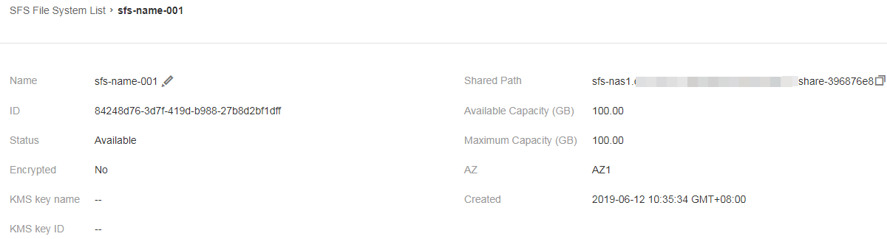

# Managing File Systems

## Viewing a File System

You can search for file systems by file system name keyword or file system status, and view their basic information.

## Procedure

1.  Log in to SFS Console.
2.  In the file system list, view all file systems.  [Table 1](#table37365828114557)  describes the parameters of each file system.

    **Table  1**  Parameter description

    
    <table><thead align="left"><tr id="row19122233114557"><th class="cellrowborder" valign="top" width="24.060000000000002%" id="mcps1.2.3.1.1">
Parameter

    </th>
    <th class="cellrowborder" valign="top" width="75.94%" id="mcps1.2.3.1.2">
Description

    </th>
    </tr>
    </thead>
    <tbody><tr id="row43511042114557"><td class="cellrowborder" valign="top" width="24.060000000000002%" headers="mcps1.2.3.1.1 ">
Name

    </td>
    <td class="cellrowborder" valign="top" width="75.94%" headers="mcps1.2.3.1.2 ">
Name of the file system, for example, <strong id="b1789719584817">sfs-name-001</strong>

    </td>
    </tr>
    <tr id="row38769363537"><td class="cellrowborder" valign="top" width="24.060000000000002%" headers="mcps1.2.3.1.1 ">
AZ

    </td>
    <td class="cellrowborder" valign="top" width="75.94%" headers="mcps1.2.3.1.2 ">
Availability zone where the file system is located

    </td>
    </tr>
    <tr id="row20691380114557"><td class="cellrowborder" valign="top" width="24.060000000000002%" headers="mcps1.2.3.1.1 ">
Status

    </td>
    <td class="cellrowborder" valign="top" width="75.94%" headers="mcps1.2.3.1.2 ">
The value can be <strong id="b11116165615101">Available</strong>, <strong id="b11172566107">Unavailable</strong>, <strong id="b18118556111016">Frozen</strong>, <strong id="b20132195613103">Creating</strong>, <strong id="b1213316566107">Deleting</strong>, <strong id="b3319181910111">Deletion error</strong>, <strong id="b332131914111">Expanding</strong>, <strong id="b33221219161116">Expansion error</strong>, <strong id="b133223192119">Capacity reducing</strong>, <strong id="b1732321971120">Capacity reduction error</strong>, and <strong id="b4324171912115">Capacity reduction failed</strong>.

    </td>
    </tr>
    <tr id="row20249422122817"><td class="cellrowborder" valign="top" width="24.060000000000002%" headers="mcps1.2.3.1.1 ">
Share Protocol

    </td>
    <td class="cellrowborder" valign="top" width="75.94%" headers="mcps1.2.3.1.2 ">
The NFS protocol is supported.

    </td>
    </tr>
    <tr id="row31409628202754"><td class="cellrowborder" valign="top" width="24.060000000000002%" headers="mcps1.2.3.1.1 ">
Available Capacity (GB)

    </td>
    <td class="cellrowborder" valign="top" width="75.94%" headers="mcps1.2.3.1.2 ">
Remaining space of the file system, available to data storage

    
 NOTE: 

The space information is refreshed every 15 minutes.

    

    </td>
    </tr>
    <tr id="row38633965114557"><td class="cellrowborder" valign="top" width="24.060000000000002%" headers="mcps1.2.3.1.1 ">
Maximum Capacity (GB)

    </td>
    <td class="cellrowborder" valign="top" width="75.94%" headers="mcps1.2.3.1.2 ">
Maximum capacity of the file system

    </td>
    </tr>
    <tr id="row15695362119"><td class="cellrowborder" valign="top" width="24.060000000000002%" headers="mcps1.2.3.1.1 ">
Encrypted

    </td>
    <td class="cellrowborder" valign="top" width="75.94%" headers="mcps1.2.3.1.2 ">
Encryption status of the created file system. The value can be <strong id="b842352706175533">Yes</strong> or <strong id="b842352706175536">No</strong>.

    </td>
    </tr>
    <tr id="row65429735114557"><td class="cellrowborder" valign="top" width="24.060000000000002%" headers="mcps1.2.3.1.1 ">
Shared Path

    </td>
    <td class="cellrowborder" valign="top" width="75.94%" headers="mcps1.2.3.1.2 ">
Shared path of the file system. The format is <em id="i12751455165915">File system domain name</em><strong id="b166268134012">:/</strong><em id="i198081316606">path</em> or <em id="i183863116420">File system IP address</em><strong id="b183876115425">:/</strong>.

    
 NOTE: 

If the shared path is too long to display completely, expand the column to view the full shared path.

    

    </td>
    </tr>
    <tr id="row27443506111522"><td class="cellrowborder" valign="top" width="24.060000000000002%" headers="mcps1.2.3.1.1 ">
Operation

    </td>
    <td class="cellrowborder" valign="top" width="75.94%" headers="mcps1.2.3.1.2 ">
Valid operations include capacity adjustment, viewing monitoring indicators, and deletion.

    </td>
    </tr>
    </tbody>
    </table>

3.  Click the name of a file system to view detailed information about the file system. See  [Figure 1](#fig964613241271).

    **Figure  1**  File system information  
    

4.  \(Optional\) Search for and view file systems by file system name keyword, key ID, or file system status.
    -   In the upper right corner of the page, click  **Search by Tag**  to query the file systems by tag.
        -   On the  **Search by Tag**  tab page that is displayed, enter a tag key and a tag value \(must be among existing keys and values\) and click  **Search**.
        -   You can use more than one tag for a combination search. Each time after a key and a value are entered, click  . The added tag search criteria are displayed under the text boxes. When more than one tag is added, they will be applied together for a combination search. A maximum of 10 tags can be added at one time.
        -   You can click  **Reset**  under the search criteria to reset.

## Deleting a File System

After a file system is deleted, data in it cannot be restored. To prevent data loss, before deleting a file system, ensure that files in it have been backed up locally.

## Prerequisites

Before deleting the file system, unmount it first. For details about how to unmount the file system, see  [Unmounting a File System](step-3-unmount-a-file-system.md).

## Procedure

1.  Log in to SFS Console.
2.  In the file system list, click  **Delete**  in the row of the file system you want to delete.
3.  In the displayed dialog box, as shown in  [Figure 2](#fig51368710153938), confirm the information, and then click  **Yes**. 

    > **NOTE:**   
    >Only  **Available**  and  **Unavailable**  file systems can be deleted.  

    **Figure  2**  Deleting a file system  
    

4.  Check the file system list to confirm that the file system is deleted successfully.
5.  \(Optional\) If you want to delete more than one file system at a time, select the file systems, and then click  **Delete**  in the upper left part of the file system list. In the dialog box that is displayed, confirm the information, enter  **Delete**  in the text box, and then click  **Yes**. 

