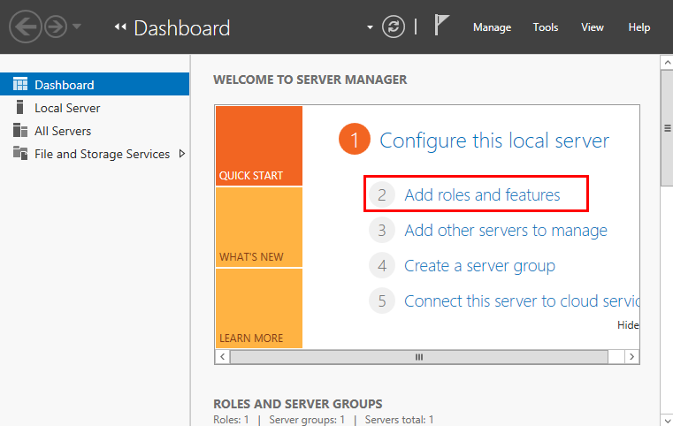
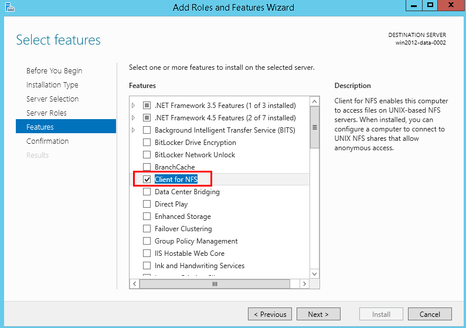
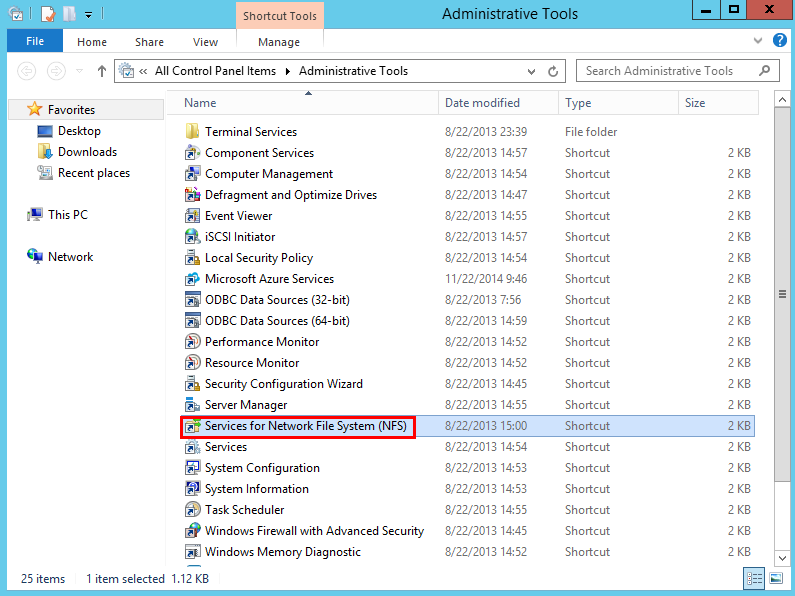
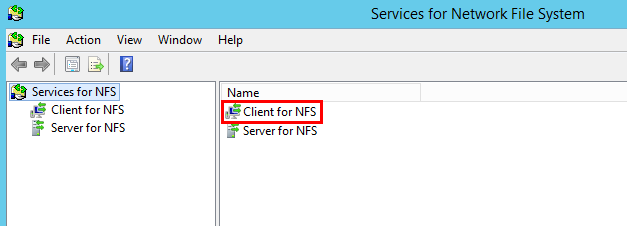
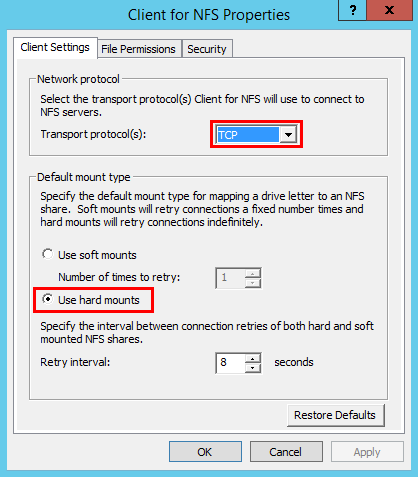

# Mounting an NFS File System to ECSs \(Windows 2012\)

After creating a file system, you need to mount the file system to ECSs so that ECSs can share the file system.

This section uses Windows 2012 as an example to describe how to mount an NFS file system. For other versions, perform the steps based on the actual situation.

## Prerequisites

-   You have created a file system and have obtained the shared path of the file system.
-   The ECSs to which a file system is mounted belong to the same VPC as the file system.
-   The IP address of the DNS server for resolving the domain names of the file systems has been configured on the ECS. For details, see  [Configuring DNS](configuring-dns.md). 

## Mounting Procedure

1.  Go to the ECS console and log in to the ECS running Windows 2012.
2.  Install the NFS client.
    1.  Click  **Server Manager**  in the lower left corner. The  **Server Manager**  window is displayed, as shown in  [Figure 1](#fig5988173610457).

        **Figure  1**  Server Manager  
        

    2.  Click  **Add Roles and Features**. See  [Figure 2](#fig598816362459).

        **Figure  2**  Wizard for adding roles and features  
        

    3.  Click  **Next**  as prompted. On the  **Server Roles**  page, select  **Server for NFS**, as shown in  [Figure 3](#fig1998863615458).

        **Figure  3**  Selecting the server for NFS  
        

    4.  Click  **Next**. In the  **Features**  page, select  **Client for NFS**  and click  **Next**, as shown in  [Figure 4](#fig398666640). Confirm the settings and then click  **Install**. If you install the NFS client for the first time, after the installation is complete, restart the client and log in to the ECS again as prompted.

        **Figure  4**  Selecting the NFS client  
        

3.  Modify the NFS transfer protocol.
    1.  Choose  **Control Panel \> System and Security \> Administrative Tools \> Services for Network File System \(NFS\)**, as shown in  [Figure 5](#fig773834418456).

        **Figure  5**  Administrative tools  
        

    2.  Right-click  **Client for NFS**, choose  **Properties**, change the transport protocol to  **TCP**, and select  **Use hard mounts**, as shown in  [Figure 6](#fig47381445453)  and  [Figure 7](#fig8738344144513).

        **Figure  6**  Services for NFS  
        

        **Figure  7**  Client for NFS properties  
        

4.  Run the following command in the Command Prompt of the Windows Server 2012 \(**X**  is the drive letter of the free disk\):

    **mount -o nolock** _shared path_ **X:**

    To copy the shared path, click    next to the shared path. See  [Figure 8](#fig212663513297). If the information shown in  [Figure 9](#fig13957194774517)  is displayed, the mounting is successful.

    **Figure  8**  Shared path  
    

    **Figure  9**  Running the command  
    

5.  After the file system is mounted successfully, you can view the mounted file system on the  **This PC**  page, as shown in  [Figure 10](#fig1120010188467).

    If the mounting fails or times out, rectify the fault by referring to  [Troubleshooting](troubleshooting.md).

    **Figure  10**  Successful mounting  
    

