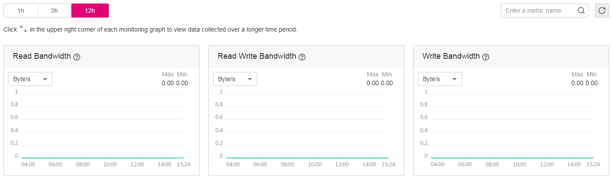

# SFS Metrics

## Function

This topic describes metrics reported by Scalable File Service \(SFS\) as well as their namespaces and dimensions. You can use the console or APIs provided by Cloud Eye to query the metrics generated for SFS.

## Namespace

SYS.SFS

## Metrics

<table><thead align="left"><tr id="row42397114153328"><th class="cellrowborder" valign="top" width="14.150000000000002%" id="mcps1.1.7.1.1">
Metric

</th>
<th class="cellrowborder" valign="top" width="8.890000000000002%" id="mcps1.1.7.1.2">
Metric Name

</th>
<th class="cellrowborder" valign="top" width="33.480000000000004%" id="mcps1.1.7.1.3">
Description

</th>
<th class="cellrowborder" valign="top" width="11.600000000000001%" id="mcps1.1.7.1.4">
Value Range

</th>
<th class="cellrowborder" valign="top" width="17.090000000000003%" id="mcps1.1.7.1.5">
Monitored Object

</th>
<th class="cellrowborder" valign="top" width="14.790000000000003%" id="mcps1.1.7.1.6">
Monitoring Period (Original Metric)

</th>
</tr>
</thead>
<tbody><tr id="row3298232153328"><td class="cellrowborder" valign="top" width="14.150000000000002%" headers="mcps1.1.7.1.1 ">
read_bandwidth

</td>
<td class="cellrowborder" valign="top" width="8.890000000000002%" headers="mcps1.1.7.1.2 ">
Read Bandwidth

</td>
<td class="cellrowborder" valign="top" width="33.480000000000004%" headers="mcps1.1.7.1.3 ">
Read bandwidth of a file system within a monitoring period

Unit: byte/s

</td>
<td class="cellrowborder" valign="top" width="11.600000000000001%" headers="mcps1.1.7.1.4 ">
≥ 0 bytes/s

</td>
<td class="cellrowborder" valign="top" width="17.090000000000003%" headers="mcps1.1.7.1.5 ">
SFS file system

</td>
<td class="cellrowborder" valign="top" width="14.790000000000003%" headers="mcps1.1.7.1.6 ">
4 minutes

</td>
</tr>
<tr id="row21884471153328"><td class="cellrowborder" valign="top" width="14.150000000000002%" headers="mcps1.1.7.1.1 ">
write_bandwidth

</td>
<td class="cellrowborder" valign="top" width="8.890000000000002%" headers="mcps1.1.7.1.2 ">
Write Bandwidth

</td>
<td class="cellrowborder" valign="top" width="33.480000000000004%" headers="mcps1.1.7.1.3 ">
Write bandwidth of a file system within a monitoring period

Unit: byte/s

</td>
<td class="cellrowborder" valign="top" width="11.600000000000001%" headers="mcps1.1.7.1.4 ">
≥ 0 bytes/s

</td>
<td class="cellrowborder" valign="top" width="17.090000000000003%" headers="mcps1.1.7.1.5 ">
SFS file system

</td>
<td class="cellrowborder" valign="top" width="14.790000000000003%" headers="mcps1.1.7.1.6 ">
4 minutes

</td>
</tr>
<tr id="row58957821154029"><td class="cellrowborder" valign="top" width="14.150000000000002%" headers="mcps1.1.7.1.1 ">
rw_bandwidth

</td>
<td class="cellrowborder" valign="top" width="8.890000000000002%" headers="mcps1.1.7.1.2 ">
Read and Write Bandwidth

</td>
<td class="cellrowborder" valign="top" width="33.480000000000004%" headers="mcps1.1.7.1.3 ">
Read and write bandwidth of a file system within a monitoring period

Unit: byte/s

</td>
<td class="cellrowborder" valign="top" width="11.600000000000001%" headers="mcps1.1.7.1.4 ">
≥ 0 bytes/s

</td>
<td class="cellrowborder" valign="top" width="17.090000000000003%" headers="mcps1.1.7.1.5 ">
SFS file system

</td>
<td class="cellrowborder" valign="top" width="14.790000000000003%" headers="mcps1.1.7.1.6 ">
4 minutes

</td>
</tr>
<tr id="row144314183017"><td class="cellrowborder" valign="top" width="14.150000000000002%" headers="mcps1.1.7.1.1 ">
read_ops

</td>
<td class="cellrowborder" valign="top" width="8.890000000000002%" headers="mcps1.1.7.1.2 ">
Read OPS

</td>
<td class="cellrowborder" valign="top" width="33.480000000000004%" headers="mcps1.1.7.1.3 ">
Read operations of a file system within a monitoring period

Unit: Count/s

</td>
<td class="cellrowborder" valign="top" width="11.600000000000001%" headers="mcps1.1.7.1.4 ">
≥ 0 Count/s

</td>
<td class="cellrowborder" valign="top" width="17.090000000000003%" headers="mcps1.1.7.1.5 ">
SFS file system

</td>
<td class="cellrowborder" valign="top" width="14.790000000000003%" headers="mcps1.1.7.1.6 ">
4 minutes

</td>
</tr>
<tr id="row1437110301405"><td class="cellrowborder" valign="top" width="14.150000000000002%" headers="mcps1.1.7.1.1 ">
write_ops

</td>
<td class="cellrowborder" valign="top" width="8.890000000000002%" headers="mcps1.1.7.1.2 ">
Write OPS

</td>
<td class="cellrowborder" valign="top" width="33.480000000000004%" headers="mcps1.1.7.1.3 ">
Write operations of a file system within a monitoring period

Unit: Count/s

</td>
<td class="cellrowborder" valign="top" width="11.600000000000001%" headers="mcps1.1.7.1.4 ">
≥ 0 Count/s

</td>
<td class="cellrowborder" valign="top" width="17.090000000000003%" headers="mcps1.1.7.1.5 ">
SFS file system

</td>
<td class="cellrowborder" valign="top" width="14.790000000000003%" headers="mcps1.1.7.1.6 ">
4 minutes

</td>
</tr>
<tr id="row68191277020"><td class="cellrowborder" valign="top" width="14.150000000000002%" headers="mcps1.1.7.1.1 ">
rw_ops

</td>
<td class="cellrowborder" valign="top" width="8.890000000000002%" headers="mcps1.1.7.1.2 ">
Read Write OPS

</td>
<td class="cellrowborder" valign="top" width="33.480000000000004%" headers="mcps1.1.7.1.3 ">
Read and write operations of a file system within a monitoring period

Unit: Count/s

</td>
<td class="cellrowborder" valign="top" width="11.600000000000001%" headers="mcps1.1.7.1.4 ">
≥ 0 Count/s

</td>
<td class="cellrowborder" valign="top" width="17.090000000000003%" headers="mcps1.1.7.1.5 ">
SFS file system

</td>
<td class="cellrowborder" valign="top" width="14.790000000000003%" headers="mcps1.1.7.1.6 ">
4 minutes

</td>
</tr>
<tr id="row65779351003"><td class="cellrowborder" valign="top" width="14.150000000000002%" headers="mcps1.1.7.1.1 ">
used_capacity

</td>
<td class="cellrowborder" valign="top" width="8.890000000000002%" headers="mcps1.1.7.1.2 ">
Used Capacity

</td>
<td class="cellrowborder" valign="top" width="33.480000000000004%" headers="mcps1.1.7.1.3 ">
Used capacity of a file system within a monitoring period

Unit: byte

</td>
<td class="cellrowborder" valign="top" width="11.600000000000001%" headers="mcps1.1.7.1.4 ">
≥ 0 bytes

</td>
<td class="cellrowborder" valign="top" width="17.090000000000003%" headers="mcps1.1.7.1.5 ">
SFS file system

</td>
<td class="cellrowborder" valign="top" width="14.790000000000003%" headers="mcps1.1.7.1.6 ">
4 minutes

</td>
</tr>
</tbody>
</table>

## Dimension

<table><thead align="left"><tr id="row64993686153328"><th class="cellrowborder" valign="top" width="40.400000000000006%" id="mcps1.1.3.1.1">
Key

</th>
<th class="cellrowborder" valign="top" width="59.599999999999994%" id="mcps1.1.3.1.2">
Value

</th>
</tr>
</thead>
<tbody><tr id="row48536124153328"><td class="cellrowborder" valign="top" width="40.400000000000006%" headers="mcps1.1.3.1.1 ">
share_id

</td>
<td class="cellrowborder" valign="top" width="59.599999999999994%" headers="mcps1.1.3.1.2 ">
SFS file system

</td>
</tr>
</tbody>
</table>

## Viewing Monitoring Statistics

1.  Log in to the management console.
2.  View the monitoring graphs using either of the following methods.
    -   Method 1: Choose  **Service List**  \>  **Storage**  \>  **Scalable File Service**. In the file system list, click  **View Metric**  in the  **Operation**  column of the target file system.
    -   Method 2: Choose  **Management & Deployment**  \>  **Cloud Eye**  \>  **Cloud Service Monitoring**  \>  **Scalable File Service**. In the file system list, click  **View Metric**  in the  **Operation**  column of the target file system.

3.  You can view the SFS file system monitoring data by metric or monitored duration.

    [Figure 1](#fig4460418173118)  shows the monitoring graphs. For more information about Cloud Eye, see the  _Cloud Eye User Guide_.

    **Figure  1**  Monitoring graphs  
    

