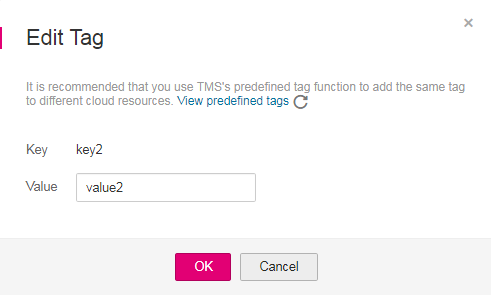
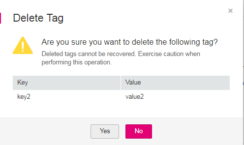

# Adding Tags to a Topic

## Scenario

Tags consist of keys and values. They identify cloud resources so that you can easily categorize and search for your resources.

-   A tag key can have multiple values.
-   Tag keys for the same resource must be unique.

## To Add Tags to a Topic

1.  Log in to the management console.
2.  Click    on the upper left to select the desired region and project.
3.  In the  **Application**  category, click  **Simple Message Notification**.

    The SMN console is displayed.

4.  In the navigation pane, choose  **Topics**.

    The  **Topics**  page is displayed.

5.  Click the topic name. The topic details are displayed.
6.  Click the  **Tags**  tab.
7.  Click  **Add Tag**  and specify tag keys and values.

    **Figure  1**  Add Tag  
    

    > **NOTE:**   
    >-   A key or value is composed of letters, numerals, special characters -\_@ and cannot start or end with a space. A key contains 36 characters at most, and a value contains 43 characters at most.  
    >-   You can add up to 10 tags for each topic.  

8.  Click  **OK**. The tags you added are displayed in the list.
9.  Click  **Edit**  under  **Operation**  to modify the tag value.

    **Figure  2**  Edit Tag  
    

10. Click  **Delete**  under  **Operation**  and click  **Yes**  in the confirmation box to delete a tag.

    **Figure  3**  Delete Tag  
    

