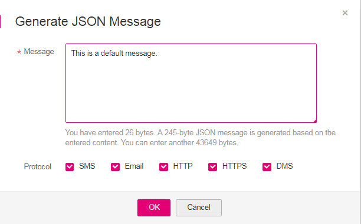

# Publishing a JSON Message

## Scenario

In a JSON message, you can specify different message content for different protocols, including SMS, email, DMS, HTTP, and HTTPS.

## Prerequisites

Subscribers in the topic must have confirmed the subscription, or they will not be able to receive any messages.

## To Publish a JSON Message

1.  Log in to the management console.
2.  Click    on the upper left to select the desired region and project.
3.  In the  **Application**  category, click  **Simple Message Notification**.

    The SMN console is displayed.

4.  In the navigation pane, choose  **Topics**.

    The  **Topics**  page is displayed.

5.  In the topic list, locate the topic to which you need to publish a message and click  **Publish Message**  under  **Operation**.
6.  Configure the required parameters according to  [Table 1](publishing-a-text-message.md#table616755201736). The topic name is provided by default and cannot be changed.

    Select  **JSON**  for  **Message Format**. Then, manually type the JSON message in the  **Message**  box or click  **Generate JSON Message**  to generate it automatically. The total size of a JSON message cannot exceed 256 KB.

    -   If you choose to manually type the JSON message, see  [JSON Message Format](json-message-format.md)  for detailed requirements.
    -   If you choose to automatically generate the JSON message, proceed with steps  [7](#li59465700211512)  through  [10](#li3542952114596).

7.  Click  **Generate JSON Message**.
8.  Enter your message content, for example, "This is a default message.", in the  **Message**  box and select the desired message protocols.

    The size of a JSON message varies depending on the protocol combinations. As you type in the message content, the system will calculate the number of bytes you have entered, the size of the JSON message, and how many bytes are left. The total size of a JSON message includes braces, quotation marks, spaces, line breaks, and message content. For details about how to calculate the size of a JSON message, see  [Calculation on the JSON Message Size](json-message-format.md#section11977745123756)  in  [JSON Message Format](json-message-format.md).

    **Figure  1**  Generate JSON Message  
    

9.  Click  **OK**. The system generates a JSON message.

    **Figure  2**  JSON message  
    

10. Modify the message content for each protocol so that different messages are sent to endpoints of different protocols. The system generates JSON-formatted content that includes a default message and message for each protocol. When SMN fails to match any specific message protocol, it sends the default message. For detailed JSON message format, see  [JSON Message Format](json-message-format.md).
11. Click  **OK**.

    SMN delivers your message to all subscription endpoints. For details about messages for different protocols, see  [Messages of Different Protocols](messages-of-different-protocols.md).

