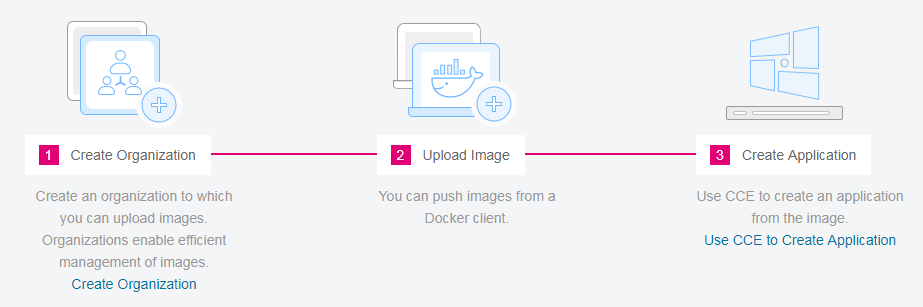

# Introduction

Software Repository for Container  \(SWR\) provides easy, secure, and reliable management of Docker container images throughout their lifecycles, featuring image push, pull, and deleting.

Private image repository and fine-grained permission management allow you to grant different access permissions, namely, read, write, and edit, to different users.

**Figure  1**  How SWR works  

