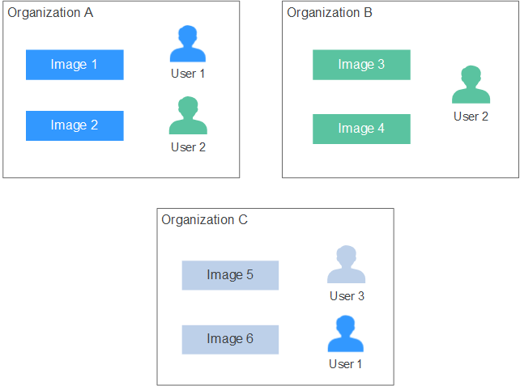
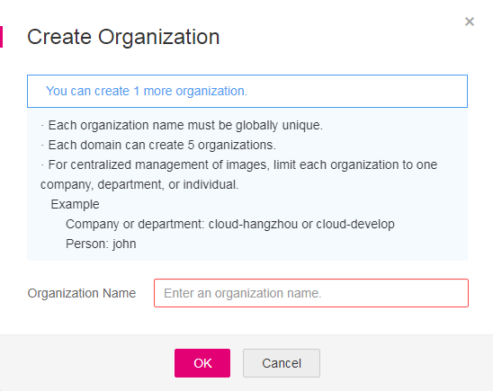
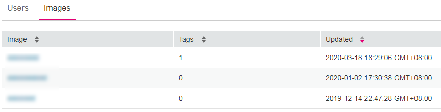

# Organization Management

Organizations are used to isolate image repositories. With each organization being limited to one company or department, images can be managed in a centralized and efficient manner. An image name only needs to be unique within an organization. The same user can access different organizations as long as the user has sufficient permissions. You can grant different permissions, namely, read, write, and manage, to users created by the same domain. For details, see  [Permissions Management](permissions-management.md).

**Figure  1**  Organization  

## Creating an Organization

You can create organizations based on the organizational structure of your enterprise to facilitate image resource management. Create an organization before pushing an image.

1.  Log in to the SWR console.
2.  In the navigation pane, choose  **Organization Management**  and then click  **Create Organization**. On the page that is displayed, specify  **Organization Name**  and click  **OK**.

    **Figure  2**  Creating an organization  
    

## Viewing the Images of an Organization

After creating an organization and pushing images into it, you can view the image list of the organization.

1.  Log in to the SWR console.
2.  In the navigation pane, choose  **Organization Management**. On the page displayed, click the desired organization in the list.
3.  To view the images of this organization, click the  **Images**  tab.

    **Figure  3**  Viewing the images of an organization  
    

