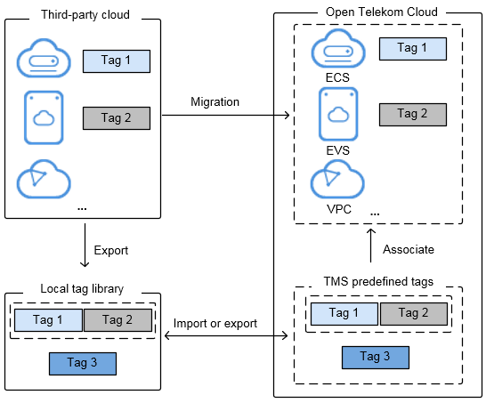

# Application Scenarios

TMS is useful in the following typical application scenarios:

-   **Central Management of Resources**

    For users who have many cloud resources, TMS allows them to quickly locate all of their resources with specific tags. TMS also provides a unified tag management platform, on which users can check, modify, or delete tags.

    **Figure  1**  Central management of resources  
    

-   **Quick Identification of Migrated Resources**

    For users who need to migrate large numbers of resources, TMS allows for the import and export of predefined tags. This improves the accuracy and efficiency of resource migration while eliminating the need to set tags each time.

    -   Creating predefined tags: You can create predefined tags on TMS before migrating resources. After resources are migrated, they can be associated directly with predefined tags.
    -   Importing and exporting predefined tags: If you have inventory tags, you can quickly import them to the predefined tag library of TMS. After resources are migrated, you can associate those resources with predefined tags. In addition, you can export predefined tags for editing.

        **Figure  2**  Quick identification of migrated resources  
        

