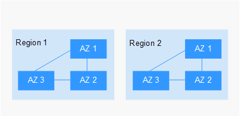

# Region and AZ

The region and Availability Zone \(AZ\) are used to describe the location of a data center. You can create resources in a specific AZ of a region.

-   A region is a physical data center, which is completely isolated to improve fault tolerance and stability. The region that is selected during resource creation cannot be changed after the resource is created.
-   An AZ is a physical location where resources use independent power supplies and networks. A region contains one or more AZs that are physically isolated but interconnected through internal networks. Because AZs are isolated from each other, any fault that occurs in an AZ will not affect other AZs.

[Figure 1](#en-us_topic_0167240468_fig8747114281212)  shows the relationship between the region and AZ.

**Figure  1**  Regions and AZs  

## How Do I Select a Region?

You are advised to select a region close to you or your target users. This reduces the network delay and improves the access speed.

## How Do I Select an AZ?

When choosing whether to deploy resources in the same AZ, you need to consider your requirements for disaster recovery \(DR\) capability and network latency.

-   If your application requires good DR capability, you are advised to deploy resources in different AZs in the same region.
-   If your application requires a low network latency between instances, you are advised to deploy resources in the same AZ.

## Regions and Endpoints

When using an API to use resources, you must specify its region and endpoint. For details about public cloud regions and endpoints, see  [Regions and Endpoints](https://docs.otc.t-systems.com/en-us/endpoint/index.html).

