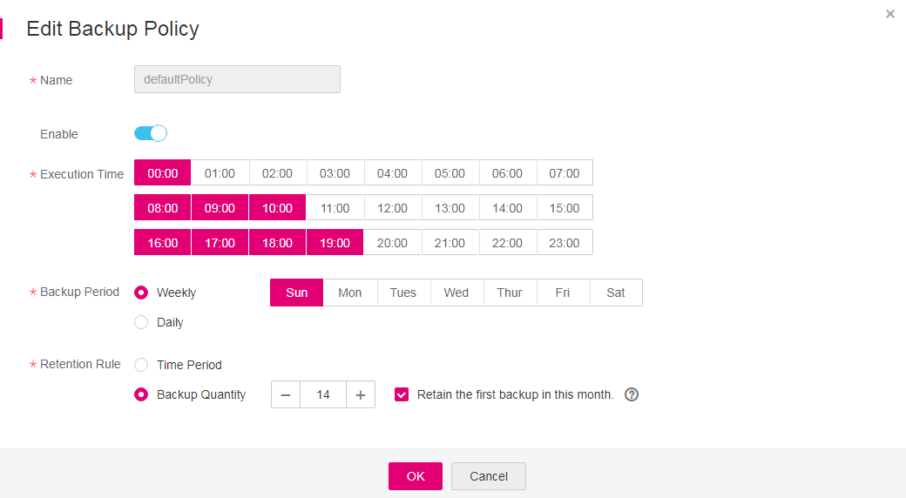

# \(Optional\) Other Operations with Backup Policies

You can edit, enable, execute, and delete backup policies.

1.  Log in to the management console.
2.  Click    in the upper left corner of the management console and select a region and a project.
3.  Click  . Under  **Storage**, click  **Volume Backup Service**.
4.  On the  **Volume Backup Service**  page, click  **Policies**  to go to the  **Policies**  tab page.
    -   Editing a backup policy
        1.  In the  **Operation**  column of the backup policy that you want to modify, click  **Edit**. The  **Edit Backup Policy**  dialog box is displayed. See  [Figure 1](#fig435016474319).

            **Figure  1**  Editing backup policies  
            

        2.  Modify the backup policy parameters.  [Table 1](creating-a-backup-policy.md#table98735364165)  describes the parameters.
        3.  Click  **OK**.

    -   Enabling a backup policy

        In the  **Operation**  column of the backup policy you want to enable, click  **Edit**. On the displayed page, click    to turn on this option.

        Alternatively, you can choose  **More**  \>  **Enable**  in the  **Operation**  column for the backup policy. In the dialog box that is displayed asking your confirmation, click  **OK**.  

        After the backup policy is successfully enabled, the policy status in the  **Enable**  column changes to  **Enabled**, and the system will automatically execute periodic backup jobs based on policy settings.

    -   Executing a backup policy

        > **NOTE:**   
        >Before performing this operation, check whether EVS disks are associated with the backup policy. If not, associate EVS disks with the backup policy first.  

        1.  When the backup policy is associated with EVS disks, select the backup policy, and choose  **More \> Execute**  in the  **Operation**  column.

            A confirmation dialog box is displayed. See  [Figure 2](#fig94051617134914).

            **Figure  2**  Executing a backup policy  
            

        2.  Confirm the backup policy parameter information and click  **OK**.

            On the  **Backup Jobs**  panel, view all the backup jobs executed based on this backup policy.

    -   Deleting a backup policy

        > **NOTE:**   
        >After a backup policy is deleted, the backup data that has already been generated by the backup policy is still available.  

        1.  Select the backup policy that you want to delete, and choose  **More**  \>  **Delete**  in the  **Operation**  column. The  **Delete Backup Policy**  dialog box is displayed. See  [Figure 3](#fig18975950185314).

            **Figure  3**  Deleting a backup policy  
            

        2.  Confirm the deletion information and click  **OK**.

