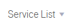
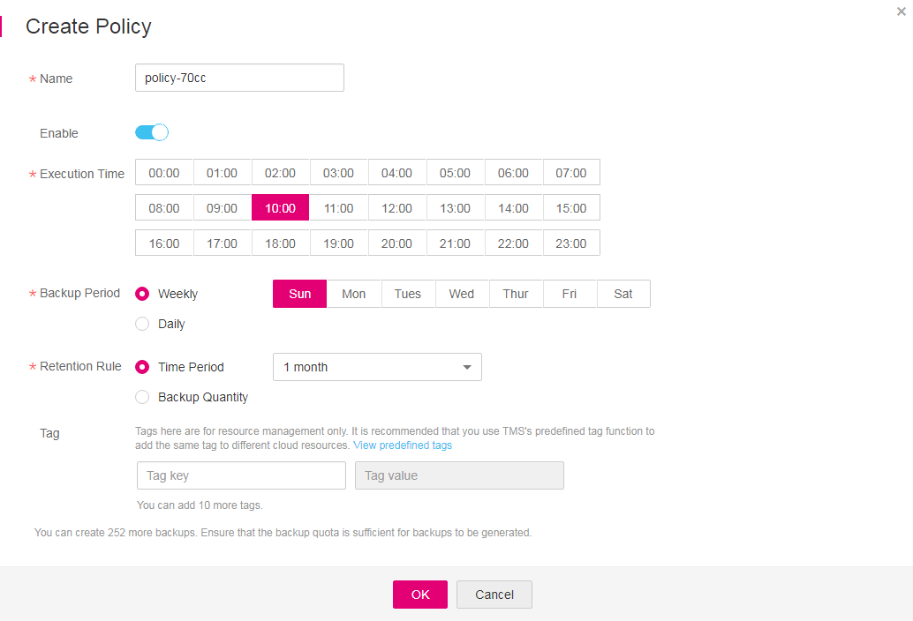

# Creating a Backup Policy

To implement periodic automatic backup on EVS disks, you need to create a backup policy first. Then the system will periodically perform backups according to the execution time specified in the backup policy. You can choose to use the default backup policy provided by the system or create one as needed.

The system automatically creates EVS disk data backups and deletes expired data backups only when a backup policy is created and enabled.

You can create a backup policy to associate all those EVS disks whose data needs to be periodically backed up.

> **NOTE:**   
>-   The system provides a default backup policy for associating EVS disks. This default backup policy can be enabled, disabled, edited, and executed. For details about how to execute the default backup policy, see  [Executing a backup policy]((optional)-other-operations-with-backup-policies.md#li17723809281). For details about how to edit the default backup policy, see  [Editing a backup policy]((optional)-other-operations-with-backup-policies.md#li58602112277).  
>-   In addition to the default backup policy, you can create another 31 backup policies. Once there are 32 backup policies in total, the  **Create Policy**  button becomes unavailable and no more policies can be created.  
>-   Deleting expired automatic data backups does not delete manual data backups.  

1.  Log in to the management console.
2.  Click    in the upper left corner of the management console and select a region and a project.
3.  Click  . Under  **Storage**, click  **Volume Backup Service**.
4.  On the  **Volume Backup Service**  page, click  **Policies**  to go to the  **Policies**  tab page.

    The  **Policies**  tab page displays existing backup policies. Expand the desired backup policy to view EVS disks associated with it.

5.  Click  **Create Backup Policy**  to expand the setting items.  [Figure 1](#fig103975522358)  displays the page.  [Table 1](#table98735364165)  describes the backup policy parameters.

    **Figure  1**  Creating a backup policy  
    

    **Table  1**  Parameter description

    
    <table><thead align="left"><tr id="row887311366166"><th class="cellrowborder" valign="top" width="22.222222222222225%" id="mcps1.2.4.1.1">
Parameter

    </th>
    <th class="cellrowborder" valign="top" width="44.44444444444445%" id="mcps1.2.4.1.2">
Description

    </th>
    <th class="cellrowborder" valign="top" width="33.333333333333336%" id="mcps1.2.4.1.3">
Remarks

    </th>
    </tr>
    </thead>
    <tbody><tr id="row7742134210513"><td class="cellrowborder" valign="top" width="22.222222222222225%" headers="mcps1.2.4.1.1 ">
Name

    </td>
    <td class="cellrowborder" valign="top" width="44.44444444444445%" headers="mcps1.2.4.1.2 ">
The name is a string of 1 to 64 characters consisting of letters, digits, underscores (_), and hyphens (-), and cannot start with <strong id="b842352706174824">default</strong>.

    </td>
    <td class="cellrowborder" valign="top" width="33.333333333333336%" headers="mcps1.2.4.1.3 ">
Example value: <strong id="b842352706153827">autobk_78ba</strong>

    </td>
    </tr>
    <tr id="row188736362161"><td class="cellrowborder" valign="top" width="22.222222222222225%" headers="mcps1.2.4.1.1 ">
Execution Time

    </td>
    <td class="cellrowborder" valign="top" width="44.44444444444445%" headers="mcps1.2.4.1.2 ">
Detailed time for backing up data of the EVS disks associated with the backup policy.

    
Backup can be scheduled on integral hours and multiple selections are supported.

    </td>
    <td class="cellrowborder" valign="top" width="33.333333333333336%" headers="mcps1.2.4.1.3 ">
Example value: <strong id="b842352706153838">02:00</strong>

    </td>
    </tr>
    <tr id="row168737368168"><td class="cellrowborder" valign="top" width="22.222222222222225%" headers="mcps1.2.4.1.1 ">
Backup Period

    </td>
    <td class="cellrowborder" valign="top" width="44.44444444444445%" headers="mcps1.2.4.1.2 ">
<strong id="b204415531453">Weekly</strong>: specifies on which days of each week the backup job will be executed. You can select all.

    
<strong id="b18081548114517">Daily</strong>: specifies the interval (every 1 to 14 days) for executing the backup job (on the hour).

    </td>
    <td class="cellrowborder" valign="top" width="33.333333333333336%" headers="mcps1.2.4.1.3 ">
Example value: <strong id="b84235270615400">Every 3 days</strong>

    
If you select <strong id="b842352706105626">Daily</strong>, the first backup time is irrelevant to the time when the backup policy is created. A backup policy takes effect from the month when it is created. Policies with the same <strong id="b1533115316357">Backup Period</strong> execute backup jobs at the same times. For example, if a backup policy with "Every 3 days" is created on the second date of a month, the first backup will be created on the fourth date of the month. "Every 3 days" indicates that backups will be created on the first date, fourth date, seventh date, and so on.

    
To ensure stable service running, back up EVS disks during off-peak hours.

    </td>
    </tr>
    <tr id="row14873036121611"><td class="cellrowborder" valign="top" width="22.222222222222225%" headers="mcps1.2.4.1.1 ">
Retention Rule

    </td>
    <td class="cellrowborder" valign="top" width="44.44444444444445%" headers="mcps1.2.4.1.2 ">
<strong id="b84235270611412">Time Period</strong>: You can choose to retain backups for one month, three months, six months, or one year, or for any desired number (2 to 99999) of days.

    
<strong id="b84235270611534">Backup Quantity</strong>: specifies the maximum allowed number of backups for a single EVS disk.

    
 NOTE: 

Set this parameter based on the applied quota. For example, if 10 EVS disks are associated with the backup policy and this parameter is set to 10, then at least a quota of 100 backups is required. If the applied quota is smaller than 100, the backup job will fail due to the insufficient quota. To view the quota, read the related tip above the VBS backup list.

    

    </td>
    <td class="cellrowborder" valign="top" width="33.333333333333336%" headers="mcps1.2.4.1.3 ">
Example value: <strong id="b842352706154215">6</strong>

    
A more frequent backup of EVS disks creates more backups and delivers a higher level of data protection but occupies more storage space. Determine the backup frequency based on the data importance and service volume. Perform relatively frequent backup operations for important data.

    
When the number of backups to be retained has exceeded the value of <strong id="b40729550611834">Backup Quantity</strong>, the system automatically deletes the earliest backups. After a backup is deleted, the other backups can still be used for restoration.

    </td>
    </tr>
    <tr id="row4873183612161"><td class="cellrowborder" valign="top" width="22.222222222222225%" headers="mcps1.2.4.1.1 ">
Retain the first backup in this month

    </td>
    <td class="cellrowborder" valign="top" width="44.44444444444445%" headers="mcps1.2.4.1.2 ">
If you select this option, the initial data backup in the current month will be retained.

    </td>
    <td class="cellrowborder" valign="top" width="33.333333333333336%" headers="mcps1.2.4.1.3 ">
The first backup in the current month will not be deleted. For example, if the current month is February, the first backup generated in February will not be deleted during February. The first backup generated in January, together with other backups generated in January, will be deleted in sequence.

    </td>
    </tr>
    <tr id="row16860111671910"><td class="cellrowborder" valign="top" width="22.222222222222225%" headers="mcps1.2.4.1.1 ">
Enable

    </td>
    <td class="cellrowborder" valign="top" width="44.44444444444445%" headers="mcps1.2.4.1.2 ">
You can turn on the switch () to enable the backup policy or turn off the switch () to disable the backup policy.

    </td>
    <td class="cellrowborder" valign="top" width="33.333333333333336%" headers="mcps1.2.4.1.3 ">
If you have disabled the backup policy or have turned off the switch (), you can select the backup policy in the backup policy list and turn on the switch () to enable it.

    </td>
    </tr>
    </tbody>
    </table>

6.  Add tags to the backup.

    A tag is represented in the form of a key-value pair. Tags are used to identify, classify, and search for cloud resources.

    Tags added in a backup policy apply to all backups generated using the backup policy. Tags are used to filter and manage backup resources only. A backup policy can have a maximum of 10 tags.

    [Table 2](#table1499463312)  describes parameters of a tag.

    **Table  2**  Parameter description

    
    <table><thead align="left"><tr id="row7997693112"><th class="cellrowborder" valign="top" width="16%" id="mcps1.2.4.1.1">
Parameter

    </th>
    <th class="cellrowborder" valign="top" width="66%" id="mcps1.2.4.1.2">
Description

    </th>
    <th class="cellrowborder" valign="top" width="18%" id="mcps1.2.4.1.3">
Example Value

    </th>
    </tr>
    </thead>
    <tbody><tr id="row41005620310"><td class="cellrowborder" valign="top" width="16%" headers="mcps1.2.4.1.1 ">
Key

    </td>
    <td class="cellrowborder" valign="top" width="66%" headers="mcps1.2.4.1.2 ">
Each tag of a backup has a unique key. The key of a tag is user-definable or is selected from those of existing tags in TMS.

    
The naming rules for a tag key are as follows:

    <ul id="ul20115438812"><li>It ranges from 1 to 36 Unicode characters.</li><li>It can contain only letters, digits, hyphens (-), and underscores (_).</li></ul>
    </td>
    <td class="cellrowborder" valign="top" width="18%" headers="mcps1.2.4.1.3 ">
Key_0001

    </td>
    </tr>
    <tr id="row1310014614314"><td class="cellrowborder" valign="top" width="16%" headers="mcps1.2.4.1.1 ">
Value

    </td>
    <td class="cellrowborder" valign="top" width="66%" headers="mcps1.2.4.1.2 ">
The values of tags can be repetitive and can be blank.

    
The naming rules for a tag value are as follows:

    <ul id="ul211610318811"><li>It ranges from 0 to 43 Unicode characters.</li><li>It can contain only letters, digits, hyphens (-), and underscores (_).</li></ul>
    </td>
    <td class="cellrowborder" valign="top" width="18%" headers="mcps1.2.4.1.3 ">
Value_0001

    </td>
    </tr>
    </tbody>
    </table>

7.  Click  **OK**.

