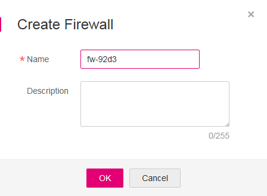

# Creating a Firewall

## Scenarios

A firewall consists of one or more access control lists \(ACLs\). The firewall determines whether data packets are allowed in or out of any associated subnet based on inbound and outbound rules. You can create a custom firewall, but any newly created firewall will be disabled by default. It will not have any inbound or outbound rules, or have any subnets associated. Each user can create up to 200 firewalls by default.

## Procedure

1.  Log in to the management console.
2.  Click    in the upper left corner and select the desired region and project.
3.  On the console homepage, under  **Network**, click  **Virtual Private Cloud**.
4.  In the navigation pane on the left, choose  **Access Control**  \>  **Firewalls**.
5.  In the right pane displayed, click  **Create Firewall**.
6.  In the displayed  **Create Firewall**  area, enter firewall information as prompted.  [Table 1](#table145313414319)  lists the parameters to be configured.

    **Figure  1**  Create Firewall  
    

    **Table  1**  Parameter description

    
    <table><thead align="left"><tr id="row05304110314"><th class="cellrowborder" valign="top" width="21.43%" id="mcps1.2.4.1.1">
Parameter

    </th>
    <th class="cellrowborder" valign="top" width="53.76%" id="mcps1.2.4.1.2">
Description

    </th>
    <th class="cellrowborder" valign="top" width="24.81%" id="mcps1.2.4.1.3">
Example Value

    </th>
    </tr>
    </thead>
    <tbody><tr id="row2053541033"><td class="cellrowborder" valign="top" width="21.43%" headers="mcps1.2.4.1.1 ">
Name

    </td>
    <td class="cellrowborder" valign="top" width="53.76%" headers="mcps1.2.4.1.2 ">
Specifies the firewall name. This parameter is mandatory.

    
The firewall name contains a maximum of 64 characters, which may consist of letters, digits, underscores (_), and hyphens (-). The name cannot contain spaces.

    </td>
    <td class="cellrowborder" valign="top" width="24.81%" headers="mcps1.2.4.1.3 ">
fw-92d3

    </td>
    </tr>
    <tr id="row1753541637"><td class="cellrowborder" valign="top" width="21.43%" headers="mcps1.2.4.1.1 ">
Description

    </td>
    <td class="cellrowborder" valign="top" width="53.76%" headers="mcps1.2.4.1.2 ">
Provides supplementary information about the firewall. This parameter is optional.

    
The firewall description can contain a maximum of 255 characters and cannot contain angle brackets (&lt; or &gt;).

    </td>
    <td class="cellrowborder" valign="top" width="24.81%" headers="mcps1.2.4.1.3 ">
N/A

    </td>
    </tr>
    </tbody>
    </table>

7.  Click  **OK**.

    The firewall is created.

