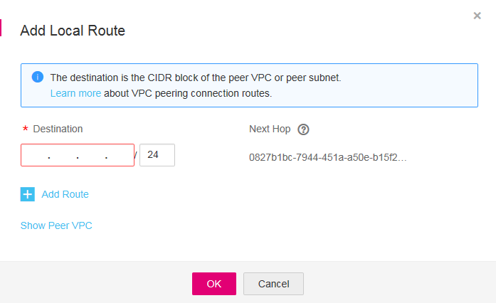

# Creating a VPC Peering Connection with a VPC in Another Account

## Scenarios

The VPC service also allows you to create a VPC peering connection with a VPC in another account. The two VPCs must be in the same region. If you request a VPC peering connection with a VPC in another account in the same region, the owner of the peer account must accept the request to activate the connection.

## Creating a VPC Peering Connection

1.  Log in to the management console.
2.  Click    in the upper left corner and select the desired region and project.
3.  On the console homepage, under  **Network**, click  **Virtual Private Cloud**.
4.  In the navigation pane on the left, click  **VPC Peering**.
5.  In the right pane displayed, click  **Create VPC Peering Connection**.
6.  Configure parameters as prompted. You must select  **Another account**  for  **Account**.

    **Figure  1**  Create VPC Peering Connection  
    

    **Table  1**  Parameter description

    
    <table><thead align="left"><tr id="row154231823162613"><th class="cellrowborder" valign="top" width="21.482148214821482%" id="mcps1.2.4.1.1">
Parameter

    </th>
    <th class="cellrowborder" valign="top" width="45.18451845184518%" id="mcps1.2.4.1.2">
Description

    </th>
    <th class="cellrowborder" valign="top" width="33.33333333333333%" id="mcps1.2.4.1.3">
Example Value

    </th>
    </tr>
    </thead>
    <tbody><tr id="row64247230268"><td class="cellrowborder" valign="top" width="21.482148214821482%" headers="mcps1.2.4.1.1 ">
Name

    </td>
    <td class="cellrowborder" valign="top" width="45.18451845184518%" headers="mcps1.2.4.1.2 ">
Specifies the name of the VPC peering connection.

    
The name contains a maximum of 64 characters, which consist of letters, digits, hyphens (-), and underscores (_).

    </td>
    <td class="cellrowborder" valign="top" width="33.33333333333333%" headers="mcps1.2.4.1.3 ">
peering-001

    </td>
    </tr>
    <tr id="row84241823122615"><td class="cellrowborder" valign="top" width="21.482148214821482%" headers="mcps1.2.4.1.1 ">
Local VPC

    </td>
    <td class="cellrowborder" valign="top" width="45.18451845184518%" headers="mcps1.2.4.1.2 ">
Specifies the local VPC. You can select one from the drop-down list.

    </td>
    <td class="cellrowborder" valign="top" width="33.33333333333333%" headers="mcps1.2.4.1.3 ">
vpc_002

    </td>
    </tr>
    <tr id="row1942432332613"><td class="cellrowborder" valign="top" width="21.482148214821482%" headers="mcps1.2.4.1.1 ">
Account

    </td>
    <td class="cellrowborder" valign="top" width="45.18451845184518%" headers="mcps1.2.4.1.2 ">
Specifies the account to which the VPC to peer with belongs.

    <ul id="ul1542462322614"><li><strong id="b17610165611213">My account</strong>: The VPC peering connection will be created between two VPCs, in the same region, in your account.</li><li><strong id="b15925111118224">Another account</strong>: The VPC peering connection will be created between your VPC and a VPC in another account, in the same region.</li></ul>
    </td>
    <td class="cellrowborder" valign="top" width="33.33333333333333%" headers="mcps1.2.4.1.3 ">
Another account

    </td>
    </tr>
    <tr id="row3424202312612"><td class="cellrowborder" valign="top" width="21.482148214821482%" headers="mcps1.2.4.1.1 ">
Peer Project ID

    </td>
    <td class="cellrowborder" valign="top" width="45.18451845184518%" headers="mcps1.2.4.1.2 ">
This parameter is available only when <strong id="b842352706191927">Another account</strong> is selected.

    
For details about how to obtain the peer project ID, see <a href="#section41291933224121">Obtaining the Peer Project ID</a>.

    </td>
    <td class="cellrowborder" valign="top" width="33.33333333333333%" headers="mcps1.2.4.1.3 ">
N/A

    </td>
    </tr>
    <tr id="row10425192313261"><td class="cellrowborder" valign="top" width="21.482148214821482%" headers="mcps1.2.4.1.1 ">
Peer VPC ID

    </td>
    <td class="cellrowborder" valign="top" width="45.18451845184518%" headers="mcps1.2.4.1.2 ">
This parameter is available only when <strong id="b447721302313">Another account</strong> is selected.

    
For details about how to obtain the peer VPC ID, see <a href="#section19734314164713">Obtaining the Peer VPC ID</a>.

    </td>
    <td class="cellrowborder" valign="top" width="33.33333333333333%" headers="mcps1.2.4.1.3 ">
65d062b3-40fa-4204-8181-3538f527d2ab

    </td>
    </tr>
    </tbody>
    </table>

7.  Click  **OK**.

## Accepting a VPC Peering Connection Request

To request a VPC peering connection with a VPC in another account, the owner of the peer account must accept the request to activate the connection.

1.  The owner of the peer account logs in to the management console.
2.  On the console homepage, under  **Network**, click  **Virtual Private Cloud**.
3.  In the navigation pane on the left, click  **VPC Peering**.
4.  Locate the row that contains the target VPC peering connection in the connection list, and click  **Accept Request**  in the  **Operation**  column.

    **Figure  2**  VPC peering connection list  
    

5.  Click  **Yes**  in the displayed dialog box.

## Refusing a VPC Peering Connection

The owner of the peer account can reject any VPC peering connection request that they receive. If a VPC peering connection request is rejected, the connection will not be established. You must delete the rejected VPC peering connection request before creating a VPC peering connection between the same VPCs as those in the rejected request.

1.  The owner of the peer account logs in to the management console.
2.  On the console homepage, under  **Network**, click  **Virtual Private Cloud**.
3.  In the navigation pane on the left, click  **VPC Peering**.
4.  Locate the row that contains the target VPC peering connection in the connection list, and click  **Reject Request**  in the  **Operation**  column.
5.  Click  **Yes**  in the displayed dialog box.

## Adding Routes for a VPC Peering Connection 

If you request a VPC peering connection with a VPC in another account, the owner of the peer account must accept the request. To enable communication between the two VPCs, you need to add routes for the VPC peering connection. The owner of the local account can add only the local route because the owner does not have the required permission to perform operations on the peer VPC. The owner of the peer account must add the peer route. The procedure for adding a local route and a peer route is the same.

1.  Log in to the management console.
2.  On the console homepage, under  **Network**, click  **Virtual Private Cloud**.
3.  In the navigation pane on the left, click  **VPC Peering**.
4.  Locate the target VPC peering connection in the connection list.
5.  Click the name of the VPC peering connection to switch to the page showing details about the connection.
6.  On the displayed page, click the  **Local Routes**  tab.
7.  In the displayed  **Local Routes**  area, click  **Add Local Route**. In the displayed dialog box, add a local route.  [Table 2](#en-us_topic_0118498960_table1626072032518)  lists the parameters to be configured.

    **Figure  3**  Add Local Route  
    

    **Table  2**  Route parameter description

    
    <table><thead align="left"><tr id="en-us_topic_0118498960_row1260520192515"><th class="cellrowborder" valign="top" width="33.33333333333333%" id="mcps1.2.4.1.1">
Parameter

    </th>
    <th class="cellrowborder" valign="top" width="33.33333333333333%" id="mcps1.2.4.1.2">
Description

    </th>
    <th class="cellrowborder" valign="top" width="33.33333333333333%" id="mcps1.2.4.1.3">
Example Value

    </th>
    </tr>
    </thead>
    <tbody><tr id="en-us_topic_0118498960_row92601620142520"><td class="cellrowborder" valign="top" width="33.33333333333333%" headers="mcps1.2.4.1.1 ">
Destination

    </td>
    <td class="cellrowborder" valign="top" width="33.33333333333333%" headers="mcps1.2.4.1.2 ">
Specifies the destination address. Set it to the peer VPC or subnet CIDR block. 

    </td>
    <td class="cellrowborder" valign="top" width="33.33333333333333%" headers="mcps1.2.4.1.3 ">
192.168.2.0/24

    </td>
    </tr>
    <tr id="en-us_topic_0118498960_row19260102012518"><td class="cellrowborder" valign="top" width="33.33333333333333%" headers="mcps1.2.4.1.1 ">
Next Hop

    </td>
    <td class="cellrowborder" valign="top" width="33.33333333333333%" headers="mcps1.2.4.1.2 ">
Specifies the next hop address. The default value is the VPC peering connection ID. Keep the default value.

    </td>
    <td class="cellrowborder" valign="top" width="33.33333333333333%" headers="mcps1.2.4.1.3 ">
d1a7863b-9d5e-4d27-8eaf-ab14d2a9148b

    </td>
    </tr>
    </tbody>
    </table>

8.  Click  **OK**.

    The routes are added for the VPC peering connection.

After a VPC peering connection is created, the two VPCs can communicate with each other through private IP addresses. You can run the  **ping**  command to check whether the two VPCs can communicate with each other. 

If two VPCs cannot communicate with each other, check the configuration by following the instructions provided in  [What Can I Do If VPCs in a VPC Peering Connection Cannot Communicate with Each Other?](what-can-i-do-if-vpcs-in-a-vpc-peering-connection-cannot-communicate-with-each-other.md).

## Obtaining the Peer Project ID

1.  The owner of the peer account logs in to the management console.
2.  Select  **My Credentials**  from the username drop-down list.
3.  On the  **Project List**  tab, obtain the required project ID.

## Obtaining the Peer VPC ID

1.  The owner of the peer account logs in to the management console.
2.  On the console homepage, under  **Network**, click  **Virtual Private Cloud**.
3.  In the navigation pane on the left, click  **Virtual Private Cloud**.
4.  Click the target VPC name and view VPC ID on the VPC details page.

