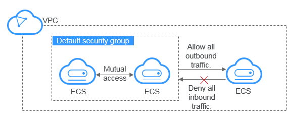

# Default Security Groups and Security Group Rules

Your account automatically comes with a security group by default. The default security group allows all outbound traffic, denies all inbound traffic, and allows all traffic between ECSs in the group. Your ECSs in the security group can communicate with each other by default. There is no need to add rules for this.

[Figure 1](#fig997718156161)  shows the default security group.

**Figure  1**  Default security group  

[Table 1](#table1580115155277)  describes the default rules for a default security group.

**Table  1**  Default security group rules

<table><thead align="left"><tr id="row15801415182713"><th class="cellrowborder" valign="top" width="14.26%" id="mcps1.2.6.1.1">
<strong id="b842352706194648">Direction</strong>

</th>
<th class="cellrowborder" valign="top" width="13.459999999999999%" id="mcps1.2.6.1.2">
<strong id="b842352706194658">Protocol</strong>

</th>
<th class="cellrowborder" valign="top" width="16.71%" id="mcps1.2.6.1.3">
<strong id="b842352706194415">Port/Range</strong>

</th>
<th class="cellrowborder" valign="top" width="26.1%" id="mcps1.2.6.1.4">
<strong id="b842352706204628">Source/Destination</strong>

</th>
<th class="cellrowborder" valign="top" width="29.470000000000002%" id="mcps1.2.6.1.5">
<strong id="b84235270694155">Description</strong>

</th>
</tr>
</thead>
<tbody><tr id="row1280251562712"><td class="cellrowborder" valign="top" width="14.26%" headers="mcps1.2.6.1.1 ">
Outbound

</td>
<td class="cellrowborder" valign="top" width="13.459999999999999%" headers="mcps1.2.6.1.2 ">
All

</td>
<td class="cellrowborder" valign="top" width="16.71%" headers="mcps1.2.6.1.3 ">
All

</td>
<td class="cellrowborder" valign="top" width="26.1%" headers="mcps1.2.6.1.4 ">
Destination: 0.0.0.0/0

</td>
<td class="cellrowborder" valign="top" width="29.470000000000002%" headers="mcps1.2.6.1.5 ">
Allow all outbound traffic.

</td>
</tr>
<tr id="row1980261512714"><td class="cellrowborder" valign="top" width="14.26%" headers="mcps1.2.6.1.1 ">
Inbound

</td>
<td class="cellrowborder" valign="top" width="13.459999999999999%" headers="mcps1.2.6.1.2 ">
All

</td>
<td class="cellrowborder" valign="top" width="16.71%" headers="mcps1.2.6.1.3 ">
All

</td>
<td class="cellrowborder" valign="top" width="26.1%" headers="mcps1.2.6.1.4 ">
Source: ID of the current security group (for example, sg-<em id="i2138146127154428">xxxxx</em>)

</td>
<td class="cellrowborder" valign="top" width="29.470000000000002%" headers="mcps1.2.6.1.5 ">
Allow communication among ECSs within the security group and deny all inbound traffic (incoming data packets).

</td>
</tr>
</tbody>
</table>

