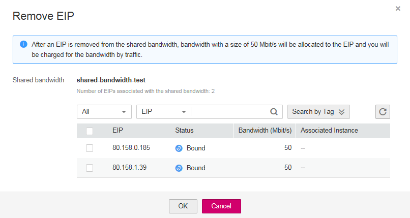

# Removing EIPs from a Shared Bandwidth

## Scenarios

Remove EIPs that are no longer required from a shared bandwidth if needed.

## Procedure

1.  Log in to the management console.
2.  Click    in the upper left corner and select the desired region and project.
3.  On the console homepage, under  **Network**, click  **Elastic IP**.
4.  In the navigation pane on the left, choose  **Elastic IP and Bandwidth**  \>  **Shared Bandwidths**.
5.  In the shared bandwidth list, locate the row that contains the bandwidth from which EIPs are to be removed, click  **More**  in the  **Operation**  column and select  **Remove EIP**, and select the EIPs to be removed in the displayed dialog box.

    **Figure  1**  Remove EIP  
    

6.  Click  **OK**.

