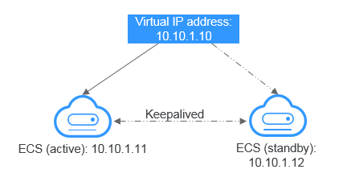
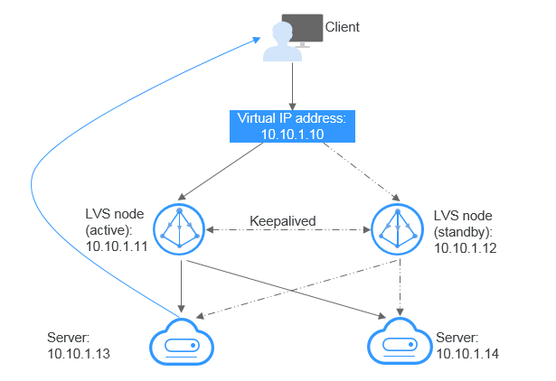

# Virtual IP Address Overview

## What Is a Virtual IP Address?

A virtual IP address \(VIP\) is an IP address that is not allocated to an actual ECS NIC. An ECS can have both private and virtual IP addresses, and you can access the ECS through either one. A virtual IP address has the same network access capabilities as a private IP address, including layer 2 and layer 3 communication in VPCs, access between VPCs using peering connections, as well as Internet access through EIPs, VPN connections, and Direct Connect connections.

Multiple ECSs deployed in active/standby mode can be bound to the same virtual IP address. The virtual IP address can then be bound to an EIP. When someone accesses that EIP from the Internet, since the virtual IP address has made it possible to link active/standby mode copies of ECSs, those ECSs are highly fault tolerant.

## Networking

Virtual IP addresses are used for high availability as they make active/standby ECS switchover possible. If the active ECS becomes faulty and cannot provide services, the virtual IP address is dynamically switched to the standby ECS and services continue uninterrupted. ECSs can be configured for HA or as load balancing clusters.

-   **Networking mode 1**: HA

    If you want to improve service availability and avoid single points of failure, you can deploy ECSs in the active/standby mode or one active and multiple standby mode. In this arrangement, the ECSs all use the same virtual IP address. If the active ECS becomes faulty, a standby ECS takes over services from the active ECS and services continue uninterrupted.

    **Figure  1**  Networking diagram of the HA mode  
    

    -   In this configuration, two ECSs in a subnet are bound to a single virtual IP address.
    -   Keepalived is then used to configure the two ECSs to work in the active/standby mode. Follow industry standards for configuring Keepalived. The details are not included here.

-   **Networking mode 2**: HA load balancing cluster

    If you want to build a high-availability load balancing cluster, use Keepalived and configure LVS nodes as direct routers.

    **Figure  2**  HA load balancing cluster  
    

    -   Bind two ECSs to the same virtual IP address.
    -   Configure the two ECSs as LVS nodes working as direct routers and use Keepalived to configure the nodes in the active/standby mode. The two ECSs will evenly forward requests to different backend servers.
    -   Configure another two ECSs as backend servers.
    -   Disable the source/destination check for the two servers.

    Follow industry standards for configuring Keepalived. The details are not included here.

## Application Scenarios

-   Using an EIP to access a virtual IP address

    If your application has high availability requirements and needs to provide services through the Internet, it is recommended that you bind an EIP to a virtual IP address.

-   Using a VPN, Direct Connect, or peering connection to access a virtual IP address

    To ensure high availability and access to the Internet, use a VPN for security and Direct Connect for a stable connection. The VPC peering connection is needed so that the VPCs in the same region can communicate with each other.

## Important Notes

-   Virtual IP addresses are not recommended when multiple NICs in the same subnet are configured on the ECS. It is too easy for there to be route conflicts on the ECS, which would cause communication failure using the virtual IP address.
-   IP forwarding must be disabled on the standby ECS. Perform the following operations to confirm whether the IP forwarding is disabled on the standby ECS:
    1.  Log in to standby ECS and run the following command to check whether the IP forwarding is enabled:

        cat /proc/sys/net/ipv4/ip\_forward

        In the command output,  **1**  indicates it is enabled, and  **0**  indicates it is disabled. The default value is  **0**.

        -   If the command output is  **1**, perform  [2](#en-us_topic_0206027322_en-us_topic_0095139658_li1473585332417)  and  [3](#en-us_topic_0206027322_en-us_topic_0095139658_li88984711254)  to disable the IP forwarding.
        -   If the command output is  **0**, no further action is required.

    2.  Use the vi editor to open the  **/etc/sysctl.conf**  file, change the value of  **net.ipv4.ip\_forward**  to  **0**, and enter  **:wq**  to save the change and exit. You can also use the  **sed**  command to modify the configuration. A command example is as follows:

        sed -i '/net.ipv4.ip\_forward/s/1/0/g' /etc/sysctl.conf

    3.  Run the following command to make the change take effect:

        sysctl -p /etc/sysctl.conf

-   The virtual IP address can use only the default security group, which cannot be changed to a custom security group.
-   It is recommended that no more than eight virtual IP addresses be bound to an ECS.
-   It is recommended that no more than 10 ECSs be bound to a virtual IP address.

