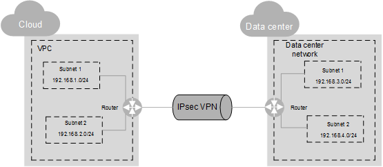

# IPsec VPN

The Internet Protocol Security \(IPsec\) VPN is an encrypted tunneling technology that uses encrypted security services to establish confidential and secure communication tunnels between different networks.

In  [Figure 1](#fig489417475262), a VPC has two subnets: 192.168.1.0/24 and 192.168.2.0/24. On your router deployed in your physical data center, you also have two subnets: 192.168.3.0/24 and 192.168.4.0/24. You can use VPN to enable subnets in your VPC to communicate with those in your data center.

**Figure  1**  IPsec VPN  

Currently, the site-to-site VPN and hub-spoke VPN are supported. You need to set up VPNs in both your data center and the VPC to establish the VPN connection.

Ensure that the VPN in your VPC and that in your data center use the same Internet Key Exchange \(IKE\) and IPsec policy configurations. Before creating a VPN, familiarize yourself with the protocols described in  [Table 1](#en-us_topic_0030969429_en-us_topic_0030119097_table19214078112957)  and ensure that your device meets the requirements and configuration constraints of the involved protocols.

**Table  1**  Involved protocols

<table><thead align="left"><tr id="en-us_topic_0030969429_en-us_topic_0030119097_row55236938112957"><th class="cellrowborder" valign="top" width="16.16%" id="mcps1.2.4.1.1">
<strong id="b842352706184931">Protocol</strong>

</th>
<th class="cellrowborder" valign="top" width="48.980000000000004%" id="mcps1.2.4.1.2">
<strong>Description</strong>

</th>
<th class="cellrowborder" valign="top" width="34.86%" id="mcps1.2.4.1.3">
<strong id="b84235270617755">Constraint</strong>

</th>
</tr>
</thead>
<tbody><tr id="en-us_topic_0030969429_en-us_topic_0030119097_row32338319112957"><td class="cellrowborder" valign="top" width="16.16%" headers="mcps1.2.4.1.1 ">
RFC 2409

</td>
<td class="cellrowborder" valign="top" width="48.980000000000004%" headers="mcps1.2.4.1.2 ">
Defines the IKE protocol, which negotiates and verifies key information to safeguard VPNs.

</td>
<td class="cellrowborder" valign="top" width="34.86%" headers="mcps1.2.4.1.3 "><ul id="en-us_topic_0030969429_en-us_topic_0030119097_ul66890200112957"><li>Use the pre-shared key (PSK) to reach an IKE peer agreement.</li><li>Use the main mode for negotiation.</li></ul>
</td>
</tr>
<tr id="en-us_topic_0030969429_en-us_topic_0030119097_row41920571112957"><td class="cellrowborder" valign="top" width="16.16%" headers="mcps1.2.4.1.1 ">
RFC 4301

</td>
<td class="cellrowborder" valign="top" width="48.980000000000004%" headers="mcps1.2.4.1.2 ">
Defines the IPsec architecture, the security services that IPsec offers, and the collaboration between components.

</td>
<td class="cellrowborder" valign="top" width="34.86%" headers="mcps1.2.4.1.3 ">
Use the IPsec tunnel to set up a VPN connection.

</td>
</tr>
</tbody>
</table>

