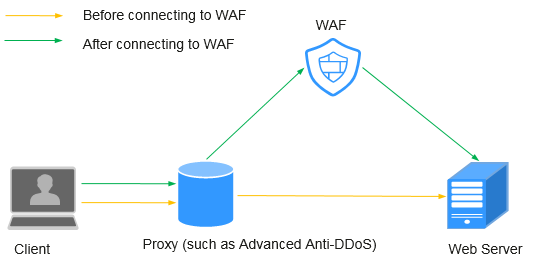
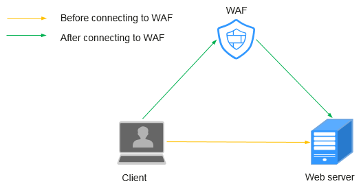
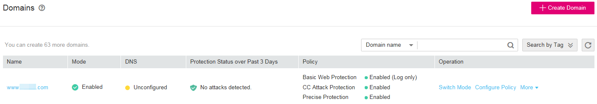
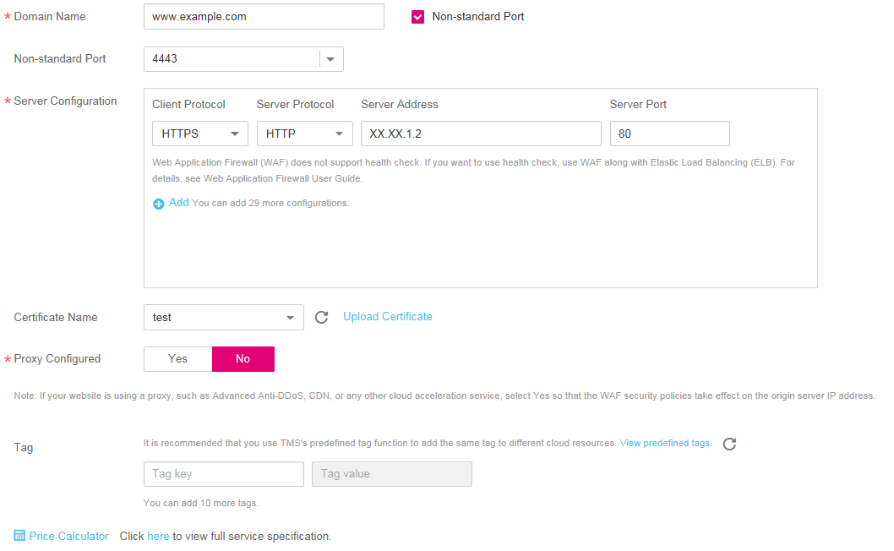
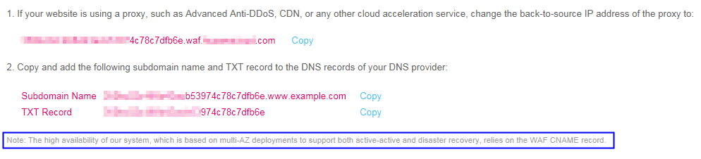
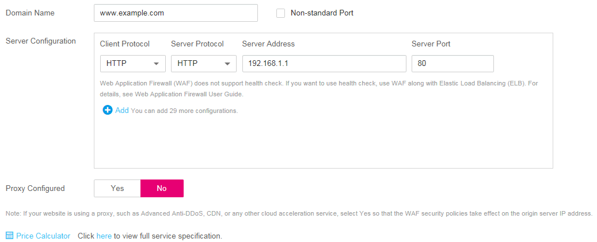
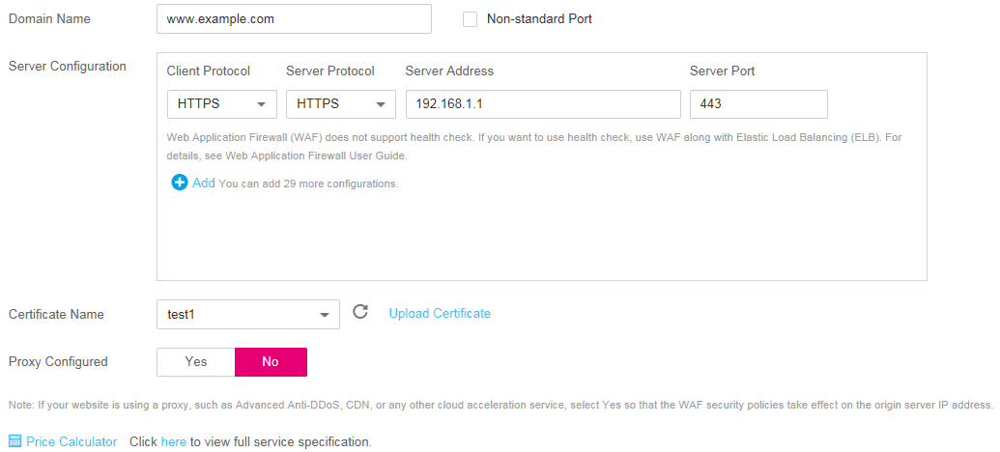
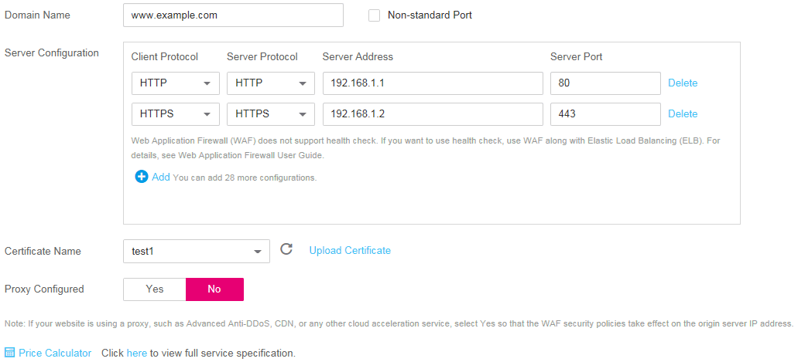

# Creating a Domain Name

This section describes how to  create a domain name and connect it  to WAF. After connecting a domain name, WAF works as a reverse proxy between the client and server. The real IP address of the server is hidden and only the IP address of WAF is visible to web visitors.

## Prerequisites

Login credentials have been obtained.

## Domain Configuration Principle

-   [Figure 1](#en-us_topic_0110861354_fig030435404518)  shows how WAF works if the web server is using a proxy.

    **Figure  1**  A proxy configured  
    

    -   DNS resolves the domain name to the IP address of a proxy \(such as AAD\) before your site is moved to WAF. In this case, the traffic passes through the proxy and then the proxy routes the traffic back to the origin server.
    -   After your site is moved to WAF, DNS resolves your domain name to the access address of WAF. In this way, the proxy forwards the traffic to WAF. WAF then filters out illegitimate traffic and only routes legitimate traffic back to the origin server.
        1.  Change the back-to-source IP address of the proxy to the access address of WAF.
        2.  Add a WAF subdomain name and TXT record to the DNS records of your DNS provider.

-   [Figure 2](#en-us_topic_0110861354_fig1624119317528)  shows how WAF works if the web server does not use a proxy.

    **Figure  2**  No proxy configured  
    

    -   DNS resolves your domain name to the origin server IP address before your site is moved to WAF. Therefore, web visitors can directly access the server.
    -   After your site is moved to WAF, DNS resolves your domain name to the CNAME of WAF. In this way, the traffic passes through WAF. WAF then filters out illegitimate traffic and only routes legitimate traffic back to the origin server.

## Procedure

1.  Log in to the management console.
2.  Click    in the upper left corner of the management console and select a region or project.
3.  Choose  **Security**  \>  **Web Application Firewall**.
4.  In the navigation pane, choose  **Domains**. The  **Domains**  page is displayed, as shown in  [Figure 3](#fig15593418182219).

    **Figure  3**  Domains  
    

5.  In the upper right corner of the domain name list, click  **Create Domain**.
6.  On the displayed page, configure basic settings.  [Figure 4](#fig175731754141418)  shows this page.  [Table 1](#table7692122554811)  describes the parameters.

    **Figure  4**  Configuring basic settings  
    

    **Table  1**  Parameter description

    
    <table><thead align="left"><tr id="row1068752517484"><th class="cellrowborder" valign="top" width="15%" id="mcps1.2.4.1.1">
Parameter

    </th>
    <th class="cellrowborder" valign="top" width="60.5%" id="mcps1.2.4.1.2">
Description

    </th>
    <th class="cellrowborder" valign="top" width="24.5%" id="mcps1.2.4.1.3">
Example Value

    </th>
    </tr>
    </thead>
    <tbody><tr id="row1368718254486"><td class="cellrowborder" valign="top" width="15%" headers="mcps1.2.4.1.1 ">
Domain Name

    </td>
    <td class="cellrowborder" valign="top" width="60.5%" headers="mcps1.2.4.1.2 ">
A domain name to be protected, which can be a single domain name or a wildcard domain name.

    <ul id="ul9206119142513"><li>Single domain name: For example, <em id="i115753818458">www.example.com</em></li><li>Wildcard domain name<ul id="ul776103520251"><li>If the server IP address of each subdomain name is the same, enter a wildcard domain name. For example, <strong id="b5326475234">*.example.com</strong>.</li><li>If the server IP addresses of subdomain names are different, add subdomain names as single domain names one by one.</li></ul>
    </li></ul>
    </td>
    <td class="cellrowborder" valign="top" width="24.5%" headers="mcps1.2.4.1.3 ">
Single domain name: <strong id="b565872715916">www.example.com</strong>

    
Wildcard domain name: <strong id="b8143143511918">*.example.com</strong>

    </td>
    </tr>
    <tr id="row116884252488"><td class="cellrowborder" valign="top" width="15%" headers="mcps1.2.4.1.1 ">
Non-standard Port

    </td>
    <td class="cellrowborder" valign="top" width="60.5%" headers="mcps1.2.4.1.2 ">
Set this parameter only if <strong id="b912632651413">Non-standard Port</strong> is selected.

    <ul id="ul86882025104815"><li>If <strong id="b18507162234">Client Protocol</strong> is <strong id="b1051161617234">HTTP</strong>, WAF protects the standard port 80 only by default. To protect a non-standard port, select <strong id="b64291331373">Non-standard Port</strong> and then select a value from the <strong id="b152616182313">Non-standard Port</strong> drop-down list.</li><li>If <strong id="b1029192017233">Client Protocol</strong> is <strong id="b17292192012311">HTTPS</strong>, WAF protects the standard port 443 only by default. To protect a non-standard port, select <strong id="b880711291070">Non-standard Port</strong> and then select a value from the <strong id="b112931120122312">Non-standard Port</strong> drop-down list.</li></ul>
    
For details about non-standard ports supported by WAF, see <a href="web-application-firewall.md">Web Application Firewall</a>.

    </td>
    <td class="cellrowborder" valign="top" width="24.5%" headers="mcps1.2.4.1.3 ">
<strong id="b19591135613711">4443</strong>

    </td>
    </tr>
    <tr id="row5690192514820"><td class="cellrowborder" valign="top" width="15%" headers="mcps1.2.4.1.1 ">
Server Configuration

    </td>
    <td class="cellrowborder" valign="top" width="60.5%" headers="mcps1.2.4.1.2 ">
Address configurations of the web server, including <strong id="b15392185820484">Client Protocol</strong>, <strong id="b1240118583488">Server Protocol</strong>, <strong id="b940275817489">Server Address</strong>, and <strong id="b2402058204818">Server Port</strong>.

    <ul id="ul16689625134815"><li><strong id="b82686283108">Client Protocol:</strong> Type of client protocol. The options are <strong id="b8423527062032_3">HTTP</strong> and <strong id="b842352706201123">HTTPS</strong>.</li><li><strong id="b1012093220101">Server Protocol</strong>: Protocol used by WAF to forward requests to the server. The options are <strong id="b754363541">HTTP</strong> and <strong id="b1575463089">HTTPS</strong>.
 NOTE: 

For details about configuring <strong id="b171101317514">Client Protocol</strong> and <strong id="b111101314517">Server Protocol</strong>, see <a href="#section645014318511">Rules for Configuring Client Protocol and Server Protocol</a>.

    

    </li><li><strong id="b161617122319">Server Address</strong>: IP address (generally the A record before the domain name is connected to WAF) or domain name (generally the CNAME before the domain name is connected to WAF) of the web server that a client accesses
 NOTE: 

Web Application Firewall (WAF) does not support health check. If you want to use health check, use WAF along with Elastic Load Balancing (ELB). For details about how to configure ELB, see <a href="https://docs.otc.t-systems.com/en-us/usermanual/elb/en-us_topic_0052569729.html" target="_blank" rel="noopener noreferrer">Backend Server (Enhanced Load Balancer)</a>. After ELB is configured, the elastic IP address (EIP) of ELB is used as the value of <strong id="b1142624815286">Server Address</strong> to connect to WAF for health check.

    

    </li><li><strong id="b842352706201213">Server Port</strong>: port number used by the web server</li></ul>
    </td>
    <td class="cellrowborder" valign="top" width="24.5%" headers="mcps1.2.4.1.3 ">
<strong id="b842352706102612">Client Protocol</strong>: <strong id="b842352706102615">HTTPS</strong>

    
<strong id="b842352706102635">Server Protocol</strong>: <strong id="b842352706102639">HTTPS</strong>

    
<strong id="b842352706102659">Server Address</strong>: <strong id="b84235270610273">192.168.1.1</strong>

    
<strong id="b1846145272915">Server Port</strong>: <strong id="b116735558290">443</strong>

    </td>
    </tr>
    <tr id="row76909251484"><td class="cellrowborder" valign="top" width="15%" headers="mcps1.2.4.1.1 ">
Certificate Name

    </td>
    <td class="cellrowborder" valign="top" width="60.5%" headers="mcps1.2.4.1.2 ">
If <strong id="b1646942183414">Client Protocol</strong> is <strong id="b14634223414">HTTPS</strong>, select an existing certificate or upload a new certificate. For details about how to upload a new certificate, see <a href="#li1098265701316">7</a>.

    </td>
    <td class="cellrowborder" valign="top" width="24.5%" headers="mcps1.2.4.1.3 ">
--

    </td>
    </tr>
    </tbody>
    </table>

7.  Upload a new certificate if  **Client Protocol**  is  **HTTPS**.
    1.  Click  **Upload Certificate**. The  **Upload Certificate**  dialog box is displayed. Enter the certificate name, and copy and paste the certificate content and private key to the corresponding text boxes. See  [Figure 5](#fig7846148397).

        **Figure  5**  Uploading a certificate  
        

        > **NOTE:**   
        >WAF encrypts and saves the private key to keep it safe.  

        Currently, only .pem certificates are supported. If the certificate is not in .pem format, convert it into a .pem certificate by referring to  [Table 2](#table1184924815910)  before uploading.

        **Table  2**  Certificate conversion commands

        
        <table><thead align="left"><tr id="row2847448797"><th class="cellrowborder" valign="top" width="21.990000000000002%" id="mcps1.2.3.1.1">
Format

        </th>
        <th class="cellrowborder" valign="top" width="78.01%" id="mcps1.2.3.1.2">
How to Convert (In Linux OSs)

        </th>
        </tr>
        </thead>
        <tbody><tr id="row1784719481093"><td class="cellrowborder" valign="top" width="21.990000000000002%" headers="mcps1.2.3.1.1 ">
CER/CRT

        </td>
        <td class="cellrowborder" valign="top" width="78.01%" headers="mcps1.2.3.1.2 ">
Rename the <strong id="b84235270691740">cert.crt</strong> certificate file to <strong id="b84235270691747">cert.pem</strong>.

        </td>
        </tr>
        <tr id="row1484714481196"><td class="cellrowborder" valign="top" width="21.990000000000002%" headers="mcps1.2.3.1.1 ">
PFX

        </td>
        <td class="cellrowborder" valign="top" width="78.01%" headers="mcps1.2.3.1.2 "><ol id="ol178472048299"><li>Run the following command to obtain a private key. For example, to convert <strong id="b124221289249">cert.pfx</strong> into <strong id="b1423152892418">cert.key</strong>, run:
<strong id="b78471748295">openssl pkcs12 -in cert.pfx -nocerts -out cert.key -nodes</strong>

        </li><li>Run the following command to obtain a certificate. For example, to convert <strong id="b15328203542412">cert.pfx</strong> into <strong id="b4329335122416">cert.pem</strong>, run:
<strong id="b10847164818913">openssl pkcs12 -in cert.pfx -nokeys -out cert.pem</strong>

        </li></ol>
        </td>
        </tr>
        <tr id="row15847548495"><td class="cellrowborder" valign="top" width="21.990000000000002%" headers="mcps1.2.3.1.1 ">
P7B

        </td>
        <td class="cellrowborder" valign="top" width="78.01%" headers="mcps1.2.3.1.2 ">
Run the following command to convert a certificate. For example, to convert <strong id="b1992263817248">cert.p7b</strong> into <strong id="b1922113812413">cert.pem</strong>, run:

        
<strong id="b884754812912">openssl pkcs7 -print_certs -in cert.p7b -out cert.pem</strong>

        </td>
        </tr>
        <tr id="row12849154819915"><td class="cellrowborder" valign="top" width="21.990000000000002%" headers="mcps1.2.3.1.1 ">
DER

        </td>
        <td class="cellrowborder" valign="top" width="78.01%" headers="mcps1.2.3.1.2 ">
Run the following command to obtain a certificate. For example, to convert <strong id="b1580714614246">privatekey.der</strong> into <strong id="b58072461245">cert.key</strong>, run:

        
<strong id="b118494481997">openssl rsa -inform DER -outform PEM -in privatekey.der -out cert.key</strong>

        </td>
        </tr>
        </tbody>
        </table>

    2.  Click  **OK**.

8.  Set  **Proxy Configured**. The default value is  **No**.

    > **NOTICE:**   
    >The bypassed option is unavailable during proxy use.  

    -   If your website is using a proxy such as Advanced Anti-DDoS \(AAD\), Content Delivery Network \(CDN\), or any other cloud acceleration service, select  **Yes**  so that the WAF security policies take effect on the origin server IP address. If this parameter is  **No**, WAF cannot obtain the real IP address requested by a web visitor.

        > **NOTE:**   
        >If a proxy such as CDN is used, WAF obtains the real source IP address of a client from the HTTP Header  **X-Forwarded-For**  by default. If the proxy does not use  **X-Forwarded-For**  to identify the real source IP address of a client, click    next to  **X-Forwarded-For**  in the row of  **Source IP Header**. In the dialog box displayed, select an existing source IP header or select  **Custom**  and enter a source IP header.  

    -   If your website does not use a proxy, select  **No**.

9.  \(Optional\) Configure a tag.

    You can select an existing tag key and tag value from the  **Tag key**  and  **Tag value**  drop-down lists or click  **View predefined tags**  to create a tag on the TMS console.

10. Click  **Create Now**. In the upper right corner of the page,  **Domain created successfully**  is displayed, indicating that the domain name is created.

    > **NOTE:**   
    >If you do not want to connect the domain name to WAF in this step, click  **Next**. Then click  **Finish**.  **DNS**  is displayed as  **Unconfigured**. Later, you can refer to  [Connecting a Domain Name](connecting-a-domain-name-to-waf.md)  to finish domain connection.  

    -   If a proxy such as CDN or AAD is used, you need to configure the back-to-source IP address, subdomain name, and TXT record.  [Figure 6](#waf_01_0056_fig450482413592)  displays the configurations.

        **Figure  6**  Connecting a domain name  
        

        1.  Configure the back-to-source IP address of the proxy on the website.

            For example, change the back-to-source IP address of CDN or AAD to the WAF IP address as shown in  [Figure 6](#waf_01_0056_fig450482413592).

        2.  Configure  **Subdomain Name**  and  **TXT Record**.

            Add a subdomain name and TXT record to the DNS records of your DNS provider.

        > **NOTICE:**   
        >The high availability of our system, which is based on multi-AZ deployments to support both active-active and disaster recovery, relies on the WAF CNAME record.  

    -   If no proxy is used, the CNAME record must be configured.  [Figure 7](#waf_01_0056_fig84741317702)  displays the configuration.

        **Figure  7**  Connecting a domain name \(CNAME record\)  
        .png "connecting-a-domain-name-(cname-record)")

        1.  Go to your DNS provider and configure the CNAME record. For details, contact your DNS provider.

            > **NOTICE:**   
            >The high availability of our system, which is based on multi-AZ deployments to support both active-active and disaster recovery, relies on the WAF CNAME record. Therefore,  
            >1.  Do not modify the hosts file. Add the CNAME record directly to the DNS records of your DNS provider.  
            >2.  Do not use the A record to replace the CNAME record.  

            The CNAME binding method of some common DNS providers is listed for your reference. If the following configuration is inconsistent with the actual configuration, rely on information provided by the DNS providers.

            1.  Log in to the management console of the DNS provider.
            2.  Go to the domain resolution record page.
            3.  Set the CNAME resolution record.
                -   Set the record type to  **CNAME**.
                -   Generally, enter the domain name prefix in the host record. For example, if the protected domain name is  **admin.demo.com**, enter  **admin**  in the host record.
                -   The record value is the CNAME generated by WAF.
                -   Resolution line: keep the default value  **TTL**.

            4.  Click  **Save**.

            > **NOTICE:**   
            >The preceding resolution methods are provided by third parties. This document does not control or assume responsibility for any third party content, including but not limited to its accuracy, compatibility, reliability, availability, legitimacy, appropriateness, performance, non-infringement, or status update, unless otherwise specified in this document.  

        2.  Verify that the CNAME has been configured.
            1.  In Windows, choose  **Start**  \>  **Run**. Then enter  **cmd**  and press  **Enter**.
            2.  Run the following command to query the CNAME. If the configured CNAME is displayed, the configuration is successful.

                **nslookup www.**_domain_**.com**

11. After the domain name is connected to WAF, click  **Next**.
12. Click  **Finish**.

    You can view the DNS status and mode of the domain name in the domain list.

    > **NOTE:**   
    >-   If your web server is using other firewalls, disable the firewalls or whitelist the WAF IP address ranges.  
    >-   If your web server is using personal security software, replace it with enterprise security software and whitelist the WAF IP address ranges.  
    >-   If a domain name has been connected to WAF,  **DNS**  should be  **Normal**. If  **DNS**  is  **Unconfigured**, choose  **More \> Check DNS**  in the  **Operation**  column of the target domain name to check the DNS status. If the problem persists, perform domain connection again by referring to  [What Should I Do If the DNS Status Is Unconfigured?](what-should-i-do-if-the-dns-status-is-unconfigured.md).  
    >-   After a domain name is created, WAF protection is enabled by default. The mode of Basic Web Protection is  **Log only**  \(detected attacks are only logged but not blocked.\). WAF creates a CC attack protection rule for the domain name by default. The rule can be modified but cannot be deleted.  **Rate Limit**  in the rule is 500 requests/5 seconds by default and it can be adjusted up to 10000 requests/5 seconds. If you want a higher rate limit than the maximum value, contact the administrator.  

## Rules for Configuring Client Protocol and Server Protocol

WAF provides various protocol types. If your website is www.example.com, WAF provides the following four access modes:

-   HTTP mode. See  [Figure 8](#fig53041342142615).

    **Figure  8**  HTTP mode  
    

    > **NOTICE:**   
    >This configuration allows web visitors to access your website over HTTP only. If they access over HTTPS, they receive the 302 Found code and are redirected to http://www.example.com.  

-   HTTPS mode. This configuration allows web visitors to access your website over HTTPS only. If they access over HTTP, they are redirected to https://www.example.com. See  [Figure 9](#fig7444410153315).

    **Figure  9**  HTTPS mode  
    

    > **NOTICE:**   
    >-   If web visitors access your website over HTTPS, the website returns a successful response.  
    >-   If web visitors access your website over HTTP, they receive the 302 Found code and are directed to https://www.example.com.  

-   HTTP and HTTPS mode. See  [Figure 10](#fig3389134713400).

    **Figure  10**  HTTP and HTTPS mode  
    

    > **NOTICE:**   
    >-   If web visitors access your website over HTTP, the website returns a successful response but no communication between the browser and website is encrypted.  
    >-   If web visitors access your website over HTTPS, the website returns a successful response and all communications between the browser and website are encrypted.  

-   HTTPS/HTTP mode. See  [Figure 11](#fig11273129104514).

    **Figure  11**  HTTPS/HTTP mode  
    

    > **NOTICE:**   
    >If web visitors access your website over HTTPS, WAF forwards the requests to your origin server over HTTP.  

