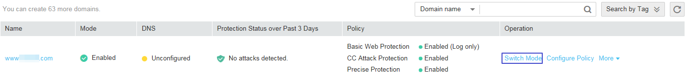

# Disabling WAF Protection

This section describes how to disable WAF protection. In this mode, WAF only forwards requests, but does not detect them.

## Prerequisites

-   Login credentials have been obtained.
-   **Mode**  of the protected domain name is  **Enabled**  or  **Bypassed**.

## Procedure

1.  Log in to the management console.
2.  Click    in the upper left corner of the management console and select a region or project.
3.  Click  **Service List**  at the top of the page and choose  **Security**  \>  **Web Application Firewall**. In the navigation pane, choose  **Domains**. The  **Domains**  page is displayed, as shown in  [Figure 1](#f43a0d099aa8b4a959f5f15efa37a602b).

    **Figure  1**  Domain name list  
    

4.  In the  **Operation**  column of the target domain name, click  **Switch Mode**.
5.  In the  **Switch Mode**  dialog box, select  **Disabled**  and then click  **OK**.

